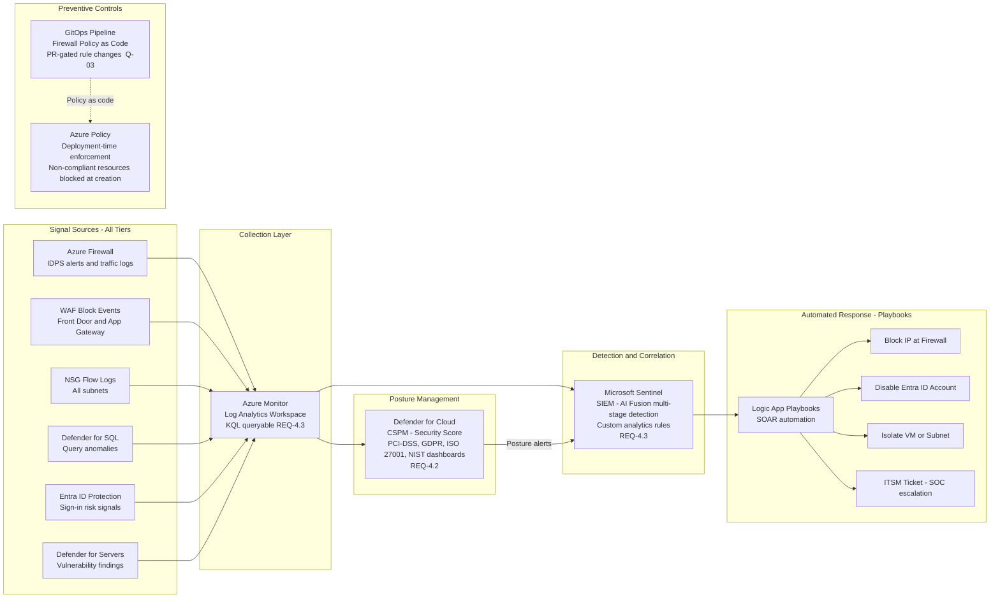
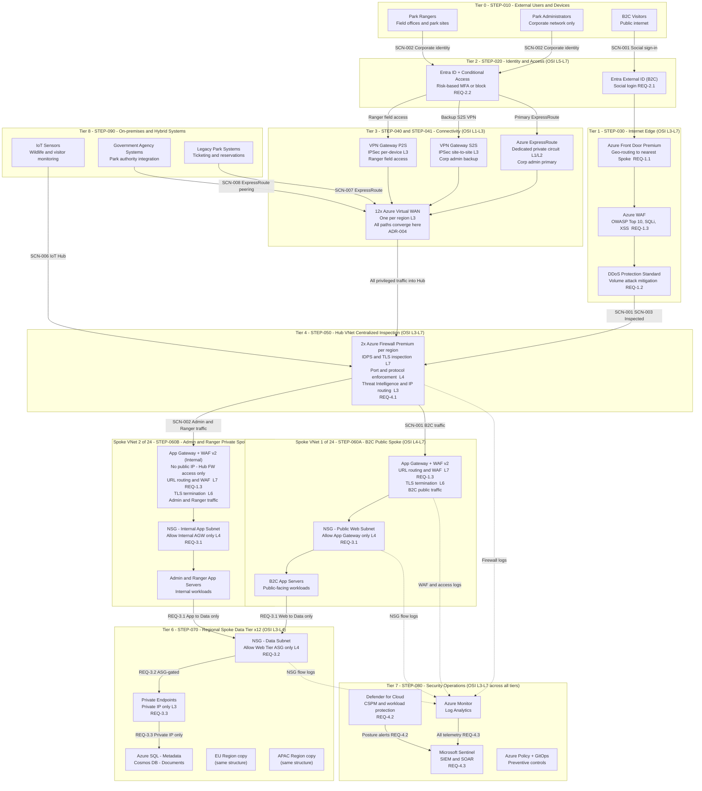

# GlobalParks - Cloud Network Security and Management
### Detailed Architecture Design

| | |
|---|---|
| **Audience** | Security Architects, Network Team |
| **Cloud scope** | Microsoft Azure - Greenfield |
| **Operations model** | Central Cloud SRE team |
| **Status** | v0.4 - Iteration 2 complete |
| **Last updated** | 2026-03-21 |

---

## Table of Contents

1. [Executive Summary](#1-executive-summary)
2. [Platform Context and Constraints](#2-platform-context-and-constraints)
3. [User Personas](#3-user-personas)
4. [Security Architecture Overview](#4-security-architecture-overview)
5. [Architecture Walkthrough](#5-architecture-walkthrough)
6. [Scenario Traces](#6-scenario-traces)
7. [Requirements Traceability Matrix](#7-requirements-traceability-matrix)
8. [Architectural Decisions](#8-architectural-decisions)
9. [Open Questions](#9-open-questions)
10. [Revision History](#10-revision-history)

---

## 1. Executive Summary

GlobalParks is a globally distributed web and mobile platform serving millions of national park visitors, while simultaneously providing secure backend access to park rangers and internal administrators. The platform operates across 12 Azure regions spanning the Americas, Europe, and Asia, and must scale to handle peak visitor traffic from any region in the world. Sensitive reservation and payment data must be completely isolated from the public internet, privileged admin access must be subject to continuous risk-aware verification, and all on-premises park systems must connect securely to the cloud without exposing management interfaces.

This document describes the network security and management architecture. The design is built on three foundational principles. First, **Zero Trust**: no request is trusted by virtue of its origin; every access decision is grounded in verified identity, device state, and contextual signals. Second, **defence in depth**: security controls are layered so that the failure of any single control does not expose the platform. Third, **central governance with regional workload isolation**: a Central SRE team owns the security hub, while regional teams manage application workloads in isolated spoke networks.

The architecture uses a **Hub and Spoke Virtual Network topology** across 12 regional Azure Virtual WANs. Public traffic enters via Azure Front Door (a globally distributed edge service with built-in WAF and DDoS protection), is routed to the nearest regional spoke, and passes through a regional Hub Firewall before reaching application or data tiers. Park administrators connect exclusively from the corporate network via ExpressRoute. Rangers in the field connect via VPN. Both paths pass through the Hub Firewall. Backend databases are accessible only via private endpoints with no public IP address. On-premises park systems integrate via ExpressRoute and Azure IoT Hub. Every signal across all tiers is aggregated into Microsoft Sentinel for AI-driven threat detection.

---

## 2. Platform Context and Constraints

GlobalParks is being built greenfield on Azure, but it is a hybrid architecture from day one. The Central Cloud SRE team owns the Hub, all shared security infrastructure, and all network policy. Regional IT teams manage application workloads in their Spoke VNets within guardrails enforced by Azure Policy - they cannot deploy resources that violate the security baseline.

Beyond the cloud-native workloads, three categories of on-premises systems must integrate securely into the platform from launch. First, legacy park systems - existing ticketing and reservation platforms running on-premises in park data centres that cannot be migrated immediately - must sync data to Azure SQL via private connectivity (SCN-007, STEP-090). Second, IoT monitoring devices deployed within park boundaries - wildlife cameras, visitor counters, environmental sensors - must stream telemetry into Azure without any device being publicly addressable (SCN-006, STEP-090). Third, government park authority and regulatory agency systems require read-only access to park management APIs via dedicated private circuits (SCN-008, STEP-090).

All on-premises traffic - whether from legacy systems, IoT devices, or government agencies - enters the platform exclusively through the Hub Firewall via the VWAN Hub. No on-premises system has a direct path to any spoke resource. Azure Arc extends cloud governance and Defender for Cloud coverage to on-premises workloads, providing a single security posture view across cloud and physical environments.

| Constraint | Detail |
|---|---|
| **Deployment state** | Greenfield Azure - but hybrid from day one; on-premises integration is in scope from launch |
| **Regions** | 12 total - 4 in Americas, 4 in Europe, 4 in Asia |
| **Scale** | Millions of concurrent B2C users globally |
| **Topology** | Hub and Spoke VNet - one VWAN Hub per region (12 total), regional Spokes per VWAN |
| **Security posture** | Zero Trust - no implicit trust based on network location or origin (cloud or on-premises) |
| **Regulatory** | PCI-DSS (payment data), GDPR (EU visitors), ISO 27001, NIST |
| **RTO / RPO** | RTO: 5 minutes, RPO: 15 minutes |
| **Firewall** | 2x Azure Firewall Premium per regional Hub (Active-Active, zone-redundant) - 24 instances total |
| **Hub VNets** | 12 total - 1 per region, each hosting 2x Azure Firewall Premium instances |
| **Spoke VNets** | 24 total - 2 per region: 1 B2C public spoke (STEP-060A) + 1 Admin/Ranger private spoke (STEP-060B) |
| **ExpressRoute** | To be contracted with provider - 4-8 week lead time |
| **On-premises systems** | Legacy park ticketing and reservation systems integrating via ExpressRoute private peering (SCN-007, STEP-090) |
| **IoT devices** | Wildlife and visitor monitoring sensors connecting via Azure IoT Hub within park boundaries (SCN-006, STEP-090) |
| **Government integration** | National park authority and regulatory agency read-only API access via ExpressRoute peering (SCN-008, STEP-090) |
| **Hybrid governance** | Azure Arc extends cloud policy, monitoring, and Defender for Cloud posture to on-premises workloads |
| **Non-goals (v1)** | Multi-cloud, application code-level security |

---

## 3. User Personas

Three distinct user types access the GlobalParks platform, each treated as a separate trust domain. The architecture does not share identity infrastructure, network paths, or access controls between them.

### B2C Visitor (millions of concurrent users)

A park visitor opening the GlobalParks app to check trail conditions or book a reservation. They authenticate using a social identity provider - Google, Apple, Microsoft, or email - and expect a fast, seamless experience from wherever they are in the world. Their trust level is low: they are given access only to the public-facing application tier and nothing else. Their traffic path is: social login via Entra External ID, then Azure Front Door for edge inspection, then the regional Hub Firewall, and finally the B2C Web Tier spoke.

### Park Administrator (privileged - corporate network only)

A central administrator who manages park configurations, inventory, and visitor booking data from a corporate office. This persona **must connect only from the corporate network** - direct internet access to the backend is not permitted. Their connectivity path is via Azure ExpressRoute (primary) or VPN Gateway Site-to-Site (backup), both entering through a regional Azure Virtual WAN Hub and the Hub Firewall before reaching any spoke resource.

**Conditional Access policy for administrators:**
- Requires Intune-managed and compliant device (corporate-issued hardware only)
- MFA enforced on every sign-in without exception
- Named Location policy: sign-in blocked if originating outside registered corporate IP ranges
- Session frequency: re-authentication required every 8 hours
- Persistent browser sessions and token caching disabled

### Park Ranger (privileged - field and park sites)

A ranger working at a remote trailhead, park gate, or visitor centre within the park boundary. Rangers need the same backend access as administrators but connect from locations where a fixed corporate network is unavailable. Their connectivity path is Azure VPN Gateway Point-to-Site (P2S) via the regional VWAN Hub, inspected by the Hub Firewall before reaching the application tier.

**Conditional Access policy for rangers:**
- Requires Intune-enrolled park-issued field device
- MFA enforced on every sign-in
- No Named Location restriction (field mobility required)
- Risk-based policy: High sign-in risk triggers hard block; Medium risk triggers additional MFA verification
- Session frequency: re-authentication required every 4 hours (elevated due to field exposure)
- Device health evaluated at each sign-in via Intune compliance signals

| Persona | Identity mechanism | Network entry | Trust level | Connectivity |
|---|---|---|---|---|
| B2C Visitor | Entra External ID - social (Google, Apple, MS, Email) | Azure Front Door | Authenticated; low trust | Public internet |
| Park Administrator | Entra ID + Conditional Access + MFA | ExpressRoute or S2S VPN via VWAN | Privileged; network-restricted | Corporate network only |
| Park Ranger | Entra ID + Conditional Access + MFA | P2S VPN via VWAN | Privileged; location-flexible | Field offices and park sites |

---

## 4. Security Architecture Overview

The platform is designed as an eight-tier security architecture, where each tier maps to one or more layers of the OSI model and enforces specific controls. The tiers are traversed in sequence - no tier can be bypassed. This section provides the n-tier diagram, the OSI layer control mapping, and a detailed view of the Security Operations tier.

---

### 4.1 N-Tier Architecture Diagram

The platform is structured as eight tiers, each mapping to one or more OSI layers, traversed in sequence - no tier can be bypassed. Each tier band carries a `STEP-###` label that links to the full explanation in [Section 5](#5-architecture-walkthrough). Arrows carry `SCN-###` labels linking to [Section 6](#6-scenario-traces) and `REQ-#.#` labels linking to [Section 7](#7-requirements-traceability-matrix).

**Interactive visualization** - Open [`azure-networking-flowchart.html`](azure-networking-flowchart.html) in a browser for the full interactive experience: filter by Tier, Scenario, Requirement, Step, or OSI Layer; step through the SCN-009 and SCN-010 walkthroughs; and view the STEP-080 Security Operations detail in [Section 4.3](#43-step-080-security-operations---detailed-view).

**Diagram source and rendering** - The complete Mermaid source is in [Appendix A](#appendix-a---architecture-diagram-mermaid-source). GitHub renders it automatically when this file is viewed online. It can also be pasted into the [Mermaid Live Editor](https://mermaid.live) to export a standalone PNG or SVG.

---

### 4.2 OSI Layer Control Mapping

The table below provides a direct mapping: for each OSI layer, the specific threats that can occur at that layer, the exact Azure service that blocks or detects them, and how the control works.

| OSI Layer | Threat example | Azure service | How it protects |
|---|---|---|---|
| **L7 - Application** | SQL injection, XSS, OWASP Top 10, API abuse, command injection | Azure WAF (Front Door + App Gateway), Azure Firewall IDPS, Microsoft Sentinel | WAF inspects HTTP payloads and blocks matching attack patterns before they reach compute; Firewall IDPS checks encrypted and unencrypted flows; Sentinel correlates multi-step attack sequences |
| **L6 - Presentation** | Weak TLS versions (TLS 1.0/1.1), expired or spoofed certificates, unencrypted data in transit | Azure Front Door (enforces TLS 1.2+ termination), App Gateway (TLS termination), Azure Firewall Premium (TLS inspection and re-encryption) | Front Door and App Gateway reject connections below TLS 1.2; Firewall Premium decrypts, inspects, and re-encrypts HTTPS traffic |
| **L5 - Session** | Session hijacking, credential stuffing, token replay, unauthorised VPN session | Microsoft Entra ID (token issuance and revocation), Conditional Access (session policy enforcement), VPN Gateway (IKEv2 session authentication) | Conditional Access evaluates each sign-in for risk and device compliance; token lifetimes are controlled; VPN sessions require Entra ID authentication |
| **L4 - Transport** | Port scanning, lateral movement via open ports, protocol abuse, TCP SYN flood | NSG (TCP/UDP allow-list rules), App Gateway (protocol validation), Azure Firewall network rules | NSGs deny all ports not explicitly allowed; Firewall applies DNAT and network rules; App Gateway rejects non-HTTP traffic |
| **L3 - Network** | IP spoofing, routing manipulation, volumetric DDoS (UDP/ICMP floods), data exfiltration via direct IP | Azure Firewall Premium (network rules and Threat Intelligence IP blocking), DDoS Protection Standard (adaptive per-IP thresholds), User-Defined Routes (force traffic through Firewall), Azure Private Endpoints (no public IP exposure) | UDRs prevent traffic bypassing the Firewall; DDoS auto-mitigates volumetric attacks; Private Endpoints eliminate public IP attack surface on databases |
| **L2 - Data Link** | VLAN hopping, MAC spoofing (mitigated by Azure software-defined fabric), ARP poisoning | Azure VNet (software-defined network - no raw L2 access), ExpressRoute (dedicated VLAN-based private peering circuits) | Azure VNet abstracts L2 - tenants cannot inject L2 frames or spoof MACs; ExpressRoute uses BGP over dedicated VLANs |
| **L1 - Physical** | Physical access to infrastructure, cable tapping, hardware compromise | Azure datacenter physical security (ISO 27001 certified), ExpressRoute dedicated fibre circuits, Microsoft global backbone isolation | Microsoft controls physical access; ExpressRoute fibres are dedicated circuits not shared with other customers |

---

### 4.3 STEP-080 Security Operations - Detailed View

The Security Operations tier collects signals from all other tiers and provides detection, posture management, preventive controls, and automated response. The diagram below shows how these capabilities interconnect.

---

## 5. Architecture Walkthrough

This section walks through each step in the order a request travels through the system. Click any `SCN-###` reference to jump to the full scenario trace in [Section 6](#6-scenario-traces). Click any `REQ-#.#` reference to jump to the traceability matrix in [Section 7](#7-requirements-traceability-matrix).

---

### STEP-010 - Users and Personas

Every request into GlobalParks begins with a person and a device. The persona type is the architectural branching point - a B2C visitor, a park administrator, and a park ranger take completely different network paths, use different identity systems, and are subject to different controls. Separating these paths at the architectural level means a compromise of a consumer credential cannot share infrastructure with privileged admin sessions.

| | Detail |
|---|---|
| **Scenarios** | [SCN-001](#scn-001---public-visitor-accesses-the-globalparks-platform), [SCN-002](#scn-002---park-administrator-accesses-backend-management), [SCN-003](#scn-003---attacker-attempts-ddos-and-sqli-against-public-endpoints) |
| **PRD requirements** | [REQ-2.1](#7-requirements-traceability-matrix), [REQ-2.2](#7-requirements-traceability-matrix) |
| **Azure services** | Logical entry point - no Azure service at this step |
| **Owner** | SRE (architecture), Identity team (policy) |

---

### STEP-020 - Identity and Access

Before any traffic reaches a network endpoint, identity must be verified. This is the logical perimeter of the architecture - the security boundary is drawn not by a firewall rule but by a verified identity claim. Identity verification is the first mandatory gate for every persona.

For **B2C visitors**, Microsoft Entra External ID provides social federation with Google, Apple, Microsoft, and email-based accounts. It handles self-registration, token issuance, and session management at a scale that would be impractical to build and operate in-house. Visitors receive a token valid only for the public-facing application tier.

For **park administrators**, Entra ID Conditional Access evaluates every sign-in against four conditions: device compliance (Intune-managed), sign-in risk score (from Entra ID Protection), Named Location (must be a registered corporate IP), and MFA completion. All four must pass. A failure on any one condition results in MFA step-up or a hard block. Administrator sessions are limited to 8 hours and persistent tokens are disabled - every re-authentication is a fresh evaluation.

For **park rangers**, the same Conditional Access framework applies, with two differences: Named Location restriction is removed (rangers roam to field sites), and sign-in risk thresholds are tighter (Medium risk triggers hard MFA, High risk blocks immediately). Ranger sessions are limited to 4 hours, reflecting the elevated exposure of field environments. Devices must be Intune-enrolled park-issued hardware - personal devices are not permitted.

**Risk-based Conditional Access - what it means in practice:**

Entra ID Protection assigns a risk score - Low, Medium, or High - to every sign-in in real time using machine learning. The score reflects signals such as: the sign-in IP matching Microsoft's list of known compromised or Tor exit-node addresses; impossible travel (sign-ins from two geographically distant locations within minutes of each other, implying credential theft); credentials appearing in a known breach database; token replay from an unusual network; or unfamiliar sign-in properties compared to the user's historical baseline.

Rangers have no Named Location restriction - meaning their accounts are not protected by the geographic lock that would block a stolen admin credential used from an unexpected IP. The risk policy compensates:

- **High sign-in risk** (e.g., sign-in from a Tor exit node, impossible travel, credential found in a breach dump): Conditional Access **blocks the sign-in immediately**. The ranger cannot authenticate regardless of whether they hold a valid MFA token. The SOC is alerted. This stops an attacker who has stolen both a password and an MFA token, because the session is terminated before any application is reached.
- **Medium sign-in risk** (e.g., unfamiliar location, unusual sign-in time, atypical device characteristics that are suspicious but not definitively malicious): Conditional Access demands a **second MFA challenge** on top of the standard one. The ranger must re-verify their identity via a separate authenticator push before access is granted.

This layer is essential for rangers precisely because they are the only persona with location-flexible access. Without Named Location protection, a compromised ranger credential would be usable from anywhere in the world. The risk score policy closes that gap by making every sign-in a real-time threat assessment, not just a one-time credential check.

| | Detail |
|---|---|
| **Scenarios** | [SCN-001](#scn-001---public-visitor-accesses-the-globalparks-platform) (social login), [SCN-002](#scn-002---park-administrator-accesses-backend-management) (CA + MFA) |
| **PRD requirements** | [REQ-2.1](#7-requirements-traceability-matrix), [REQ-2.2](#7-requirements-traceability-matrix) |
| **Azure services** | Microsoft Entra External ID (B2C), Microsoft Entra ID, Conditional Access policies, Entra ID Protection |
| **Owner** | Identity team (policies), SRE (integration) |

---

### STEP-030 - Internet Edge and Global Routing

This is the outermost security layer. Three controls work together: geo-routing to the nearest regional datacenter, volumetric attack absorption, and application-layer payload inspection - all before any request enters Azure compute.

**Azure Front Door Premium** provides anycast global routing ([REQ-1.1](#7-requirements-traceability-matrix)). Anycast means that when a visitor in Singapore connects, their TCP handshake terminates at the nearest Microsoft **PoP (Point of Presence)** - one of hundreds of Microsoft-operated edge nodes globally. Traffic then travels over the Microsoft backbone to the Asia-Pacific spoke, not over the public internet. This reduces latency and removes the unpredictability of internet routing.

**Azure WAF (Web Application Firewall)** is attached to Front Door as a policy ([REQ-1.3](#7-requirements-traceability-matrix)). It uses the **DRS (Default Rule Set)** - Microsoft's managed rule library - which maps directly to the **OWASP (Open Web Application Security Project)** Top 10 vulnerability classification. OWASP Top 10 is the industry-standard list of the most critical web application security risks. WAF custom rules add GlobalParks-specific patterns for SQL injection and XSS beyond the managed ruleset. All inspection happens at the PoP - malicious requests are blocked before they touch a VNet.

**Azure DDoS Protection Standard** ([REQ-1.2](#7-requirements-traceability-matrix)) is attached to all spoke VNets. Front Door's PoP network absorbs layer-7 flood attacks upstream; DDoS Protection Standard adds adaptive per-IP thresholds at the VNet layer for network-layer (L3/L4) volumetric attacks, with telemetry flowing to Sentinel.

**WAF at Front Door vs WAF at App Gateway - what differs:**

| Control | Front Door WAF | App Gateway WAF v2 |
|---|---|---|
| Inspection point | Global edge - before traffic enters any Azure VNet | Inside VNet - after Hub Firewall forwards to spoke |
| TLS state | Post-termination - Front Door terminates TLS; WAF sees plaintext | Post-termination - App Gateway terminates TLS |
| Geo-filtering | Yes - block by country or region | No |
| Rate limiting | Yes - per client IP | Yes |
| Bot protection | Yes - managed bot ruleset | Limited |
| Rule scope | Global - one policy across all regions and PoPs | Per-application - custom rules per backend pool |
| Purpose in this design | First layer - blocks known attacks before entering Azure | Second layer - defence in depth; catches anything that bypassed Front Door or originated internally |

**Why B2C internet traffic does not pass through Azure Virtual WAN (Tier 3):**

Azure Virtual WAN is the private network connectivity layer - its gateways terminate dedicated private circuits (ExpressRoute) and encrypted private tunnels (S2S and P2S VPN) from corporate offices and ranger field devices. It handles known, authenticated private networks only.

B2C visitor traffic follows a completely different path. Azure Front Door operates as a globally distributed edge service with hundreds of PoPs worldwide. When a visitor in Sydney connects to GlobalParks, their TCP handshake terminates at the Sydney Front Door PoP - before any Azure VNet or VWAN is involved. From the PoP, Front Door forwards the request over Microsoft's private global backbone to the nearest regional origin: the Hub Firewall's public-facing interface. The Hub Firewall has a public IP address specifically for this internet-facing entry - it is the origin endpoint that Front Door's health probes monitor and route to.

VWAN's gateways are never in this path. Internet traffic enters the VNet through the Hub Firewall's public interface directly. VWAN is simply not relevant to internet-originated traffic - its role is gateway aggregation for private connectivity. The two paths (public internet via Front Door, private network via VWAN) converge only at the Hub Firewall in Tier 4, which is why the Hub Firewall is both the Tier 4 enforcement point and the single convergence point for all traffic sources.

| | Detail |
|---|---|
| **Scenarios** | [SCN-001](#scn-001---public-visitor-accesses-the-globalparks-platform) (visitor routed), [SCN-003](#scn-003---attacker-attempts-ddos-and-sqli-against-public-endpoints) (attacker blocked at edge) |
| **PRD requirements** | [REQ-1.1](#7-requirements-traceability-matrix), [REQ-1.2](#7-requirements-traceability-matrix), [REQ-1.3](#7-requirements-traceability-matrix) |
| **Azure services** | Azure Front Door Premium, Azure WAF (DRS + custom rules), Azure DDoS Protection Standard |
| **Owner** | SRE (WAF policy tuning), Network team (DDoS plan) |

---

### STEP-050 - Hub VNet - Centralized Inspection

The Hub is the mandatory choke point through which all traffic in the platform must pass - whether it is a visitor request arriving from Front Door, an admin session via ExpressRoute, a ranger session via P2S VPN, cross-spoke traffic, or on-premises integration traffic. This is the direct implementation of [REQ-4.1](#7-requirements-traceability-matrix). All spoke VNets peer to the Hub. User-Defined Routes (UDRs) on every spoke subnet redirect all traffic to the Azure Firewall's private IP before it can go anywhere.

**Why Tier 3 (VPN and ExpressRoute) does not need its own dedicated firewall:**

A common question is whether admin and ranger traffic should be inspected by a firewall at the point it enters Tier 3 (the VPN Gateway or ExpressRoute termination) rather than waiting until Tier 4. The answer is that it is - the Hub Firewall's reach extends into Tier 3 via **Azure Routing Intent** (Private Traffic Routing Policy in Azure Firewall Manager). When Routing Intent is enabled on the VWAN Hub, Azure automatically programmes the routing tables of every gateway within that hub - ExpressRoute, S2S VPN, and P2S VPN - to use the Hub Firewall as the mandatory next hop for all traffic destined for any spoke or any cross-region path. There is no routing configuration that permits a VPN session or an ExpressRoute circuit to send traffic directly to a spoke VNet without first traversing the Hub Firewall. The VWAN routing fabric itself enforces the mandatory firewall traversal.

Tier 1 has a dedicated WAF and DDoS edge because internet traffic is inherently untrusted and high-volume, requiring protection at the outermost perimeter before traffic enters any Azure VNet. Tier 3 traffic arrives over authenticated, encrypted private circuits (ExpressRoute) or authenticated encrypted tunnels (VPN) - the threat model is different. The Hub Firewall provides IDPS, TLS inspection, and threat intelligence filtering the moment that traffic exits the VWAN Hub toward any spoke. NSGs on the VPN Gateway subnets add a further network-level access control layer. The Hub Firewall is simultaneously the Tier 4 enforcement point and the de facto entry firewall for all Tier 3 connectivity paths.

**Azure Firewall Premium** (2 instances per regional Hub, Active-Active, zone-redundant) performs three inspection layers. The **IDPS (Intrusion Detection and Prevention System)** engine maintains a continuously updated signature database of known attack patterns - malicious traffic matching a signature is blocked and the event logged. TLS inspection decrypts and re-encrypts HTTPS flows inline using a CA certificate, allowing the IDPS to inspect encrypted payloads (where most modern attacks hide). Threat Intelligence filtering maintains Microsoft's live feed of known-malicious IP addresses and domains, blocking outbound connections to C2 infrastructure and inbound connections from known attack sources.

Two Firewall instances per region (Active-Active) ensure the 5-minute RTO is met. Both instances process traffic simultaneously behind an internal load balancer - there is no failover delay. Azure Firewall Manager distributes policy from a single parent policy to all 12 regional Firewall instances via GitOps pipeline, ensuring a new block rule is applied across all regions through a reviewed and approved code change.

| | Detail |
|---|---|
| **Scenarios** | [SCN-004](#scn-004---cross-region-traffic), [SCN-005](#scn-005---soc-investigates-a-multi-stage-attack) |
| **PRD requirements** | [REQ-4.1](#7-requirements-traceability-matrix) |
| **Azure services** | Azure Firewall Premium (2x per region, Active-Active), VNet Peering, UDRs, Azure Firewall Manager, Azure Firewall Policy (GitOps-managed) |
| **Owner** | SRE / Global Security Team |

---

### STEP-060A - Regional Spoke - Public Web Tier (B2C)

This separation is implemented as dedicated Spoke VNets - not merely separate subnets within a shared VNet. Each region has two Spoke VNets: a B2C public spoke and an Admin/Ranger private spoke, resulting in 24 Spoke VNets across the 12-region deployment. Two separate VNets provide a stronger blast radius boundary than subnets: a VNet-level compromise cannot cross VNet boundaries without explicit, audited peering rules.

B2C visitor traffic is forwarded by the Hub Firewall to the B2C public Spoke VNet. An Application Gateway receives the traffic, provides L7 load balancing, terminates TLS, and applies a second WAF layer inside the VNet. This second WAF (App Gateway WAF v2) applies the same OWASP DRS ruleset but with application-specific custom rules tuned to the GlobalParks public API. An NSG on the web subnet enforces that only traffic originating from the Application Gateway can reach B2C app servers - all other inbound is denied.

App servers are tagged with an **ASG (Application Security Group)** labelled `asg-b2c-web`. This ASG identity label is referenced in the Data Tier NSG rule (STEP-070). When B2C app servers scale out and receive new IPs, the ASG follows the new NICs automatically - the data tier security rule remains valid without manual intervention.

Defender for Servers continuously scans every app server for missing patches, vulnerabilities, and open management ports, feeding findings to Sentinel.

| | Detail |
|---|---|
| **Scenarios** | [SCN-001](#scn-001---public-visitor-accesses-the-globalparks-platform) |
| **PRD requirements** | [REQ-3.1](#7-requirements-traceability-matrix), [REQ-3.2](#7-requirements-traceability-matrix) |
| **Azure services** | Azure Application Gateway (WAF v2), NSG, ASG (asg-b2c-web), regional Spoke VNet, Defender for Servers |
| **Owner** | Regional IT (workloads), SRE (NSG baselines via Azure Policy) |

---

### STEP-060B - Regional Spoke - Internal App Tier (Admin and Ranger)

Admin and Ranger traffic exits the Hub Firewall into a dedicated **internal Application Gateway with WAF v2** before reaching the internal app subnet. This internal App Gateway is deployed on a private subnet with no public frontend IP - it is reachable only from the Hub Firewall's private IP range. It performs three functions: URL-based routing to direct admin and ranger API requests to the appropriate backend pools; TLS termination and re-encryption within the internal network; and a second WAF layer (App Gateway WAF v2 with OWASP DRS) specifically tuned for internal management API traffic.

**Why add a WAF layer for already-inspected private network traffic?**

The Hub Firewall (IDPS and TLS inspection) is the first mandatory L7 inspection layer for all privileged traffic. The internal App Gateway WAF v2 adds a second, application-aware inspection layer for HTTP/S web application attack patterns - SQL injection in management API query parameters, XSS payloads in admin console inputs, path traversal in file management APIs - that a compromised but authenticated admin device might carry even through a firewall-inspected session. The critical risk scenario is a legitimate admin credential being used from a compromised device: the traffic passes Conditional Access, passes the Hub Firewall (it looks like a normal authenticated session), but carries a malicious HTTP payload targeting the management API. The internal App Gateway WAF catches this. This is documented as [ADR-005](#adr-005---internal-application-gateway-for-the-adminranger-web-tier).

An NSG on the internal App Gateway subnet restricts inbound to the Hub Firewall source IP only. An NSG on the internal app subnet restricts inbound to the internal App Gateway source IP only - no direct path from the Hub Firewall to an app server exists. App servers in this tier are tagged with ASG `asg-admin-app`.

Separating B2C and admin/ranger workloads onto different subnets with different App Gateways and NSGs provides defence-in-depth isolation: a B2C application vulnerability cannot spread laterally to the admin tier, and WAF policies for each tier are independently tuned to their respective attack surface.

| | Detail |
|---|---|
| **Scenarios** | [SCN-002](#scn-002---park-administrator-accesses-backend-management), [SCN-002b](#scn-002b---park-ranger-accesses-backend-from-a-field-office) |
| **PRD requirements** | [REQ-1.3](#7-requirements-traceability-matrix) (WAF v2), [REQ-3.1](#7-requirements-traceability-matrix), [REQ-3.2](#7-requirements-traceability-matrix) |
| **Azure services** | Azure Application Gateway (WAF v2, internal, no public IP), NSG (allow Hub Firewall source only on AGW subnet; allow internal AGW source only on app subnet), ASG (asg-admin-app), regional Spoke VNet, Defender for Servers |
| **Owner** | Regional IT (workloads), SRE (NSG baselines, WAF policy tuning) |

---

### STEP-070 - Regional Spoke - Data Tier

The Data Tier holds all sensitive data and is completely invisible to the public internet. This is achieved via **Azure Private Endpoints** ([REQ-3.3](#7-requirements-traceability-matrix)), which inject a virtual NIC with a private IP directly into the Data Tier subnet. The database's public endpoint is disabled entirely. There is no public IP, no public DNS record resolving to a reachable address.

**Data store split (Q-04):** Azure SQL Database stores structured metadata - reservation details, park configurations, pass records, invoice references. Azure Cosmos DB stores document-type content - invoice PDFs references, reservation agreement documents, pass certificates, and unstructured visitor data. Each service gets its own Private Endpoint with its own private DNS zone (`privatelink.database.windows.net` and `privatelink.documents.azure.com`).

**Azure Private DNS Zones** are linked to the Hub VNet so that all regional spoke workloads resolve database FQDNs to private IPs transparently. Without this, DNS would return the public IP and traffic would bypass the private endpoint.

The **NSG on the Data Tier subnet** allows inbound traffic only from `asg-b2c-web` and `asg-admin-app`. Any lateral movement from any other subnet - even within the same VNet - is denied at this layer.

Defender for SQL monitors query patterns and detects anomalous access - SQL injection attempts at the database layer, access from unusual subnets, or bulk data reads outside normal patterns.

This structure is replicated identically across all 12 regional spokes. Each region has its own Data Tier, its own Private Endpoints, and its own DNS zones. Cosmos DB is configured for multi-region writes to meet the 15-minute RPO. Azure SQL uses Active Geo-Replication with a 5-minute recovery objective.

| | Detail |
|---|---|
| **Scenarios** | [SCN-001](#scn-001---public-visitor-accesses-the-globalparks-platform), [SCN-002](#scn-002---park-administrator-accesses-backend-management) |
| **PRD requirements** | [REQ-3.1](#7-requirements-traceability-matrix), [REQ-3.2](#7-requirements-traceability-matrix), [REQ-3.3](#7-requirements-traceability-matrix) |
| **Azure services** | Azure Private Endpoints, Azure SQL (geo-replicated), Azure Cosmos DB (multi-region write), NSG, Azure Private DNS Zones, Defender for SQL |
| **Owner** | Data team (DB config), Network team (Private DNS), SRE (NSG policy) |

---

### STEP-040 - Connectivity - Park Administrators (Corporate Network)

Park Administrators are restricted to the corporate network at the network layer - not just by policy. The architecture enforces this by ensuring no admin-facing endpoint is reachable from the public internet.

**Azure ExpressRoute** is the primary path ([ADR-003](#adr-003---expressroute--s2s-vpn-for-administrators-p2s-vpn-for-rangers)). It provides a dedicated private circuit between corporate HQ and Azure - physically isolated from the public internet, never traversing shared infrastructure. ExpressRoute connects to the regional **Azure Virtual WAN** Hub, which provides enterprise-scale any-to-any routing between the corporate circuit and all regional spokes, all routed through the Hub Firewall.

**VPN Gateway Site-to-Site (S2S)** serves as the backup path for branch offices or during an ExpressRoute circuit outage. S2S traffic also enters via VWAN and is subject to identical Firewall inspection. All admin traffic - regardless of path - passes through the Hub Firewall before reaching any spoke resource.

Note: ExpressRoute provisioning requires 4-8 weeks with a network provider. This must be contracted immediately to avoid blocking the admin connectivity path at launch (Q-06).

| | Detail |
|---|---|
| **Scenarios** | [SCN-002](#scn-002---park-administrator-accesses-backend-management) |
| **PRD requirements** | Supports [REQ-2.2](#7-requirements-traceability-matrix) and [REQ-4.1](#7-requirements-traceability-matrix) |
| **Azure services** | Azure ExpressRoute, Azure Virtual WAN, VPN Gateway (S2S), Entra ID Conditional Access |
| **Owner** | Network team (circuits and gateway), SRE (routing, Firewall rules) |

---

### STEP-041 - Connectivity - Park Rangers (Field and Park Sites)

Park Rangers connect from field locations via **Azure VPN Gateway Point-to-Site (P2S)**, authenticated using their Entra ID credentials. P2S traffic is now routed through the regional **Azure Virtual WAN** Hub (User VPN configuration), ensuring consistent routing policy and scale parity with the administrator path. This means all three privileged connectivity paths - ExpressRoute, S2S VPN, and P2S VPN - converge at VWAN before the Hub Firewall.

The P2S VPN profile restricts ranger devices to specific destination subnets (the Internal App Tier - STEP-060B). Rangers cannot reach Hub management interfaces, cross-spoke to other regions, or access the B2C public subnet without an explicit Firewall policy rule permitting it.

| | Detail |
|---|---|
| **Scenarios** | [SCN-002b](#scn-002b---park-ranger-accesses-backend-from-a-field-office) |
| **PRD requirements** | Supports [REQ-2.2](#7-requirements-traceability-matrix) and [REQ-4.1](#7-requirements-traceability-matrix) |
| **Azure services** | VPN Gateway P2S (VWAN User VPN), Entra ID authentication, Azure Firewall (Hub inspection) |
| **Owner** | Network team (gateway and VPN profile), SRE (Firewall rules, access policy) |

---

### STEP-080 - Security Operations and Governance

All controls in STEP-010 through STEP-041 generate signals. This step collects, correlates, and acts on those signals. The SOC and SRE team need a single view of the entire platform across all 12 regions with the ability to detect sophisticated multi-stage attacks that no single alert would surface. See [Section 4.3](#43-step-080-security-operations---detailed-view) for the full operational diagram.

**Azure Monitor and Log Analytics** collect every signal - Firewall IDPS events, WAF block events, NSG Flow Logs, Application Gateway access logs, database anomaly alerts, and Entra ID sign-in risk signals - into a central workspace queryable in KQL.

**Microsoft Defender for Cloud** ([REQ-4.2](#7-requirements-traceability-matrix)) provides continuous posture management against the Microsoft Cloud Security Benchmark, mapped to PCI-DSS, GDPR, ISO 27001, and NIST compliance frameworks. Its workload plans add runtime threat detection: Defender for Servers on app tier VMs, Defender for SQL on Azure SQL databases, Defender for Storage on Cosmos DB backing storage.

**Microsoft Sentinel** ([REQ-4.3](#7-requirements-traceability-matrix)) ingests all signals without custom connectors and applies AI Fusion to correlate multi-layer attack sequences. Logic App Playbooks automate response: blocking an attacker IP at the Firewall, disabling a compromised Entra ID account, isolating a VM subnet, and creating an ITSM ticket - all within minutes of detection.

**Azure Policy** and a **GitOps pipeline** (Q-03) enforce preventive controls. Firewall Policy rules are managed as code in a Git repository. Changes go through a pull request review and approval workflow before being deployed to all 12 regional Firewall instances via Firewall Manager. This prevents unauthorised rule changes and provides a complete audit trail.

| | Detail |
|---|---|
| **Scenarios** | [SCN-005](#scn-005---soc-investigates-a-multi-stage-attack); receives signals from SCN-001 through SCN-008 |
| **PRD requirements** | [REQ-4.2](#7-requirements-traceability-matrix), [REQ-4.3](#7-requirements-traceability-matrix) |
| **Azure services** | Microsoft Sentinel, Defender for Cloud (CSPM, Defender for Servers, Defender for SQL), Azure Monitor, Log Analytics, Azure Policy, Azure Network Watcher, Azure Firewall Manager (GitOps) |
| **Owner** | SOC / SRE (Sentinel rules, Playbooks), Security Architect (Defender policy), SRE (Policy baselines, GitOps pipeline) |

---

### STEP-090 - On-premises and Hybrid Systems

Global Parks operates physical infrastructure within park boundaries - visitor centres, entry gates, and remote monitoring stations - that cannot be fully migrated to cloud in the initial phase. These systems must integrate securely with the Azure platform without exposing any management interface to the public internet. All on-premises traffic enters the platform through the Hub Firewall via the VWAN Hub.

**Legacy park systems** (ticketing, reservation management at older parks) connect via **Azure ExpressRoute** from their datacenter locations. Data flows to Azure SQL via Private Endpoint for daily synchronisation. **Azure Data Factory** orchestrates the ETL pipeline between on-premises databases and cloud data stores.

**IoT sensors** (wildlife monitoring cameras, visitor counters, weather stations at remote park locations) connect via **Azure IoT Hub** with device-level authentication (X.509 certificates). Telemetry flows into Azure Event Hubs and is processed by Azure Stream Analytics before landing in Cosmos DB. IoT Hub provides device twin management, firmware update orchestration, and device-level revocation.

**Government agency integration** (national park authorities, environmental agencies requiring read access to park data) connects via dedicated ExpressRoute circuits with private peering, entering through the VWAN Hub. A separate read-only API surface in the Internal App Tier (STEP-060B) serves agency requests, scoped by Firewall Policy rules that restrict agency traffic to authorised endpoints only.

**Azure Arc** extends Azure management (Policy, Defender for Servers, Update Management) to on-premises servers that cannot be migrated, enabling consistent security posture monitoring across the hybrid boundary.

| | Detail |
|---|---|
| **Scenarios** | [SCN-006](#scn-006---iot-sensor-sends-telemetry-to-azure-iot-hub), [SCN-007](#scn-007---legacy-park-system-syncs-to-azure-sql), [SCN-008](#scn-008---government-agency-accesses-park-data) |
| **PRD requirements** | Enables future [REQ-4.1](#7-requirements-traceability-matrix) extension to on-premises; supports [REQ-4.3](#7-requirements-traceability-matrix) (telemetry from on-prem to Sentinel) |
| **Azure services** | Azure ExpressRoute (on-prem primary), Azure IoT Hub, Azure Arc, Azure Data Factory, Azure Event Hubs, Azure Stream Analytics |
| **Owner** | Network team (circuits), SRE (Arc enrollment, IoT Hub), Data team (Data Factory pipelines) |

---

## 6. Scenario Traces

Each scenario shows the exact steps traversed and what happens at each one. Use the back-links at the end of each scenario to return to the step detail in Section 5.

---

### SCN-001 - Public Visitor Accesses the GlobalParks Platform

A visitor in Singapore opens the GlobalParks app to book a campsite reservation.

1. **STEP-010** - Identified as a B2C persona.
2. **STEP-020** - Signs in with Google account via Entra External ID. Token issued.
3. **STEP-030** - HTTPS request hits the nearest Front Door PoP (Singapore). WAF inspects for OWASP violations. DDoS protection active. Front Door routes over Microsoft backbone to Asia-Pacific spoke.
4. **STEP-050** - Hub Firewall performs IDPS and TLS inspection. Traffic forwarded to the B2C public subnet.
5. **STEP-060A** - App Gateway load-balances to a B2C app server. Reservation is processed.
6. **STEP-070** - Reservation written to Azure SQL via Private Endpoint. No public IP involved.
7. **STEP-080** - WAF, Firewall, and NSG Flow Logs stream to Sentinel.

**Requirements exercised:** REQ-1.1, REQ-1.2, REQ-1.3, REQ-2.1, REQ-3.1, REQ-3.2, REQ-3.3, REQ-4.1, REQ-4.3

[Back to STEP-010](#step-010---users-and-personas) | [Back to STEP-030](#step-030---internet-edge-and-global-routing)

---

### SCN-002 - Park Administrator Accesses Backend Management

An administrator at corporate HQ needs to update park capacity limits.

1. **STEP-010** - Identified as a privileged admin persona, corporate network only.
2. **STEP-020** - Signs in via Entra ID. Conditional Access evaluates: device is Intune-compliant, sign-in risk is low, location matches a registered corporate IP. MFA completed. Access granted.
3. **STEP-040** - Traffic travels over ExpressRoute to the regional VWAN Hub. VWAN Routing Intent directs it to the Hub Firewall.
4. **STEP-050** - Hub Firewall applies IDPS and TLS inspection. Session is allowed and forwarded to the Internal App Gateway.
5. **STEP-060B** - Internal App Gateway (WAF v2) inspects the HTTP/S payload for OWASP Top 10 attack patterns. URL routing directs the request to the admin API backend pool. Traffic passes the internal app subnet NSG and reaches the admin API server.
6. **STEP-070** - Configuration update written to Azure SQL via Private Endpoint.
7. **STEP-080** - Admin session logged. Deviations trigger Sentinel analytic rules.

**Requirements exercised:** REQ-1.3, REQ-2.2, REQ-3.1, REQ-3.2, REQ-3.3, REQ-4.1, REQ-4.3

[Back to STEP-020](#step-020---identity-and-access) | [Back to STEP-040](#step-040---connectivity---park-administrators-corporate-network)

---

### SCN-002b - Park Ranger Accesses Backend from a Field Office

A ranger at a remote visitor centre marks a trail as closed due to weather.

1. **STEP-010** - Identified as a privileged ranger persona.
2. **STEP-020** - Signs in via Entra ID. Device is Intune-enrolled. Sign-in risk score is evaluated - low, so standard MFA challenge is sufficient. Access granted.
3. **STEP-041** - Device establishes a P2S VPN tunnel via VWAN User VPN, authenticated by Entra ID. VWAN Routing Intent directs the session to the Hub Firewall.
4. **STEP-050** - Hub Firewall applies IDPS and TLS inspection. Session is allowed and forwarded to the Internal App Gateway.
5. **STEP-060B** - Internal App Gateway (WAF v2) inspects the HTTP/S payload. URL routing directs the trail update to the ranger API backend pool. Traffic passes the internal app subnet NSG and reaches the admin API server.
6. **STEP-070** - Update written to Azure SQL via Private Endpoint.
7. **STEP-080** - Session logged in Sentinel.

**Requirements exercised:** REQ-1.3, REQ-2.2, REQ-3.1, REQ-3.2, REQ-3.3, REQ-4.1, REQ-4.3

[Back to STEP-020](#step-020---identity-and-access) | [Back to STEP-041](#step-041---connectivity---park-rangers-field-and-park-sites)

---

### SCN-003 - Attacker Attempts DDoS and SQLi Against Public Endpoints

1. **STEP-030** - Volumetric flood absorbed by Front Door PoP network. DDoS Protection Standard activates mitigation. WAF detects SQLi payload in query string and returns HTTP 403. Malicious requests never reach the Hub or any spoke.
2. **STEP-080** - WAF block events stream to Log Analytics. Sentinel's analytic rule for WAF spike fires. A Playbook adds the attacker's IP range to the WAF block list automatically.

**Requirements exercised:** REQ-1.2, REQ-1.3, REQ-4.3

[Back to STEP-030](#step-030---internet-edge-and-global-routing)

---

### SCN-004 - Cross-Region Traffic (Americas to Europe)

1. **STEP-050** - Traffic leaving the Americas spoke is directed to the Hub Firewall by the UDR. Azure Firewall performs deep packet inspection. Allowed traffic is forwarded to the Europe VWAN Hub and onward to the Europe spoke. Denied traffic is dropped and logged.
2. **STEP-080** - Cross-region connection visible in Firewall logs and Sentinel.

**Requirements exercised:** REQ-4.1, REQ-4.3

[Back to STEP-050](#step-050---hub-vnet---centralized-inspection)

---

### SCN-005 - SOC Investigates a Multi-Stage Attack

Sentinel AI Fusion correlates: an Entra ID anomalous sign-in alert, a spike in Firewall IDPS hits from the same session, and an unusual bulk query to Azure SQL detected by Defender for SQL - all within 20 minutes.

1. **STEP-080** - Sentinel fires a high-confidence incident. A Playbook disables the Entra ID account, blocks the source IP at the Firewall, isolates the affected subnet, and creates an ITSM ticket. SOC analyst traces back through Firewall and NSG Flow Logs and confirms containment.
2. **STEP-050, STEP-060A, STEP-070** - Logs from these steps were the source signals Sentinel correlated.

**Requirements exercised:** REQ-4.2, REQ-4.3

[Back to STEP-080](#step-080---security-operations-and-governance)

---

### SCN-006 - IoT Sensor Sends Telemetry to Azure IoT Hub

A wildlife monitoring camera at a remote trailhead sends a motion-detected event.

1. **STEP-090** - Camera authenticates to Azure IoT Hub using an X.509 device certificate. IoT Hub validates the device identity and accepts the telemetry payload.
2. **STEP-050** - IoT Hub routes the event to Event Hubs; Stream Analytics processes and enriches the data.
3. **STEP-070** - Processed telemetry written to Cosmos DB via Private Endpoint.
4. **STEP-080** - IoT Hub device diagnostics and Stream Analytics metrics feed Azure Monitor.

**Requirements exercised:** REQ-4.1 (all IoT traffic through Hub), REQ-3.3 (data at rest in private Cosmos DB), REQ-4.3 (telemetry to Sentinel)

[Back to STEP-090](#step-090---on-premises-and-hybrid-systems)

---

### SCN-007 - Legacy Park System Syncs to Azure SQL

An older park's on-premises reservation system performs its nightly sync to Azure SQL.

1. **STEP-090** - Data Factory pipeline initiates an ETL job. The source is the on-premises database accessible via ExpressRoute private peering.
2. **STEP-050** - Traffic enters VWAN Hub and passes through Hub Firewall before reaching the data tier.
3. **STEP-070** - Transformed records land in Azure SQL via Private Endpoint.
4. **STEP-080** - Data Factory run logs captured in Azure Monitor.

**Requirements exercised:** REQ-3.3 (Azure SQL private), REQ-4.1 (traffic through Hub Firewall)

[Back to STEP-090](#step-090---on-premises-and-hybrid-systems)

---

### SCN-008 - Government Agency Accesses Park Data

A national park authority queries visitor statistics via a read-only API.

1. **STEP-090** - Agency connects via their dedicated ExpressRoute circuit with private peering into the VWAN Hub.
2. **STEP-050** - Hub Firewall applies a Firewall Policy rule that permits the agency's IP range to reach only the Internal App Gateway endpoint. All other destinations are denied. IDPS inspection is applied.
3. **STEP-060B** - Internal App Gateway receives the request. WAF v2 inspects the payload. URL routing directs traffic to the read-only API backend pool only. The internal app subnet NSG permits traffic from the Internal AGW source IP.
4. **STEP-070** - API performs a read-only query to Azure SQL via Private Endpoint.
5. **STEP-080** - Agency session logged and visible in Sentinel.

**Requirements exercised:** REQ-4.1, REQ-3.2, REQ-3.3, REQ-4.3

[Back to STEP-090](#step-090---on-premises-and-hybrid-systems)

---

### SCN-009 - Sydney Visitor Books a Campsite at Great Barrier Reef (Gold Coast, Australia)

A visitor in Sydney opens the GlobalParks app to book a campsite at a Great Barrier Reef park near Gold Coast. Visitor and park are in the same geography.

1. **STEP-010** - Sydney visitor identified as B2C persona. Park target: Great Barrier Reef, Gold Coast (Australia East geography).
2. **STEP-020** - Visitor authenticates via Entra External ID using Google login. Session token issued valid for the B2C public spoke.
3. **STEP-030** - TCP connection terminates at the Sydney/Melbourne Front Door PoP - the nearest Microsoft edge node. WAF inspects the HTTP/S request (OWASP DRS). DDoS mitigation is active at the PoP layer. The request does not touch Azure VWAN - Front Door routes directly over the Microsoft backbone to the Hub Firewall's public interface in Australia East. VWAN is the private network gateway (ExpressRoute, VPN) and is not in the internet traffic path.
4. **STEP-050** - One of the two Active-Active Hub Firewall instances in Australia East receives the session. IDPS inspects the payload. TLS is decrypted and re-encrypted. Clean session - forwarded to the B2C Public Spoke VNet.
5. **STEP-060A** - Public App Gateway in the B2C Spoke VNet (Spoke VNet 1 of 24 for Australia East) receives the request. WAF v2 applies a second OWASP inspection with custom rules for the reservation API. URL routing sends it to the camping reservation backend pool.
6. **STEP-070** - B2C app server writes the campsite reservation to Azure Cosmos DB via Private Endpoint (private IP only, no public exposure). The Cosmos DB instance is in Australia East - same region as the visitor and the park. Write is immediate. Cosmos DB geo-replicates the reservation to all other 11 regions within the RPO window (15 minutes). Rangers at the Gold Coast park see the booking in real time.
7. **STEP-080** - Reservation request and write operation logged in Azure Monitor. Session telemetry streams to Sentinel.

**Key observation:** The entire transaction stays within Australia East. The visitor is in Sydney, the park is in Gold Coast, and the Azure region serving the request is Australia East. Sub-100ms end-to-end response time.

**Requirements exercised:** REQ-1.1, REQ-1.2, REQ-1.3, REQ-2.1, REQ-3.3, REQ-4.1, REQ-4.3

[Back to STEP-030](#step-030---internet-edge-and-global-routing) | [Back to STEP-070](#step-070---regional-spoke---data-tier)

---

### SCN-010 - Sydney Visitor Books a Campsite at Yosemite National Park (California, USA)

The same Sydney visitor now books a campsite at Yosemite NP - a park in California, USA. Visitor and park are on different continents. This scenario illustrates how the architecture handles cross-region scenarios transparently for the visitor.

1. **STEP-010** - Same Sydney visitor, B2C persona. Park target: Yosemite NP (US West geography).
2. **STEP-020** - Same Google login via Entra External ID. The authentication token is globally valid.
3. **STEP-030** - TCP connection again terminates at the Sydney Front Door PoP - not a California PoP. Front Door routes to the nearest healthy regional origin, which is still Australia East (the visitor is in Sydney). Front Door does not route to a California origin just because the park is in California. Front Door optimises for the visitor's network path, not the park's physical location. WAF and DDoS inspection at the Sydney PoP are identical to SCN-009. Internet traffic does not touch VWAN for the same reason as SCN-009.
4. **STEP-050** - Australia East Hub Firewall receives the session. Same IDPS and TLS inspection as SCN-009. The Hub Firewall has no awareness that the reservation destination is a California park - it sees an authenticated B2C session requesting the reservation API.
5. **STEP-060A** - Australia East B2C Spoke VNet (Spoke VNet 1 of 24 for Australia East) handles the request. Same App Gateway WAF v2 path as SCN-009.
6. **STEP-070** - The reservation is written to the Australia East Cosmos DB instance via Private Endpoint. The write succeeds immediately. Cosmos DB multi-region write then replicates the reservation asynchronously to the Americas West region (where Yosemite park data is anchored) within the RPO window. A Yosemite ranger in California checking bookings via the Admin/Ranger Spoke VNet in US West will see the reservation once replication completes - typically within seconds to minutes for Cosmos DB global distribution, well within the 15-minute RPO.
7. **STEP-080** - Session logged in Azure Monitor and Sentinel across both the Australia East and Americas West instances (via Cosmos DB replication metadata).

**Key observation:** The visitor in Sydney gets the same fast response time booking Yosemite as they do booking a Gold Coast park. The cross-continental nature of the booking is completely transparent to the visitor. The architectural mechanism that makes this work is Cosmos DB multi-region write - every regional instance is a writable replica, so the nearest instance always accepts the write, and global consistency is eventually achieved through replication. The visitor and the park never need to be in the same Azure region.

**Cross-region complication (Option B - 12 separate VWANs):** If a scenario arises requiring a real-time synchronous API call from the Australia East spoke to the Americas West spoke (for example, to lock a specific Yosemite campsite in real time to prevent double-booking), this would require an explicit Site-to-Site connection between the Australia East VWAN and the Americas West VWAN. This is a consequence of ADR-004 (Option B) and is the reason Q-09 (which VWAN pairs need explicit cross-region S2S connections) remains open.

**Requirements exercised:** REQ-1.1, REQ-1.2, REQ-1.3, REQ-2.1, REQ-3.3, REQ-4.1, REQ-4.3

[Back to STEP-030](#step-030---internet-edge-and-global-routing) | [Back to STEP-070](#step-070---regional-spoke---data-tier)

---

## 7. Requirements Traceability Matrix

[Back to Section 5](#5-architecture-walkthrough)

| Req ID | Requirement | PRD Epic | Satisfied by | Step |
|---|---|---|---|---|
| REQ-1.1 | Route traffic to nearest regional Spoke by geography | Epic 1 - Edge | Azure Front Door Premium (anycast geo-routing) | [STEP-030](#step-030---internet-edge-and-global-routing) |
| REQ-1.2 | Automatically absorb and mitigate DDoS attacks | Epic 1 - Edge | Azure DDoS Protection Standard + Front Door PoP network | [STEP-030](#step-030---internet-edge-and-global-routing) |
| REQ-1.3 | Inspect all HTTP/HTTPS for OWASP Top 10 at edge | Epic 1 - Edge | Azure WAF - DRS managed ruleset + custom SQLi/XSS rules | [STEP-030](#step-030---internet-edge-and-global-routing) |
| REQ-2.1 | Scalable B2C identity with social login | Epic 2 - Identity | Microsoft Entra External ID | [STEP-020](#step-020---identity-and-access) |
| REQ-2.2 | Zero Trust for admins and rangers - MFA or block on risk | Epic 2 - Identity | Entra ID Conditional Access + Entra ID Protection | [STEP-020](#step-020---identity-and-access) |
| REQ-3.1 | Web tier separated from data tier at subnet level | Epic 3 - Segmentation | VNet subnetting + NSG on each application subnet | [STEP-060A](#step-060a---regional-spoke---public-web-tier-b2c), [STEP-060B](#step-060b---regional-spoke---internal-app-tier-admin-and-ranger), [STEP-070](#step-070---regional-spoke---data-tier) |
| REQ-3.2 | Data tier only accepts traffic from application tier | Epic 3 - Segmentation | NSG on Data Tier subnet - allow only asg-b2c-web and asg-admin-app | [STEP-070](#step-070---regional-spoke---data-tier) |
| REQ-3.3 | Databases must have no public IPs | Epic 3 - Segmentation | Azure Private Endpoints - public endpoint disabled | [STEP-070](#step-070---regional-spoke---data-tier) |
| REQ-4.1 | All cross-Spoke traffic through central Firewall | Epic 4 - Governance | Azure Firewall Premium (2x per region) + UDRs on all spokes | [STEP-050](#step-050---hub-vnet---centralized-inspection) |
| REQ-4.2 | Continuous posture scanning against compliance standards | Epic 4 - Governance | Microsoft Defender for Cloud (CSPM + PCI-DSS, GDPR, ISO 27001, NIST) | [STEP-080](#step-080---security-operations-and-governance) |
| REQ-4.3 | All telemetry into central AI-driven SIEM/SOAR | Epic 4 - Governance | Microsoft Sentinel + Log Analytics + Logic App Playbooks | [STEP-080](#step-080---security-operations-and-governance) |

---

## 8. Architectural Decisions

---

### ADR-001 - Azure Front Door Premium as the Global Edge

**Status:** Accepted

**Decision:** Azure Front Door Premium replaces Azure Traffic Manager for all HTTP/HTTPS global routing.

Traffic Manager is a DNS-based load balancer. It routes by geography at the DNS layer but cannot inspect HTTP payloads, cannot terminate TLS, and cannot enforce WAF policies. It would require a separate App Gateway in every region to provide WAF capability, fragmenting policy management across 12 regions.

Front Door Premium combines anycast routing, WAF, bot management, TLS termination, and DDoS absorption into a single globally managed service. One WAF policy applies across all PoPs simultaneously. Traffic Manager remains relevant only for non-HTTP workloads (e.g. raw TCP, non-web APIs) - GlobalParks has none of these in scope for v1, so Traffic Manager is explicitly excluded from this architecture.

---

### ADR-002 - Azure Firewall Premium vs. Third-Party NVA

**Status:** Azure Firewall Premium for v1. NVA evaluation triggered if any condition below is confirmed.

Azure Firewall Premium integrates natively with Firewall Manager, Microsoft Sentinel, and Azure Policy. The PaaS model eliminates OS patching, HA configuration, and custom log connectors - significant operational savings for a Central SRE team.

A third-party NVA must be evaluated if any of the following arise from regulatory mapping:

- A compliance framework mandates Common Criteria EAL4+ certified firewall
- FIPS 140-2 hardware-certified encryption is required
- Custom IPS signature sets beyond Microsoft's managed library are needed
- Single Hub Firewall throughput exceeds 10 Gbps (two instances per region mitigates this for most workloads)
- Advanced SD-WAN or BGP policy requirements exceed VWAN capabilities

---

### ADR-003 - ExpressRoute + S2S VPN for Administrators, P2S VPN for Rangers

**Status:** Accepted

**ExpressRoute vs S2S VPN - comparison:**

| Factor | Azure ExpressRoute (Primary) | VPN Gateway S2S (Backup) |
|---|---|---|
| Bandwidth | Up to 100 Gbps | Up to 10 Gbps |
| Latency | Predictable, low - SLA-backed | Variable - internet-dependent |
| Reliability | 99.95% SLA with dual circuits | 99.9% SLA Active-Active |
| Security | Private circuit - never on public internet | IPSec encrypted over public internet |
| Public internet exposure | None | Encrypted but traverses internet |
| Cost | Higher - circuit fee + gateway + provider | Lower - gateway + bandwidth only |
| Provisioning time | 4-8 weeks with provider | Hours to days |
| Use case | Primary corporate connectivity - guaranteed SLA | Branch offices and ER failover |

ExpressRoute is primary because it provides guaranteed bandwidth, predictable latency, and zero public internet exposure - all critical for privileged administrative access. S2S VPN provides resilience when ExpressRoute is unavailable and serves smaller branch offices that do not justify a dedicated circuit.

Rangers use P2S because they operate from field locations with no fixed network. P2S with Entra ID authentication ties network access to the same identity verified by Conditional Access. All P2S traffic routes through VWAN, consistent with the admin path.

---

### ADR-005 - Internal Application Gateway for the Admin/Ranger Web Tier

**Status:** Accepted (Iteration 3)

**Decision:** Deploy a dedicated internal Application Gateway with WAF v2 for admin and ranger HTTP/S traffic, positioned between the Hub Firewall and the internal app subnet. The App Gateway has no public IP and is accessible only from the Hub Firewall's private IP range.

**Rationale:** The Hub Firewall (Azure Firewall Premium with IDPS and TLS inspection) provides the first and mandatory L7 inspection layer for all privileged traffic. The internal App Gateway adds a second, application-aware WAF layer specifically for web application attack patterns in HTTP/S payloads. The critical threat scenario this mitigates is a **legitimate but compromised admin device**: such a device passes Conditional Access (real user, real MFA token, compliant device), passes the Hub Firewall (the HTTPS session looks legitimate), but carries a malicious HTTP payload - SQL injection in a management API parameter, XSS in an admin console field, path traversal in a file upload API. The internal App Gateway WAF v2, with OWASP DRS tuned to the management API's expected request patterns, catches these application-layer attacks.

Additionally, the internal App Gateway provides URL-based routing to separate admin and ranger API backend pools behind a single gateway, and enables per-application WAF rule tuning without touching Hub Firewall policy.

| Factor | Hub Firewall alone (previous design) | Hub Firewall + Internal App Gateway (accepted) |
|---|---|---|
| L7 IDPS | Yes - signature-based, 58,000+ patterns | Yes - same |
| HTTP application-layer WAF (OWASP) | Partial - via TLS inspection + IDPS signatures | Full - dedicated WAF v2 with OWASP DRS per application |
| URL routing | No | Yes - separate admin and ranger backend pools |
| NSG trust anchor | App subnet trusts Hub Firewall IP | App subnet trusts internal AGW IP (tighter blast radius) |
| Cost | Lower | Higher - additional App Gateway (WAF v2 SKU) per region |
| Operational complexity | Lower | Higher - WAF policy per App Gateway to maintain |

**Conclusion:** The additional cost and operational overhead is justified by the elevated risk profile of the admin/ranger application tier. A management API compromise would expose park configuration, financial data, and operational controls. WAF on the internal path is the same defence-in-depth principle already applied on the B2C path, applied consistently to the privileged path.

---

### ADR-004 - VWAN Topology: 12 Separate VWAN Instances vs One Global VWAN with 12 Hubs

**Status:** Decision: 12 separate VWAN instances (one per region). Tradeoffs documented below.

**Option A - One global Azure Virtual WAN with 12 regional hubs (Microsoft recommended pattern):**
- Each hub is operationally independent - hub failure does not affect other hubs
- The VWAN control plane is a management construct only; data plane is per-hub
- Any-to-any routing between hubs is automatic within the same VWAN
- Single Firewall Manager policy applied across all regions
- Lower management overhead

**Option B - 12 separate VWAN instances (selected):**
- Complete control plane isolation between regions
- No shared management resource of any kind
- Cross-region routing requires explicit VNet peering or site-to-site connections between VWAN Hubs (more complex and higher latency for cross-region scenarios like SCN-004)
- 12 separate Firewall Manager scopes - GitOps pipeline must target each separately
- Higher management overhead but maximum organisational isolation

**Implication for SCN-004 (cross-region traffic):** With 12 separate VWANs, cross-region traffic between spokes (e.g. Americas to Europe) cannot use VWAN's automatic hub-to-hub routing. Explicit site-to-site connections between regional VWAN Hubs must be configured and maintained. This adds operational complexity and should be documented in the network design for each region pair that requires cross-region communication.

---

## 9. Open Questions

All questions from prior iterations are now closed.

| ID | Question | Answer | Owner | Status |
|---|---|---|---|---|
| Q-01 | Which Azure regions host the Spokes? | 12 total - 4 in Americas, 4 in Europe, 4 in Asia | Architect | **Closed** |
| Q-02 | Which regulatory frameworks apply? | PCI-DSS (payment data), GDPR (EU visitors), ISO 27001, NIST | Compliance / Legal | **Closed** |
| Q-03 | GitOps or direct Firewall Policy management? | GitOps pipeline - Firewall Policy as code, PR-gated, deployed via Firewall Manager | SRE | **Closed** |
| Q-04 | Azure SQL or Cosmos DB as primary data store? | Azure SQL for structured metadata; Cosmos DB for documents (invoices, agreements, passes) | Data team | **Closed** |
| Q-05 | What are the RTO and RPO targets? | RTO: 5 minutes, RPO: 15 minutes. Requires Active-Active Firewall (x2 per region), zone-redundant App Gateway, Cosmos DB multi-region write, Azure SQL geo-replication | SRE / Product | **Closed** |
| Q-06 | Is ExpressRoute already contracted? | Not yet - must be contracted immediately. 4-8 week provider lead time will impact admin connectivity at launch | Network team | **Closed - action required** |
| Q-07 | What throughput is expected at Hub Firewall? | 2x Azure Firewall Premium per region (Active-Active). Throughput distributed across both instances; re-evaluate if per-instance demand exceeds 10 Gbps | SRE / Network team | **Closed** |

**Open for Iteration 3:**

| ID | Question | Why it matters | Owner |
|---|---|---|---|
| Q-08 | Which specific 12 regions (exact Azure region names)? | Affects ExpressRoute provider selection, GDPR data residency (must not store EU visitor data outside EU regions), and Cosmos DB geo-replication topology | Architect / Legal |
| Q-09 | Which region pairs need cross-region routing (SCN-004)? | With 12 separate VWANs (ADR-004), explicit S2S connections are needed for each cross-region pair - must be scoped before network design is finalised | Network team |
| Q-10 | Which legacy park systems are in scope for STEP-090? | Drives ExpressRoute site count, Data Factory pipeline design, and Azure Arc enrollment scope | Data team / Park IT |

---

## 10. Revision History

| Version | Date | Summary of changes |
|---|---|---|
| 0.1 | 2026-03-21 | Initial skeleton - traceability model, step IDs defined |
| 0.2 | 2026-03-21 | Iteration 1 - PRD ingested; all steps documented; Mermaid diagram added; ADRs drafted |
| 0.3 | 2026-03-21 | Iteration 2 - Em dashes removed; Section 4 rebuilt as n-tier diagram with OSI mapping; Admin and Ranger connectivity separated; ADR-002 NVA conditions; ADR-003 for ExpressRoute + VWAN |
| 0.4 | 2026-03-21 | Iteration 2 complete - Three personas (fix); STEP-090 on-premises added with SCN-006/007/008; main Mermaid updated with STEP labels, P2S through VWAN, T6 multi-region, T8; STEP-050 split into 050A (B2C) and 050B (Admin/Ranger); Conditional Access policies detailed; WAF comparison table added; DRS/OWASP/PoP/IDPS explained; hyperlinks and back-links added; OSI table restructured to direct threat-to-service mapping; STEP-080 detailed Mermaid added as Section 4.3; ADR-001 updated (Traffic Manager excluded); ADR-003 pros/cons table added; ADR-004 added (VWAN topology); all 7 open questions closed; Q-08/09/10 added for Iteration 3 |
| 0.7 | 2026-03-21 | Step renumbering - Private Connectivity steps moved earlier to reflect logical traffic order: STEP-040/041 (Private Connectivity, was STEP-070/071), STEP-050 (Hub VNet, was STEP-040), STEP-060A/060B (Spoke VNets, were STEP-050A/050B), STEP-070 (Data Tier, was STEP-060); STEP-080 and STEP-090 unchanged; all references, anchors, Mermaid diagrams, and HTML filter data updated |
| 0.6 | 2026-03-21 | Iteration 3 continued - 24 Spoke VNets (2 per region) introduced; Hub VNet and Spoke VNet counts added to Section 2; T5 split into T5A (B2C Public Spoke) and T5B (Admin/Ranger Private Spoke) in Section 4.1 Mermaid; STEP-030 updated with explanation of why B2C internet traffic bypasses VWAN; STEP-060A updated with 24-spoke context; SCN-009 (Sydney to Great Barrier Reef) and SCN-010 (Sydney to Yosemite - cross-region) added to Section 6; HTML updated with UI fixes, step-by-step scenario walkthroughs, and OSI layer filter |
| 0.8 | 2026-03-21 | Section 4.1 Mermaid diagram moved to Appendix A; Section 4.1 replaced with description and links to interactive HTML and Appendix A; Appendix A added with rendering instructions and full Mermaid source |
| 0.5 | 2026-03-21 | Iteration 3 - Section 2 rewritten as hybrid architecture with on-premises constraint rows added; STEP-020 risk-based Conditional Access fully explained (High block / Medium step-up MFA); STEP-050 VWAN Routing Intent documented as the Tier 3 firewall enforcement mechanism; STEP-060B rewritten with internal App Gateway (ADMINAGW, WAF v2, no public IP) added to admin/ranger path; Section 4.1 Mermaid updated with ADMINAGW; SCN-002, SCN-002b, SCN-008 traces updated to reflect internal AGW hop; ADR-005 added (internal App Gateway for admin/ranger tier); interactive HTML updated with ADMINAGW, OSI Layer filter (L1-L7), auto-scroll to highlighted section, back-to-top button |

---

## Appendix A - Architecture Diagram (Mermaid Source)

The Mermaid source below generates the eight-tier N-tier architecture diagram referenced in [Section 4.1](#41-n-tier-architecture-diagram). Each tier corresponds to a `STEP-###` in [Section 5](#5-architecture-walkthrough).

### How to view or export this diagram

| Method | How |
|---|---|
| **GitHub (online)** | GitHub renders Mermaid natively - the diagram displays automatically when you view this file in the GitHub web UI. No action needed. |
| **Interactive browser** | Open [`azure-networking-flowchart.html`](azure-networking-flowchart.html) in any browser. Supports filtering by Tier, Scenario, Requirement, Step, and OSI Layer, plus step-by-step walkthrough scenarios. |
| **Mermaid Live Editor** | Copy the code block below and paste it at [mermaid.live](https://mermaid.live). Export as PNG or SVG for use in presentations or other documents. |
| **VS Code / Cursor** | Install the [Markdown Preview Mermaid Support](https://marketplace.visualstudio.com/items?itemName=bierner.markdown-mermaid) extension. Open the Markdown preview pane to see the rendered diagram alongside the document. |
| **mermaid-cli (CI/CD)** | Run `mmdc -i DESIGN.md -o architecture.png` to generate a PNG as part of a documentation pipeline. Requires Node.js and `@mermaid-js/mermaid-cli`. |

---

