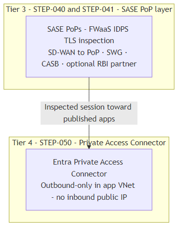
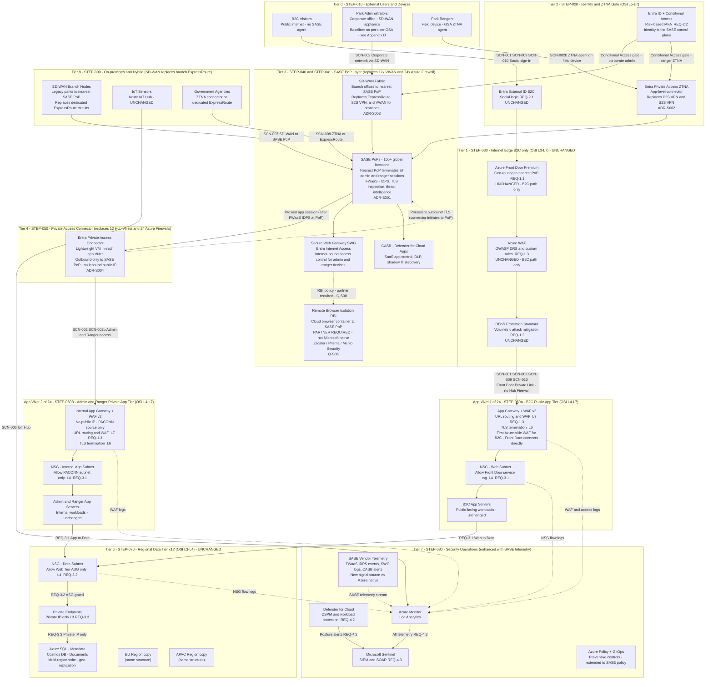
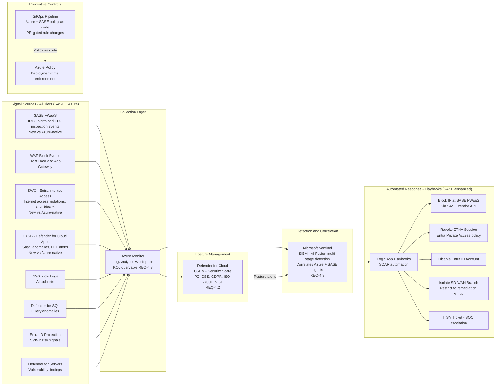

# GlobalParks - Cloud Network Security and Management
### SASE Architecture Design - Companion to DESIGN.md

| | |
|---|---|
| **Audience** | Security Architects, Network Team |
| **Cloud scope** | Microsoft Azure - SASE / SSE overlay |
| **Operations model** | Central Cloud SRE team + SASE vendor operations |
| **Status** | v1.23 - SASE iteration |
| **Last updated** | 2026-04-07 |
| **Companion document** | <a href="https://baskar-commits.github.io/globalparks-cloud-network-security/DESIGN.html" target="_blank" rel="noopener noreferrer">DESIGN.md</a> - Azure-native Hub-and-Spoke reference architecture |

---

## How to use this document

**SASE** companion to <a href="https://baskar-commits.github.io/globalparks-cloud-network-security/DESIGN.html" target="_blank" rel="noopener noreferrer"><code>DESIGN.md</code></a>: same GlobalParks story, but enforcement shifts from Azure hub firewalls toward **SASE at the edge**.

Use the **Table of Contents** below. Main sections stay readable; depth lives in **Appendices A–H**. Appendix sections link back when you need to return.

Optional: open <a href="sase-networking-flowchart.html" target="_blank" rel="noopener noreferrer"><strong>sase-networking-flowchart.html</strong></a> in a browser—the diagram uses the same **STEP** / **SCN** / **REQ** labels as this file.

---

## Table of Contents

1. [Executive Summary](#nav-section-1)
   - 1.1 [Glossary and Acronyms](#nav-section-1-1)
2. [Platform Context and Constraints](#nav-section-2)
3. [User Personas](#nav-section-3); [Appendix D (full detail)](#appendix-d---user-personas-full-detail)
4. [Security Architecture Overview](#nav-section-4); [Appendix E (full detail)](#appendix-e---security-architecture-overview-full-detail)
5. [Architecture Walkthrough](#nav-section-5); [Appendix F (STEP detail)](#appendix-f---architecture-walkthrough-step-detail)
6. [Scenario Traces](#nav-section-6); [Appendix G (full detail)](#appendix-g---scenario-traces-full-detail)
7. [Requirements summary](#nav-section-7) → full matrix in [Appendix H](#nav-appendix-h)
8. [Architectural Decisions](#nav-section-8)
9. [Open Questions](#nav-section-9)

**Appendices (A–H, in order in this file)**

- [Appendix A - Architecture Diagram (Mermaid Source)](#appendix-a---architecture-diagram-mermaid-source)
- [Appendix B - STEP-080 Security Operations Detail Diagram](#appendix-b---step-080-security-operations-detail-diagram)
- [Appendix C - Glossary (SASE extensions)](#appendix-c---glossary-and-acronyms-sase-extensions)
- [Appendix D - User Personas (full detail)](#appendix-d---user-personas-full-detail)
- [Appendix E - Security Architecture (full detail)](#appendix-e---security-architecture-overview-full-detail)
- [Appendix F - Architecture Walkthrough / STEP detail](#appendix-f---architecture-walkthrough-step-detail)
- [Appendix G - Scenario Traces (full detail)](#appendix-g---scenario-traces-full-detail)
- [Appendix H - Requirements Traceability (full detail)](#nav-appendix-h)

10. [Revision History](#nav-section-10)

---

## 1. Executive Summary

> **Interactive diagram**
> <a href="sase-networking-flowchart.html" target="_blank" rel="noopener noreferrer"><strong>sase-networking-flowchart.html</strong></a> uses the same **STEP** / **SCN** / **REQ** labels as this document (see **How to use** above).

---

**Before you read this section**

GlobalParks is the booking and operations platform for parks, rangers, visitors, and admin staff described in **`DESIGN.md`**. This document keeps that product and compliance story and compares **two ways to secure it**: inspection in **Azure hub** firewalls (the baseline in `DESIGN.md`) versus inspection at **SASE edge** PoPs before traffic reaches Azure (this document). If acronyms pile up (`ZTNA`, `FWaaS`, `SWG`, and so on), skim **[Appendix C](#appendix-c---glossary-and-acronyms-sase-extensions)** first or open the HTML flowchart and match **STEP** / **SCN** labels.

The business requirements, personas, compliance obligations, and data residency constraints are identical to **`DESIGN.md`**. What changes is **where and how security is enforced**.

In the Azure-native design, security inspection is **inside Azure**: 12 Hub VNets each hosting 2 Azure Firewall Premium instances (24 total), with traffic forced through them via Virtual WAN Routing Intent. In the SASE architecture, security inspection moves **outside Azure to the network edge**: a global network of SASE Points of Presence (PoPs) apply FWaaS, IDPS, TLS inspection, SWG, and CASB before traffic ever enters an Azure VNet. Azure's role becomes a clean backend, not a security enforcement hub.

The three foundational principles stay the same: **Zero Trust**, **defence in depth**, and **central governance with regional workload isolation**. Only the implementation moves from Azure-native building blocks to SASE-style cloud services.

**The biggest structural change:** **P2S** and **S2S** VPN Gateway paths and **Azure Virtual WAN** drop out of the privileged connectivity story. **Park Rangers** use a **ZTNA** client (**Entra Private Access**). **Corporate administrators** use **SD-WAN** into the nearest **SASE PoP**. Before traffic hits any Azure VNet, the PoP applies **FWaaS** (IDPS, TLS inspection, threat intelligence), **SWG** (**Entra Internet Access**), and **CASB** (**Defender for Cloud Apps**). If you need **RBI**, that is a **partner** capability (for example Zscaler, Prisma, or Menlo), because **Microsoft SSE** does not ship native RBI today. The twelve hub VNets and twenty-four **Azure Firewall** instances in the reference design go away under a pure SASE path.

**Design trade-off (administrators and ZTNA):** The baseline assumes admins on the **corporate LAN** reach SASE through **site-based SD-WAN**, not a **per-user GSA** client on every laptop. Private apps still flow through the **SASE PoP** and **Private Access Connector** with **Entra ID** and **Conditional Access**; rangers differ because they attach from the field with a user agent. That keeps rollout simpler and avoids a second client on standard desktops. It is **not** a claim that insider risk, LAN lateral movement, or compromised PCs are impossible. For a tighter story on optional **GSA** on admins, read [Administrators, ZTNA, and defense in depth](#administrators-ztna-and-defense-in-depth-design-trade-off) in **[Appendix D](#appendix-d---user-personas-full-detail)** and the short note in [Section 3](#nav-section-3), plus [Q-S09](#nav-section-9).

**What does not change:** B2C public visitor traffic continues to use Azure Front Door Premium as the internet edge - Front Door is itself a SASE-class edge service and is not replaced. The data tier (Private Endpoints, Azure SQL, Cosmos DB) is unchanged. Microsoft Sentinel, Defender for Cloud, and Azure Policy remain the security operations and governance layer, enriched with additional SASE vendor telemetry.

### Executive Summary - Key Differences at a Glance

These **grouped tables** are the Azure-native versus SASE comparison for executives. Read the blocks in order, or jump to the group you care about. **[Section 2](#nav-section-2-delivery)** adds only **delivery and operations** constraints (ExpressRoute, availability targets, hybrid patterns, who runs what) without repeating the rows below.

Quick jump: [Connectivity](#key-differences-connectivity) · [Footprint](#key-differences-footprint) · [Policy / SaaS / B2C](#key-differences-policy) · [Vendor / compliance / commercial](#key-differences-vendor-compliance)

#### 1. Connectivity and access paths

| Aspect | Azure-native (DESIGN.md) | SASE (this document) | Reasoning |
|---|---|---|---|
| **Admin connectivity** | ExpressRoute (primary) + S2S VPN → VWAN → Hub Firewall | SD-WAN → nearest SASE PoP → FWaaS → Private Access Connector | No dedicated circuit needed; any broadband underlay works |
| **Ranger connectivity** | P2S VPN client → VWAN → Hub Firewall | ZTNA agent (Entra Private Access) → nearest SASE PoP | App-level access replaces network tunnel; per-app policy |
| **Admin ZTNA client (GSA)** | N/A (ExpressRoute / VPN path) | **Baseline:** optional - SD-WAN site path without per-user GSA; **Hardening:** GSA on admins for same app-level segmentation as rangers ([Appendix D](#appendix-d---user-personas-full-detail)) | Connectivity story vs least-privilege on the endpoint |
| **B2C connectivity** | Front Door → Hub Firewall (public IP) → App Gateway | Front Door → App Gateway directly (Private Link) | B2C path unchanged in principle; Hub Firewall hop eliminated |

#### 2. Inspection location and Azure network footprint

| Aspect | Azure-native (DESIGN.md) | SASE (this document) | Reasoning |
|---|---|---|---|
| **Security perimeter for admin/ranger** | Azure Hub VNets + 24x Azure Firewall Premium | SASE PoPs - FWaaS in cloud | Inspection moves to the edge; Azure becomes a clean backend |
| **Hub VNets** | 12 (one per region) | 0 - eliminated | SASE PoP + Private Access Connector replaces Hub VNet function |
| **Workload VNets** | 24 (2 per region - B2C + Admin/Ranger) | 24 (same pairing) | Regional app footprint unchanged; hub inspection layer removed |
| **Firewall instances in Azure** | 24 Azure Firewall Premium | 0 in Azure - FWaaS at SASE PoP | Firewall is cloud-delivered, not VNet-deployed |
| **Azure Virtual WAN** | 12 separate instances (Option B, ADR-004) | Eliminated - SASE PoP fabric replaces it | SASE vendor's global PoP network is the WAN fabric |
| **VPN Gateways** | 12x S2S + 12x P2S via VWAN | Eliminated - replaced by SD-WAN and ZTNA | Connectivity method changes fundamentally |

#### 3. Policy, SaaS, and B2C inspection depth

| Aspect | Azure-native (DESIGN.md) | SASE (this document) | Reasoning |
|---|---|---|---|
| **Policy management** | Azure Firewall Manager + GitOps | SASE vendor policy console + Azure Policy + GitOps | Security policy split across SASE platform and Azure |
| **CASB (SaaS governance)** | Partial (FQDN allow lists, Sentinel alerts) | **Defender for Cloud Apps** at SASE edge - shadow IT, SaaS session policy, DLP on SaaS | **Enhanced** - explicit CASB vs firewall-only SaaS hints in Azure-native |
| **B2C IDPS coverage** | Hub Firewall IDPS on B2C path | Front Door WAF + App Gateway WAF v2 only - no IDPS | Accepted trade-off; documented in ADR-S004 |

#### 4. Vendor, compliance, and commercial

| Aspect | Azure-native (DESIGN.md) | SASE (this document) | Reasoning |
|---|---|---|---|
| **SASE vendor dependency** | None - 100% Azure-native | SASE vendor (Microsoft SSE or Zscaler/Prisma) | New operational dependency; vendor selection matters |
| **Compliance (GDPR)** | Data stays in Azure regions always | SASE PoP traffic transit requires data residency scrutiny | PoP routing must be constrained to compliant regions |
| **Cost model** | Azure Firewall Premium per-instance + VWAN | SASE per-user licensing + reduced Azure costs | Different cost structure - evaluate at scale |
| **Remote Browser Isolation (RBI)** | Not present | RBI at SASE PoP - **partner required** (Zscaler, Prisma, Menlo) | Microsoft SSE has no native RBI; gap for PCI-DSS-scoped admin/ranger browser sessions |

---

### 1.1 Glossary and Acronyms

This document extends the Glossary in `DESIGN.md` Section 1.1. **SASE-specific terms and acronyms** (SSE, ZTNA, FWaaS, GSA vs Entra Private Access, RBI, and so on) are in **[Appendix C - Glossary and Acronyms (SASE extensions)](#appendix-c---glossary-and-acronyms-sase-extensions)**.

---

## 2. Platform Context and Constraints

The platform context is largely unchanged. GlobalParks is a hybrid architecture from day one, with the same 12-region footprint, same compliance obligations, same on-premises integration requirements, and same Central SRE team.

The key contextual shift is that SASE **redistributes responsibility**: the Central SRE team no longer manages 24 Azure Firewall instances and 12 VWAN hubs. Instead, they co-manage Azure Policy and GitOps (unchanged) alongside the SASE vendor's policy console (new). This changes the operational model and requires new skill sets around SASE platforms.

**Inventory and path-level comparison** (topology counts, firewall, VWAN, VPN, vendor, GDPR, connectivity paths, CASB, cost, and so on) lives in **[Section 1 - Key Differences at a Glance](#key-differences-at-a-glance)** (four short tables by topic). The short list below **adds** delivery and operations detail only.

### Platform delivery and operations (beyond Section 1)

| Constraint | Azure-native (DESIGN.md) | SASE (this document) | Reasoning |
|---|---|---|---|
| **ExpressRoute** | Required for admin connectivity (4-8 wk lead time) | Optional - only for government agency integration | SD-WAN removes the need for dedicated circuits for branches |
| **RTO / RPO** | RTO 5 min, RPO 15 min | Same targets - SASE PoP HA + connector HA must be designed | SASE vendor SLA and connector redundancy must meet RTO |
| **On-premises systems** | Legacy via ExpressRoute; IoT via IoT Hub; Gov via ExpressRoute | Legacy via SD-WAN; IoT via IoT Hub (unchanged); Gov via ZTNA or ExpressRoute | SD-WAN replaces dedicated ExpressRoute circuits for legacy branches |
| **Operational model** | Azure-only; SRE owns Firewall Manager + GitOps | Azure + SASE vendor; SRE co-manages SASE console + GitOps | New platform to operate; vendor's SRE support is co-responsibility |

---

## 3. User Personas

Personas and compliance context match `DESIGN.md`; **connectivity and access granularity** change for administrators and rangers. **Full narrative:** ZTNA vs VPN, administrator **SD-WAN vs GSA** trade-off, and Conditional Access nuance are in **[Appendix D - User Personas (full detail)](#appendix-d---user-personas-full-detail)**.

| Persona | Identity (unchanged) | Azure-native connectivity | SASE connectivity | Key difference |
|---|---|---|---|---|
| **B2C Visitor** | Entra External ID - social login | Front Door → Hub Firewall → B2C Spoke | Front Door → App Gateway directly | Hub Firewall hop removed from B2C path |
| **Park Administrator** | Entra ID + Conditional Access + MFA | Corporate LAN → ExpressRoute → VWAN → Hub Firewall → Spoke | Corporate LAN → SD-WAN → SASE PoP → FWaaS → Private Access Connector → Spoke | No dedicated circuit; **baseline** no GSA on device; optional hardening in Appendix D |
| **Park Ranger** | Entra ID + Conditional Access + MFA + risk-based | Field device → P2S VPN client → VWAN → Hub Firewall → Spoke | Field device → GSA ZTNA agent → SASE PoP → FWaaS → Private Access Connector → Spoke | App-level access replaces network tunnel; per-app policy at PoP |

---

## 4. Security Architecture Overview

GlobalParks stays an **eight-tier** security model (same tier numbers as `DESIGN.md` and **[Appendix A](#appendix-a---architecture-diagram-mermaid-source)**). **Tiers T3 and T4** are where the SASE design diverges: **SASE PoP** services replace **Virtual WAN, VPN gateways, and hub firewalls**; the **Private Access Connector** becomes the in-VNet anchor for admin and ranger traffic. **T1** (B2C internet edge) and **T6** (data tier) stay aligned with `DESIGN.md`; other tiers gain or lose components around that spine.

**Full detail** (every tier, Azure-native vs SASE, OSI mapping, detection and prevention) is in **[Appendix E](#appendix-e---security-architecture-overview-full-detail)**. **Step-by-step traffic** for the PoP and connector is in **[Appendix F](#appendix-f---architecture-walkthrough-step-detail)** (**STEP-040**, **STEP-041**, **STEP-050**).

### T3 and T4 in the diagram (subset)

The interactive diagram is <a href="sase-networking-flowchart.html" target="_blank" rel="noopener noreferrer"><strong>sase-networking-flowchart.html</strong></a> (same Mermaid structure as Appendix A, with filters and walkthroughs).

**In the flowchart:** open the file in a browser, choose the **Tier** tab, then select **Tier 3** and **Tier 4** in turn to isolate those layers. For end-to-end context, use **Walkthrough** (Admin SD-WAN or Ranger ZTNA) so T3 and T4 appear in path order.

This **PNG** is generated from the **Tier 3** and **Tier 4** subgraphs (and edges between those nodes) inside <a href="sase-networking-flowchart.html" target="_blank" rel="noopener noreferrer"><strong>sase-networking-flowchart.html</strong></a>, so the figure tracks the live flowchart. The full eight-tier Mermaid source is still in **[Appendix A](#appendix-a---architecture-diagram-mermaid-source)**.

**After you change Tier 3 or Tier 4** in `sase-networking-flowchart.html`, regenerate the image from the repo root:

`node scripts/export-sase-section4-diagram.cjs`

That script writes `docs/diagrams/sase-section4-t3-t4.mmd` (for debugging) and updates `docs/images/sase-section4-t3-t4.png`. Commit the PNG when the flowchart changes.

### Where to go for more than this section

**Section 4** on purpose only orients you (eight tiers, T3/T4 swap, figure, flowchart). **Appendix E** holds the long tables. Use the map below to open **one** appendix subsection that matches what you are trying to answer, instead of reading all of Appendix E every time.

| Your question or goal | Open this |
|---|---|
| See the **full** eight-tier picture (diagram or interactive) | [Appendix A](#appendix-a---architecture-diagram-mermaid-source) Mermaid, or <a href="sase-networking-flowchart.html" target="_blank" rel="noopener noreferrer"><strong>sase-networking-flowchart.html</strong></a> with no Tier filter |
| **Per tier:** what Azure-native had vs what SASE does (inventory-style) | [Appendix E §4.1](#appendix-e-41-n-tier-architecture-diagram) tier-by-tier comparison |
| **OSI:** which layer is enforced where after SASE | [Appendix E §4.2](#appendix-e-42-osi-layer-control-mapping) |
| **Security ops:** detection vs prevention by tier, telemetry | [Appendix E §4.3](#appendix-e-43-detection-and-prevention-by-tier) |

---

## 5. Architecture Walkthrough

Same **STEP-###** sequence as `DESIGN.md` Section 5. **Full step narratives, comparison tables, and SCN cross-links** are in **[Appendix F - Architecture Walkthrough (STEP detail)](#appendix-f---architecture-walkthrough-step-detail)**.

| Step | Title | Description |
|---|---|---|
| [STEP-010](#nav-step-010) | Users and Personas | Visitors, admins, and rangers; rangers run **GSA**; many admins rely on site **SD-WAN** without mandatory per-laptop ZTNA. |
| [STEP-020](#nav-step-020) | Identity and Access | **Entra ID** and **Conditional Access** unchanged in intent; **Entra Private Access** adds an app-level gate under the same policies. |
| [STEP-040](#nav-step-040) | Connectivity - Administrators (SD-WAN → SASE PoP) | Office **SD-WAN** picks the best underlay to the nearest **PoP**; **FWaaS** inspects before the **Private Access Connector** reaches internal **App Gateway**. |
| [STEP-041](#nav-step-041) | Connectivity - Rangers (ZTNA) | **GSA** on the device opens TLS to the **PoP** (not a routed VPN); only **published** apps reach Azure via the connector. |
| [STEP-030](#nav-step-030) | Internet Edge and Global Routing | **B2C** stays on **Front Door** + **WAF** + **DDoS**; visitors use **Private Link** to **App Gateway**; admin and ranger web use **SWG** at the **PoP**. |
| [STEP-050](#nav-step-050) | SASE PoP and Private Access Connector | **FWaaS** at the **PoP** replaces hub **Azure Firewall** choke points; **connector** is outbound-only inside each admin and ranger app VNet. |
| [STEP-060A](#nav-step-060a) | B2C App VNet - Public Web Tier | **App Gateway** + **WAF v2**; **NSG** allows **Front Door** service tag instead of hub firewall IPs; dual WAF is the main visitor **L7** story. |
| [STEP-060B](#nav-step-060b) | Admin/Ranger App VNet - Internal App Tier | **Internal App Gateway** + **WAF v2**; trusted source is the **PACONN** subnet after the **PoP** brokers the session. |
| [STEP-070](#nav-step-070) | Regional Data Tier | **Private Endpoints**, **SQL**, **Cosmos DB**, **ASG**-aware **NSGs**; **unchanged** from `DESIGN.md`; **SASE** does not sit on app-to-data hops. |
| [STEP-080](#nav-step-080) | Security Operations and Governance | **Sentinel**, **Defender for Cloud**, **Monitor**, **Azure Policy** plus **GitOps**; add **FWaaS**, **SWG**, and **CASB** logs and **PoP**-aware playbooks. |
| [STEP-090](#nav-step-090) | On-premises and Hybrid Systems | Legacy branches use **SD-WAN** to the **PoP** instead of **ExpressRoute** tails; **IoT Hub** and **Arc** unchanged; partners via **ZTNA** or **ExpressRoute**. |

---

## 6. Scenario Traces

**Full step-by-step traces** (with **Back to Section 6** and **Back to STEP** links) are in **[Appendix G - Scenario Traces (full detail)](#appendix-g---scenario-traces-full-detail)**.

| Scenario | Summary | Description |
|---|---|---|
| [SCN-001](#nav-scn-001) | Public visitor - B2C path without Hub Firewall | External ID sign-in; **Front Door** + **App Gateway** **WAF**; **Private Link** to **App Gateway**; **Cosmos** via **Private Endpoint**; no hub **IDPS** hop. |
| [SCN-002](#nav-scn-002) | Administrator via SD-WAN and SASE | HQ admin updates capacity; **SD-WAN** to **PoP**, **FWaaS**, **connector**, internal **App Gateway**; baseline without per-user **GSA** (see **Appendix D** / **Q-S09**). |
| [SCN-002b](#nav-scn-002b) | Ranger via ZTNA | Field ranger with **GSA**; TLS to **PoP**; published trail app only through **connector**; no **VNet** VPN route table on the device. |
| [SCN-003](#nav-scn-003) | DDoS and SQLi on public endpoints | Attacker hits **B2C** edge; **DDoS Standard** and **Front Door** **WAF** block; events to **Sentinel** and block-list playbook. |
| [SCN-004](#nav-scn-004) | Cross-region admin traffic via SASE fabric | Admin session enters **Americas** **PoP**; vendor fabric hands off to **Europe** **PoP** and local **connector**; no **VWAN** region pair. |
| [SCN-005](#nav-scn-005) | SOC multi-stage attack with SASE telemetry | **Sentinel** fusion on **Entra** risk, **PoP** **FWaaS** / **IDPS**, and **Defender for SQL**; playbooks can revoke **ZTNA** and block at **PoP**. |
| [SCN-006](#nav-scn-006) | IoT telemetry (unchanged) | Sensor to **IoT Hub** path identical to `DESIGN.md`; **SASE** does not reshape this flow. |
| [SCN-007](#nav-scn-007) | Legacy sync via SD-WAN | Branch batch to **SQL** via **SD-WAN** → **PoP** → **connector**; same job behaviour, faster WAN bring-up than dedicated **ExpressRoute**. |
| [SCN-008](#nav-scn-008) | Government agency access | Partner **ZTNA** / connector and **B2B**; **FWaaS** + internal **WAF** scope read-only APIs to **Private Endpoint** **SQL**. |
| [SCN-009](#nav-scn-009) | Sydney visitor / Great Barrier Reef | Regional **B2C** example (**Australia East**); sub-100 ms; hub firewall hop removed; rest matches `DESIGN.md` intent. |
| [SCN-010](#nav-scn-010) | Sydney visitor / Yosemite | Cross-region **B2C** booking; **Cosmos** multi-region write unchanged; visitor still served from **Australia East** **App Gateway**. |

---

## 7. Requirements traceability (summary)

This section is the **short view** only (legend + coverage snapshot). **Every** detailed table—the full REQ-by-REQ matrix, TCO and cost comparisons, governance notes, and vendor summary—is in **[Appendix H](#nav-appendix-h)** only. Follow that link when you need the audit-ready pack.

### Legend

| Symbol | Meaning |
|---|---|
| ✅ **Native** | Microsoft products in M365 E3/E5 or Azure with no extra SASE vendor |
| ⚠️ **Partial** | Microsoft covers the capability with documented limits |
| ❌ **Gap** | Needs third-party SASE/FWaaS, SD-WAN partner, or hybrid Azure component |

### Coverage at a glance

| Area | Microsoft SSE / Azure (summary) | Typical gap or partner |
|---|---|---|
| B2C edge (REQ-1.x) | Front Door, WAF, DDoS (**unchanged**) | None |
| Identity / ZTNA (REQ-2.x) | Entra ID, CA, Entra Private Access, **enhanced** for app scope | None |
| Ranger internet / SWG | Entra Internet Access | ⚠️ L7 HTTP/S only; no PoP IDPS; add FWaaS partner or hybrid |
| CASB / SaaS | Defender for Cloud Apps | ⚠️ Non-Microsoft SaaS depth vs specialist CASB |
| Privileged IDPS (REQ-4.1 admin/ranger) | Not in Microsoft SSE alone | ❌ Zscaler / Prisma / Cloudflare FWaaS or hybrid Azure Firewall |
| B2C IDPS (REQ-4.1) | WAF only on B2C path | ❌ Accepted trade-off (ADR-S004); hybrid Firewall if required |
| Branch WAN (REQ-4.1) | No native SD-WAN | ❌ Validated SD-WAN partner |
| Segmentation / data (REQ-3.x) | NSG, ASG, Private Endpoints | None (**unchanged**) |
| Posture / SIEM (REQ-4.2, 4.3) | Defender for Cloud, Sentinel | ⚠️ SASE telemetry via connector (native for Microsoft SSE) |
| DLP (REQ-DLP) | Purview + CASB + SWG | ⚠️ Non-Microsoft SaaS at scale |
| RBI (REQ-RBI) | Not native in Microsoft SSE | ❌ Partner RBI (Q-S08) |

---

## 8. Architectural Decisions

---

### ADR-S001 - SASE Vendor Selection: Microsoft SSE vs Third-Party

**Status:** Microsoft SSE (Entra Internet Access + Entra Private Access + Defender for Cloud Apps) preferred for initial deployment. Third-party evaluation triggered if conditions below are met.

**Microsoft SSE rationale:**
- Native Entra ID integration - Conditional Access policies evaluated inline with ZTNA session establishment
- Single agent (Global Secure Access) for both private access (ZTNA) and internet access (SWG)
- Defender for Cloud Apps (CASB) already in Microsoft E5 licensing - no additional vendor
- Sentinel native connector - no API integration required for telemetry ingestion
- SD-WAN: Microsoft does not have a native SD-WAN product; requires a partner (Barracuda SecureEdge, VMware SD-WAN, Cisco Meraki) with Microsoft-validated SASE integration

**Third-party SASE evaluation triggers:**
- Requirement for a single-vendor SD-WAN + SSE platform (Zscaler, Palo Alto Prisma Access, Cloudflare One)
- FIPS 140-2 certified FWaaS is required by a compliance framework
- PoP count or geographic coverage of Microsoft SSE is insufficient for specific regional latency requirements
- Advanced UEBA or DLP capabilities beyond Microsoft's current SSE feature set are required

| Factor | Microsoft SSE | Zscaler (ZIA + ZPA) | Palo Alto Prisma Access |
|---|---|---|---|
| Entra ID integration | Native | API-based | API-based |
| SD-WAN | Partner-required | Native (ZDX) | Native (Prisma SD-WAN) |
| PoP count | 100+ (Global Secure Access network) | 150+ | 100+ |
| Sentinel integration | Native connector | Syslog/API | API |
| Licensing model | Per user, included in E5/F5 (SSE) | Per user, additional cost | Per user, additional cost |
| Single-vendor | No (SD-WAN partner needed) | Yes | Yes |

---

### ADR-S002 - Entra Private Access (ZTNA) over VPN Gateway for Rangers

**Status:** Accepted

**Decision:** Replace P2S VPN Gateway with Entra Private Access (ZTNA) for ranger field access.

**Rationale:**
- ZTNA provides per-application access scope - a ranger can only reach explicitly published apps, not any VNet resource. P2S VPN gives a ranger a routed IP in the VNet, relying entirely on Firewall rules to restrict lateral movement.
- ZTNA session is established after Conditional Access evaluation - if risk score is High, the session is denied before any network connection is made. P2S VPN blocks happen at the Firewall after the tunnel is established.
- No VPN Gateway infrastructure to manage, patch, or scale. SASE PoP availability is the vendor's SLA.
- GSA agent replaces the Azure VPN client - single client for both private access and internet access.

**Trade-offs:**
- ZTNA requires the GSA agent to be installed and maintained on all ranger devices (Intune-managed - achievable).
- SASE vendor PoP availability becomes a dependency for ranger connectivity (SLA must be evaluated against RTO requirement).
- Offline-first scenarios (rangers in areas with no internet at all) require a fallback - this is unchanged from P2S VPN, which also requires internet connectivity.

**Corporate administrators (baseline):** This ADR does **not** require GSA on every admin PC. Admins reach the same PoP and **Private Access Connector** path via **SD-WAN** (ADR-S003). The **endpoint** trade-off (whether to add **GSA** on admins for app-level parity and insider-threat reduction) is documented in [Appendix D](#administrators-ztna-and-defense-in-depth-design-trade-off) and **Q-S09**.

---

### ADR-S003 - SD-WAN over ExpressRoute for Branch Office Connectivity

**Status:** Accepted

**Decision:** Replace dedicated ExpressRoute circuits for legacy park and corporate branch offices with SD-WAN connected to SASE PoPs.

**Rationale:**
- ExpressRoute requires 4-8 week provider lead time and a contractual commitment per-circuit. SD-WAN can be deployed over existing internet connections within days.
- SD-WAN provides automatic failover across multiple underlinks (broadband + 4G + MPLS). ExpressRoute requires redundant circuits and BGP failover configuration for the same resilience.
- SD-WAN eliminates the VWAN dependency - branch traffic goes to the nearest SASE PoP rather than to an Azure-specific endpoint.

**Retained for:** Government agencies with existing ExpressRoute contracts or regulatory requirements that prohibit SD-WAN-over-internet for sensitive data.

---

### ADR-S004 - Hub VNet Elimination and B2C IDPS Trade-off

**Status:** Accepted - trade-off documented

**Decision:** Eliminate 12 Hub VNets and 24 Azure Firewall Premium instances. For admin/ranger traffic, FWaaS at the SASE PoP provides equivalent IDPS and TLS inspection. For B2C traffic, Front Door WAF (Layer 7) and App Gateway WAF v2 provide two WAF layers but no IDPS (signature-based stateful inspection).

**The trade-off:** In the Azure-native design, B2C traffic passed through Azure Firewall Premium IDPS after Front Door. This provided signature-based threat detection (2,500+ signatures) on the B2C path in addition to WAF. In the SASE design, this layer is absent from the B2C path because:
- B2C traffic enters via Front Door Private Link directly to App Gateway - no Hub Firewall is in the path.
- SASE FWaaS at PoPs is in the admin/ranger path, not the B2C path (SASE is identity-centric and B2C visitors do not have SASE agents).

**Why this trade-off is accepted:**
- B2C traffic is HTTP/HTTPS-only. The attack surface is L7 web application attacks (SQL injection, XSS, OWASP Top 10) - which WAF covers comprehensively.
- Non-HTTP protocols (where IDPS adds the most value vs. WAF) are not present on the B2C path.
- Front Door WAF (global, DRS ruleset) + App Gateway WAF v2 (application-specific rules) provide two independent inspection layers.
- Sentinel correlation and Defender for Cloud Apps provide compensating detective controls.

**Mitigation if IDPS is required on B2C path:** A single lightweight Azure Firewall Standard (not Premium) instance per region could be added in front of the App Gateway as an IDPS proxy - this would be a hybrid approach, not pure SASE. Documented as a future option.

---

### ADR-S005 - GDPR Data Residency and SASE PoP Routing

**Status:** Open - requires vendor confirmation

**Issue:** GDPR requires that EU visitor data (PII, reservation data) does not transit non-EU infrastructure. In the Azure-native design, all EU traffic stays within EU Azure regions by design. In the SASE design, EU admin and ranger sessions transit SASE PoPs - the SASE vendor must be configured to restrict EU user sessions to EU PoPs only.

**Required action before SASE production deployment in EU regions:**
- Confirm SASE vendor's EU-only routing configuration capability (geo-fenced PoP selection)
- Review SASE vendor's data processing agreements for GDPR compliance
- Validate that SASE vendor's EU PoPs are covered by adequate data residency certifications
- Document EU-specific SASE routing policy in the network design

---

## 9. Open Questions

| ID | Question | Why it matters | Owner | Status |
|---|---|---|---|---|
| Q-S01 | Which SD-WAN partner for Microsoft SSE integration? | Microsoft SSE requires an SD-WAN partner; vendor affects PoP integration, routing policy, and SLA | Network team / Procurement | **Open** |
| Q-S02 | GDPR compliance for SASE PoP routing (EU users) | EU admin/ranger sessions must not transit non-EU PoPs | Legal / Network team | **Open - ADR-S005** |
| Q-S03 | SASE PoP latency SLA vs ExpressRoute - latency-sensitive workloads? | Some admin workloads may require sub-10ms latency (e.g. real-time telemetry dashboards) | Architecture / Network team | **Open** |
| Q-S04 | SASE per-user licensing cost vs. Azure Firewall Premium + VWAN cost at GlobalParks scale? | Cost model changes from instance-based to per-user; total cost depends on user count and tier | Finance / SRE | **Open** |
| Q-S05 | Government agency integration - ZTNA connector or retain ExpressRoute? | Agency operational constraints may not allow GSA agent installation in their network | Network team / Agency IT | **Open** |
| Q-S06 | Private Access Connector redundancy - how many connectors per App VNet for RTO? | PACONN is in the critical path for admin/ranger access; single connector = single point of failure | SRE | **Open** |
| Q-S07 | SASE PoP telemetry ingestion format for Sentinel - native connector or Syslog? | Affects telemetry latency, fidelity, and Sentinel cost | SRE / SOC | **Open - depends on ADR-S001 vendor selection** |
| Q-S08 | Is Remote Browser Isolation (RBI) required for ranger and admin endpoints by PCI-DSS scope or accepted as a risk gap? | Rangers and admins access external portals while holding active ZTNA sessions to payment-adjacent systems. A browser-borne compromise on such a device is a higher-risk event. PCI-DSS DSS v4.0 Req 5 (malware protection) and Req 6 (secure systems) may require RBI for in-scope endpoints. Microsoft SSE has no native RBI - a third-party vendor is required. If not mandated, Microsoft Edge for Business session controls + Defender for Endpoint are the fallback compensating controls. | Security Architect / Compliance | **Open** |
| Q-S09 | Should GlobalParks require **GSA / Entra Private Access on corporate administrator devices** (not only SD-WAN site path) for defense in depth? | Baseline design uses **SD-WAN to PoP** without mandatory **per-user GSA** on admin laptops. Threats from **inside the corporate network** and **lateral movement** argue for **optional or mandatory GSA** on privileged admins, **micro-segmentation**, or **PAW**. See [Appendix D](#appendix-d---user-personas-full-detail). Decision affects client rollout, helpdesk, and blast-radius story. | Security Architect / IAM | **Open** |

---

## Appendix A - Architecture Diagram (Mermaid Source)

The Mermaid source below generates the SASE eight-tier architecture diagram. Each tier lines up with a `STEP-###` in [Appendix F](#appendix-f---architecture-walkthrough-step-detail); [Section 5](#nav-section-5) is the short index.

### How to view or export this diagram

| Method | How |
|---|---|
| **GitHub (online)** | GitHub renders Mermaid natively - diagram displays automatically |
| **Interactive browser** | Open <a href="sase-networking-flowchart.html" target="_blank" rel="noopener noreferrer"><code>sase-networking-flowchart.html</code></a> - full filtering and SASE-specific walkthroughs |
| **Mermaid Live Editor** | Copy the code block and paste at [mermaid.live](https://mermaid.live) |

---

---

## Appendix B - STEP-080 Security Operations Detail Diagram

The diagram below shows the full signal-to-response flow for the SASE Security Operations tier. The key addition versus `DESIGN.md` Appendix B is the **SASE Vendor Telemetry** input.

## Appendix C - Glossary and Acronyms (SASE extensions)

← [Back to Section 1.1](#nav-section-1-1)

### Glossary and Acronyms (full table)

This section extends the Glossary in `DESIGN.md` Section 1.1. All original terms (ADR, ASG, B2C, IDPS, etc.) remain valid. The following terms are specific to the SASE architecture.

| Acronym / Term | Full name | Brief description |
|---|---|---|
| **SASE** | Secure Access Service Edge | Gartner-coined architecture combining SD-WAN (network) and SSE (security) into a unified cloud-delivered service. Security is delivered from the edge, not from data centre appliances. |
| **SSE** | Security Service Edge | The security half of SASE: SWG + CASB + ZTNA. Microsoft's SSE offering comprises Entra Internet Access, Entra Private Access, and Defender for Cloud Apps. |
| **ZTNA** | Zero Trust Network Access | An alternative to VPN that provides per-application access rather than network-level access. Users connect to a SASE PoP; the PoP proxies access to specific apps. The user never gets a routed IP into the network. |
| **SWG** | Secure Web Gateway | A cloud-delivered proxy for internet-bound traffic. Enforces acceptable-use policy, TLS inspection, URL filtering, and malware scanning for admin and ranger devices. Microsoft product: Entra Internet Access. |
| **FWaaS** | Firewall as a Service | A cloud-delivered firewall running at SASE PoPs, providing IDPS, TLS inspection, threat intelligence IP/domain blocking, and application-layer policy - the cloud equivalent of Azure Firewall Premium. |
| **CASB** | Cloud Access Security Broker | A security policy enforcement point between users and SaaS applications. Provides visibility into shadow IT, DLP, session controls, and access governance. Microsoft product: Defender for Cloud Apps. |
| **SD-WAN** | Software-Defined Wide Area Network | Software-defined overlay network that uses any underlay (MPLS, broadband, 4G/5G) to connect branch offices to the nearest SASE PoP. Replaces dedicated MPLS or ExpressRoute circuits for branch connectivity. |
| **SASE PoP** | SASE Point of Presence | A globally distributed edge node operated by the SASE vendor. Terminates user connections (ZTNA, SD-WAN), applies FWaaS and SWG inspection, and proxies traffic to the target application. Microsoft Global Secure Access, Zscaler, and Palo Alto Prisma Access all operate global PoP networks (100+ locations). |
| **Private Access Connector** | Entra Private Access Connector | A lightweight VM or container deployed inside an Azure VNet (or on-premises). It maintains a persistent outbound connection to the SASE PoP, allowing the PoP to proxy authenticated, inspected user sessions to private apps - without any inbound public IP or firewall rule on the VNet. |
| **Entra Private Access (service)** | Microsoft Entra Private Access | The **cloud service** (control plane + PoP integration) that defines ZTNA app segments, policies, and connector registration. Not installed on the device; it is what the GSA agent and connectors talk to. |
| **GSA** | Global Secure Access | The **client software** on Windows or macOS that implements Microsoft's SSE on the endpoint. It is the user-facing agent that tunnels private app traffic to Entra Private Access (ZTNA) and internet traffic to Entra Internet Access (SWG). **GSA is not the same as Entra Private Access:** Entra Private Access is the service; GSA is one way users consume it (see row above). |
| **Microsoft SSE** | Microsoft Security Service Edge | Microsoft's current SSE product: Entra Internet Access (SWG) + Entra Private Access (ZTNA) + Defender for Cloud Apps (CASB). The SD-WAN element is provided through Microsoft's network partner ecosystem. |
| **Private Link Origin** | Azure Front Door Private Link Origin | A Front Door Premium feature allowing the origin backend (e.g. App Gateway) to have a private IP with no public-facing endpoint. Front Door connects to the App Gateway via Private Link, removing the need for a public IP on the App Gateway. |
| **DLP** | Data Loss Prevention | Controls that detect and block sensitive data (PII, financial data, credentials) from leaving an authorised perimeter. Available in CASB and SWG platforms. |
| **UEBA** | User and Entity Behaviour Analytics | Machine-learning-driven detection of anomalous user behaviour compared to a historical baseline. Available in Microsoft Sentinel and some SASE vendors. |
| **RBI** | Remote Browser Isolation | A SASE security capability that executes web browsing inside a cloud-hosted browser container at the SASE PoP. Only a pixel-stream (or DOM-reconstructed rendering) is sent to the user's device - the actual web content never reaches the endpoint. Prevents browser-borne malware, zero-day exploits, and credential phishing at the point of rendering. **Microsoft SSE does not include native RBI today** - a third-party vendor (Zscaler Cloud Browser Isolation, Palo Alto Prisma Browser Isolation, Menlo Security) is required if RBI is mandated. |

---

## Appendix D - User Personas (full detail)

← [Back to Section 3](#nav-section-3)

The three personas remain identical in terms of identity, trust level, and compliance requirements. What changes is the **connectivity mechanism** for administrators and rangers, and the **access granularity** ZTNA provides compared to VPN.

| Persona | Identity (unchanged) | Azure-native connectivity | SASE connectivity | Key difference |
|---|---|---|---|---|
| **B2C Visitor** | Entra External ID - social login | Front Door → Hub Firewall → B2C Spoke | Front Door → App Gateway directly | Hub Firewall hop removed from B2C path |
| **Park Administrator** | Entra ID + Conditional Access + MFA | Corporate LAN → ExpressRoute → VWAN → Hub Firewall → Spoke | Corporate LAN → SD-WAN → SASE PoP → FWaaS → Private Access Connector → Spoke | No dedicated circuit; SASE PoP is the chokepoint; **baseline** no GSA on device; optional hardening below |
| **Park Ranger** | Entra ID + Conditional Access + MFA + risk-based | Field device → P2S VPN client → VWAN → Hub Firewall → Spoke | Field device → GSA ZTNA agent → SASE PoP → FWaaS → Private Access Connector → Spoke | App-level access replaces network tunnel; per-app policy enforced at PoP |

### ZTNA vs VPN - What changes for Rangers

The shift from P2S VPN to ZTNA is the most operationally significant persona change. The table below captures the practical differences:

| Factor | P2S VPN (Azure-native) | ZTNA - Entra Private Access (SASE) | Why it matters |
|---|---|---|---|
| **Access scope** | Network-level - ranger gets a routed IP into the VNet | App-level - ranger reaches only explicitly permitted apps | ZTNA enforces least-privilege at the access layer, not just at the Firewall |
| **Client software** | Azure VPN client with P2S profile | Global Secure Access (GSA) agent | Single agent replaces both VPN and SWG clients |
| **Authentication** | Entra ID credentials + device certificate | Entra ID credentials + device compliance (Conditional Access) | Same identity plane; ZTNA integrates tighter with CA signals |
| **Session establishment** | Tunnel to VPN Gateway (full network route) | TLS session to nearest SASE PoP (proxy, not tunnel) | No network route established; blast radius of credential compromise reduced |
| **Lateral movement risk** | Ranger VPN session can reach any VNet resource permitted by Firewall rules | Ranger can only reach explicitly published apps | Lateral movement is architecturally impossible beyond published app boundaries |
| **Internet traffic** | Separate from VPN (split tunnel or force-tunnel) | Routed through SWG at SASE PoP (Entra Internet Access) | Unified internet + private access through single agent and policy |
| **Offline resilience** | VPN re-establishes automatically | ZTNA agent re-connects to nearest PoP automatically | Both are resilient; ZTNA PoP availability replaces VPN Gateway availability |

### Administrators, ZTNA, and defense in depth (design trade-off)

ZTNA (Entra Private Access via **GSA** on the device) enforces **application-level** reachability: the user does not receive a full routed corporate path into Azure; only **published applications** are proxied through the PoP. **Park Rangers** use that model in the baseline design because they lack a **fixed SD-WAN-attached site** and would otherwise depend on **P2S VPN** with broader network semantics.

**Park Administrators** in the baseline design are modeled on **corporate offices** with an **SD-WAN appliance** that steers traffic to the **nearest SASE PoP**. After PoP inspection (**FWaaS**, **SWG**, **CASB** as applicable), traffic to GlobalParks private apps still uses the **Private Access Connector** and **published app** definitions. The **connector** is the VNet-side enforcement anchor for both personas. The **trade-off** is on the **endpoint**:

- **Baseline (as drawn):** No **GSA** requirement on every admin PC. Trust is layered as **Entra ID + Conditional Access + SD-WAN site path + PoP controls + connector + NSG/ASG** inside Azure. Corporate **LAN** exposure (lateral movement, compromised workstations, flat networks) is **not** reduced to the same degree as on a ranger laptop that only has **ZTNA-published** paths from the device.
- **Stronger alignment with Zero Trust:** Deploy **GSA / Entra Private Access on administrator devices** (especially **privileged** roles, **remote** admins without SD-WAN, or **high-value** app tiers) so **both** personas get **explicit per-app sessions** from the workstation. Alternatively or additionally: **micro-segmentation** on the corporate LAN, **Privileged Access Workstations (PAW)**, **JIT/JEA**, and **strict** CA policies for admin sign-in.

This document **does not** mandate one choice for all enterprises; it documents the **baseline diagram** and the **security rationale** for tightening. See [Q-S09](#nav-section-9).

### Conditional Access - unchanged

Conditional Access policies for administrators and rangers remain **aligned** with those in `DESIGN.md` Section 3. The SASE identity plane is Entra ID. SASE is identity-centric. For **rangers**, a **GSA-mediated ZTNA session** is gated by Conditional Access before the PoP grants access to private apps. For **administrators on the baseline SD-WAN path**, the user still signs in under the same CA policies; traffic from the **SD-WAN-attached site** is forwarded through the PoP to **published applications** via the connector without requiring a **GSA client** on the device unless the organization adopts the **optional hardening** above. Risk-based policy (High risk = hard block; Medium risk = step-up MFA) applies identically at identity evaluation time.

---

## Appendix E - Security Architecture Overview (full detail)

← [Back to Section 4](#nav-section-4)

### 4.1 N-Tier Architecture Diagram

← [Back to Section 4 - Security Architecture Overview](#nav-section-4)

The SASE architecture retains eight tiers but the **content and components of Tier 3 and Tier 4 change fundamentally**. Tiers 0, 1, 2, 5A, 5B, 6, 7, and 8 evolve (some components removed, some added) while preserving the same security intent.

**Interactive visualization** - View <a href="sase-networking-flowchart.html" target="_blank" rel="noopener noreferrer"><code>sase-networking-flowchart.html</code></a> in any browser. Filter by Tier, Scenario, Requirement, Step, or OSI Layer. Use the Walkthrough tab for the Admin SD-WAN path and Ranger ZTNA path step-by-step traces.

**Diagram source and rendering** - The complete Mermaid source is in [Appendix A](#appendix-a---architecture-diagram-mermaid-source).

#### Tier-by-tier comparison

| Tier | Step | Azure-native | SASE | Change summary |
|---|---|---|---|---|
| **T0** | STEP-010 | B2C (internet), Admin (corporate LAN), Ranger (field, VPN client) | B2C (internet), Admin (corporate LAN + SD-WAN), Ranger (field, ZTNA agent) | Device-side client changes for Admin and Ranger |
| **T1** | STEP-030 | Azure Front Door + WAF + DDoS (B2C only) | Azure Front Door + WAF + DDoS (B2C only) - **unchanged** | B2C edge is unchanged; SASE does not apply to anonymous internet traffic |
| **T2** | STEP-020 | Entra External ID (B2C), Entra ID + CA (Admin/Ranger) | Same + **Entra Private Access (ZTNA)** as app-access gate | Connector + published apps for **both** personas; **GSA on device** baseline for rangers, **optional** for admins ([Appendix D](#appendix-d---user-personas-full-detail)) |
| **T3** | STEP-040/041 | 12x VWAN, 12x VPN Gateway S2S, 12x VPN Gateway P2S, ExpressRoute circuits | **SASE PoPs** (global, 100+ locations), SD-WAN fabric, SWG, CASB | Entire private connectivity layer replaced by SASE cloud fabric |
| **T4** | STEP-050 | 12 Hub VNets, 24x Azure Firewall Premium, UDRs, Routing Intent | **Private Access Connector** (lightweight VM per app VNet) | Hub VNets and Azure Firewalls eliminated; connector is the VNet-side anchor |
| **T5A** | STEP-060A | App Gateway WAF v2 (B2C Spoke) - behind Hub Firewall | App Gateway WAF v2 (B2C App VNet) - **Front Door connects directly** | NSG allows Front Door service tag instead of Hub Firewall IP |
| **T5B** | STEP-060B | Internal App Gateway WAF v2 - behind Hub Firewall | Internal App Gateway WAF v2 - **behind Private Access Connector** | Traffic arrives from PACONN subnet instead of Hub Firewall |
| **T6** | STEP-070 | Private Endpoints, SQL, Cosmos DB, NSG, Private DNS - 12 regions | **Identical - unchanged** | Data tier is independent of connectivity and inspection topology |
| **T7** | STEP-080 | Sentinel, Defender for Cloud, Azure Monitor, Azure Policy | Same + **SASE vendor telemetry** (FWaaS, SWG, CASB logs) as new signal source | SASE adds a new telemetry plane; Sentinel ingests it |
| **T8** | STEP-090 | ExpressRoute for legacy branches, IoT Hub, gov via ExpressRoute | **SD-WAN** for legacy branches, IoT Hub unchanged, gov via ZTNA or ExpressRoute | Legacy branch circuits replaced by SD-WAN; IoT unchanged |

---

### 4.2 OSI Layer Control Mapping

← [Back to Section 4 - Security Architecture Overview](#nav-section-4)

The OSI mapping is largely preserved. The key shift is **who enforces each layer control** - in some cases the enforcement point moves from an Azure VNet resource to a SASE PoP cloud resource.

| OSI Layer | Azure-native control | SASE control | Change |
|---|---|---|---|
| **L7 - Application** | WAF (Front Door + App Gateway), Azure Firewall IDPS, Sentinel | WAF (Front Door + App Gateway), **FWaaS IDPS at SASE PoP**, Sentinel + SASE vendor logs | IDPS moves from Azure Firewall to SASE FWaaS for admin/ranger path |
| **L6 - Presentation** | TLS termination at Hub Firewall (IDPS inspection), App Gateway | TLS termination at **SASE PoP** (admin/ranger), App Gateway (B2C) | SASE PoP performs TLS inspection before traffic enters Azure |
| **L5 - Session** | Entra ID + Conditional Access, VPN session (IKEv2) | Entra ID + Conditional Access, **ZTNA proxy session to published apps** (TLS proxy, no IKE) for traffic through the PoP; **rangers:** user agent (GSA) establishes client ZTNA session; **admins (baseline):** SD-WAN site path to PoP without mandatory GSA, or optional GSA for same session model ([Appendix D](#appendix-d---user-personas-full-detail)) | VPN session replaced for privileged paths; identity plane identical; admin endpoint model is a **documented trade-off** |
| **L4 - Transport** | NSG, Azure Firewall network rules, App Gateway | NSG, **SASE PoP port/protocol policy**, App Gateway | Azure Firewall L4 rules replaced by SASE PoP policy |
| **L3 - Network** | VWAN routing, UDRs, DDoS, Private Endpoints, Azure Firewall threat intelligence | **SASE PoP routing** (IP threat intelligence), DDoS (B2C unchanged), Private Endpoints | VWAN + UDR routing replaced by SASE PoP routing fabric |
| **L2 - Data Link** | ExpressRoute dedicated VLANs, Azure VNet abstraction | **SD-WAN underlay** (any broadband/MPLS), Azure VNet abstraction | L2 underlay changes from dedicated circuit to SD-WAN overlay |
| **L1 - Physical** | Azure datacentre physical security, ExpressRoute dedicated fibre | Azure datacentre physical security (unchanged), **SD-WAN on shared underlay** | Physical isolation reduced - SD-WAN uses shared internet underlay for branch |

---

### 4.3 Security Detection and Prevention by Tier

← [Back to Section 4 - Security Architecture Overview](#nav-section-4)

The SASE architecture adds a new telemetry source (SASE vendor logs) to the detection layer. For the Security Operations signal-to-response flow diagram, see [Appendix B](#appendix-b---step-080-security-operations-detail-diagram).

| Tier | Step | Service | Detection | Prevention | vs. Azure-native |
|---|---|---|---|---|---|
| T0 - External Users | STEP-010 | Entra ID Protection | Risky sign-in events, leaked credentials | - | **Unchanged** |
| T2 - Identity + ZTNA | STEP-020 | Entra Conditional Access | Risk signal aggregation | Hard block (High), step-up MFA (Medium), device compliance gate | **Unchanged** |
| T2 - Identity + ZTNA | STEP-020 | Entra Private Access (ZTNA) + connector | Access to unpublished apps blocked by default at connector/PoP | Only **published** GlobalParks apps are reachable through the PoP path; **rangers** use GSA for client-side ZTNA session; **admins (baseline)** rely on SD-WAN to PoP without mandatory GSA. See [Appendix D](#appendix-d---user-personas-full-detail) for optional GSA / LAN controls | **New** - replaces VPN route table; admin **client** ZTNA is optional |
| T3 - SASE PoP | STEP-040/041 | FWaaS at SASE PoP | IDPS alerts, threat intelligence events, TLS inspection hits | Inline IDPS block, malicious IP/domain block, TLS re-encrypt | **New** - replaces Azure Firewall Premium |
| T3 - SASE PoP | STEP-040/041 | SWG (Entra Internet Access) | Malicious URL access, policy violations, shadow IT | Block non-permitted internet destinations for admin/ranger | **New** - replaces Azure Firewall internet rules |
| T3 - SASE PoP | STEP-040/041 | CASB (Defender for Cloud Apps) | Shadow IT, SaaS policy violation, unusual data export | Block unauthorised SaaS apps, enforce session controls | **New** - replaces partial coverage from Sentinel alerts |
| T3 - SASE PoP | STEP-041 | **RBI - Remote Browser Isolation** (partner: Zscaler / Prisma / Menlo) | Browser-borne malware execution, drive-by downloads, phishing page rendering | External web content rendered in cloud container - device never executes web code | **New - partner required; ❌ not native in Microsoft SSE** |
| T1 - Internet Edge | STEP-030 | Azure Front Door + WAF | L7 attack pattern logging | OWASP/DRS blocking, geo-blocking, bot protection | **Unchanged** |
| T1 - Internet Edge | STEP-030 | Azure DDoS Protection Standard | Volumetric attack telemetry | Adaptive scrubbing at Azure edge | **Unchanged** |
| T4 - Private Access Connector | STEP-050 | Entra Private Access Connector | Connector health - disconnection events logged | Outbound-only - no inbound public IP; unauthenticated access impossible | **Replaces** Azure Firewall + Hub VNet |
| T5A - B2C App VNet | STEP-060A | App Gateway WAF v2 | OWASP detection, custom rule alerts | WAF blocking tuned to B2C API surface | **Unchanged** - now more critical (no Hub Firewall above it) |
| T5A - B2C App VNet | STEP-060A | NSG (web subnet) | Flow log anomalies | Allow Front Door service tag only (was Hub Firewall IP) | **NSG source changed** |
| T5B - Admin/Ranger App VNet | STEP-060B | Internal App Gateway WAF v2 | Management API attack detection | WAF blocking for admin/ranger API endpoints | **Unchanged** - now receives traffic from PACONN |
| T5B - Admin/Ranger App VNet | STEP-060B | NSG (app subnet) | Flow log anomalies | Allow PACONN subnet only (was Hub Firewall IP) | **NSG source changed** |
| T6 - Data Tier | STEP-070 | NSG + ASG | Unauthorised subnet access | Allow only asg-b2c-web and asg-admin-app | **Unchanged** |
| T6 - Data Tier | STEP-070 | Defender for SQL | Query anomalies, injection attempts | Alert to Sentinel; Playbook can quarantine | **Unchanged** |
| T6 - Data Tier | STEP-070 | Private Endpoints | - | No public endpoint - private IP only | **Unchanged** |
| T7 - Security Operations | STEP-080 | SASE Vendor Telemetry | FWaaS IDPS events, SWG violation logs, CASB alerts | - (detection only; response via Sentinel Playbooks) | **New signal source** - streams to Azure Monitor |
| T7 - Security Operations | STEP-080 | Microsoft Sentinel | AI Fusion detection, cross-tier correlation including SASE events | SOAR Playbooks: IP block at SASE PoP, account disable, isolation | **Enhanced** - now ingests SASE telemetry |
| T7 - Security Operations | STEP-080 | Defender for Cloud | CSPM posture drift, compliance dashboards | Policy blocks non-compliant deployments | **Unchanged** |
| T7 - Security Operations | STEP-080 | Azure Policy + GitOps | Policy violation detection | Preventive enforcement + SASE policy-as-code | **Extended** - SASE policy added to GitOps scope |
| T8 - On-premises | STEP-090 | SD-WAN branch nodes | Branch connectivity health, path analytics | SD-WAN policy restricts which SASE apps branches can reach | **New** - replaces ExpressRoute monitoring |
| T8 - On-premises | STEP-090 | Azure Arc | Hybrid posture, Defender for Servers | Policy extended to on-premises servers | **Unchanged** |
| T8 - On-premises | STEP-090 | Azure IoT Hub | Device identity anomalies | X.509 cert device auth; per-device policy | **Unchanged** |

---

## Appendix F - Architecture Walkthrough (STEP detail)

← [Back to Section 5](#nav-section-5)

Walk through these steps in order; it is the same sequence as `DESIGN.md` Section 5. At the end of each step you get a small table: what moved, what stayed, and what SASE adds or removes versus the Azure-native design.

If <a href="sase-networking-flowchart.html" target="_blank" rel="noopener noreferrer"><strong>sase-networking-flowchart.html</strong></a> is open, set the **Step** filter to the same **STEP-###** ID. Scenario links such as **SCN-002** point to [Appendix G](#appendix-g---scenario-traces-full-detail), where the same flow is written out as a numbered path.

---

### STEP-010 - Users and Personas

← [Back to Section 5 - Architecture Walkthrough](#nav-section-5)

You still have three personas: visitor, admin, ranger. They still split cleanly on identity and how they reach the platform.

**What changes here:** On the device, rangers move from the Azure VPN client to the **GSA** agent, which covers both private apps (**ZTNA**) and internet policy (**SWG**) in one install. Many corporate admins never need **GSA** on the laptop if the site **SD-WAN** appliance already sends their traffic to the **SASE PoP**.

| | Detail |
|---|---|
| **Scenarios** | [SCN-001](#nav-scn-001), [SCN-002](#nav-scn-002), [SCN-002b](#nav-scn-002b) |
| **PRD requirements** | REQ-2.1, REQ-2.2 |
| **SASE components** | Global Secure Access (GSA) agent on ranger devices; SD-WAN appliance at admin offices |
| **vs. Azure-native** | Azure VPN client replaced by GSA agent; no P2S VPN profile to distribute |

---

### STEP-020 - Identity and Access

← [Back to Section 5 - Architecture Walkthrough](#nav-section-5)

Identity stays the brain of the design. With SASE, **Conditional Access** matters even more, because **ZTNA** does not give you a “fall back to the network path” story: the user either passes policy or the **PoP** never forwards the session.

`DESIGN.md` Section 3 policies still apply as written:
- **Admins:** device compliance, MFA, Named Location (corporate IP), 8-hour session
- **Rangers:** device compliance, MFA, risk-based policy (High = hard block, Medium = step-up MFA), 4-hour session

**What SASE adds:** **Entra Private Access** as the app-level gate. You can require a healthy **ZTNA** session from a compliant device before a private app is even offered. That sits under Conditional Access; it does not replace it.

**Risk handling:** The same risk-based policy as in `DESIGN.md` STEP-020 still applies. The only shift is mechanical: a high-risk user gets blocked at the **SASE PoP** instead of at the hub firewall after a **P2S** tunnel is up.

| | Detail |
|---|---|
| **Scenarios** | [SCN-001](#nav-scn-001), [SCN-002](#nav-scn-002) |
| **SASE components** | Entra Private Access (ZTNA gate), Entra Internet Access (SWG), Entra ID + Conditional Access |
| **vs. Azure-native** | Entra Private Access replaces VPN Gateway as the app-access gate; identity plane is otherwise identical |

---

### STEP-040 - Connectivity - Park Administrators (SD-WAN to SASE PoP)

← [Back to Section 5 - Architecture Walkthrough](#nav-section-5)

Admins still work from corporate offices. Azure-native leaned on **ExpressRoute** (think weeks of lead time) and **VWAN**. Here, the office has an **SD-WAN** box that rides whatever underlay you already have (broadband, MPLS, LTE backup) into the closest **SASE PoP**.

**How it behaves:** The appliance watches link quality and shifts management traffic to the better path. At the **PoP**, **FWaaS** does **IDPS**, TLS work, and threat feeds, then traffic rides a **Private Access Connector** to the internal **App Gateway** in the admin/ranger spoke.

**Why SD-WAN over ExpressRoute for branches:**

| Factor | ExpressRoute (Azure-native) | SD-WAN to SASE PoP | Reasoning |
|---|---|---|---|
| Provisioning time | 4-8 weeks with provider | Hours - SD-WAN on existing internet | Eliminates the critical-path dependency at launch |
| Underlay | Dedicated private fibre circuit | Any broadband, MPLS, or 4G | More flexible; branches without fibre connectivity can still connect |
| Bandwidth guarantee | Yes - contractual SLA | Quality of underlying ISP; SD-WAN selects best path | ExpressRoute provides stronger bandwidth SLA |
| Latency | Predictable, low | Variable - depends on internet path to nearest PoP | ExpressRoute has an edge on latency for high-sensitivity workloads |
| Cost | High - circuit fee + VWAN gateway + provider | Lower - SD-WAN licensing + existing internet | Significant cost saving at scale |
| Security | Private circuit - never on public internet | TLS-encrypted tunnel over internet - inspected at PoP | Both secure; ExpressRoute has no internet exposure |
| Resilience | Active-Active with redundant ER circuits | SD-WAN automatic failover across underlinks | Both resilient by design |
| Scalability | Fixed circuit capacity | Elastic - aggregate multiple broadband links | SD-WAN scales more flexibly |

**Trade-off (ADR-S003):** For day-to-day admin work (config changes, reports, bookings), this path is good enough. If something truly needs sub-10ms, you can still bolt a private underlay onto **SD-WAN** without throwing away the model.

| | Detail |
|---|---|
| **Scenarios** | [SCN-002](#nav-scn-002) |
| **SASE components** | SD-WAN appliance at corporate office, SASE PoP (FWaaS), Private Access Connector in Azure VNet |
| **vs. Azure-native** | ExpressRoute + VWAN + Hub Firewall replaced by SD-WAN + SASE PoP + Private Access Connector |

---

### STEP-041 - Connectivity - Park Rangers (ZTNA via Entra Private Access)

← [Back to Section 5 - Architecture Walkthrough](#nav-section-5)

Rangers run **GSA** on Intune-managed laptops or tablets. The agent opens **TLS** to the nearest **PoP**; it is not a classic routed **VPN** tunnel. The **PoP** checks **Conditional Access** (device health, risk, MFA). If the bar is met, **HTTP/S** to published apps goes through the **Private Access Connector** into the admin/ranger spoke.

**Why this feels different from P2S:** The ranger does not get a **VNet** route table entry. They only see apps you published in **Entra Private Access**. A stolen password still cannot wander the network, because that network was never exposed to the device.

**Compared with Azure-native P2S:** With **P2S**, the device had a private IP inside the **VNet**. Firewall rules limited where it could go, but misconfiguration or chained bugs could still widen blast radius. **ZTNA** shrinks the world to named apps off the device.

**RBI (optional, partner):** For untrusted web, policy can force rendering in a cloud browser so the endpoint only sees pixels. That matters when the same device also has **ZTNA** into payment-adjacent apps. **Microsoft SSE** does not include **RBI** natively; you pair a vendor (Zscaler, Prisma, Menlo, and so on) or lean on **Edge for Business** controls as a lighter option. See [Appendix H](#nav-appendix-h), **[Section 7](#nav-section-7)** (summary only), and [Q-S08](#nav-section-9).

| | Detail |
|---|---|
| **Scenarios** | [SCN-002b](#nav-scn-002b) |
| **SASE components** | GSA agent on ranger device, SASE PoP (FWaaS + ZTNA policy), Entra Private Access Connector, **RBI at SASE PoP (partner - if required)** |
| **vs. Azure-native** | P2S VPN client + VWAN + Hub Firewall replaced by GSA agent + SASE PoP + Private Access Connector |

---

### STEP-030 - Internet Edge and Global Routing

← [Back to Section 5 - Architecture Walkthrough](#nav-section-5)

**B2C path:** Same idea as Azure-native: **Front Door**, **WAF**, **DDoS**. Visitors are anonymous; they do not run a SASE client, so nothing in the SASE fabric applies to their path.

**What shifts for B2C:** **Front Door** now lands on **App Gateway** through **Private Link Origin**, not via a hub firewall public IP. You drop **App Gateway** public IP exposure, but you also lose hub **IDPS** on that hop. Full rationale is in [ADR-S004](#adr-s004---hub-vnet-elimination-and-b2c-idps-trade-off).

**Admin and ranger internet:** Their web browsing goes out through the **SWG** at the **PoP** (**GSA** on the endpoint). That replaces the old pattern of leaning on **Azure Firewall** FQDN rules or a bespoke breakout for privileged users.

| | Detail |
|---|---|
| **Scenarios** | [SCN-001](#nav-scn-001), [SCN-003](#nav-scn-003) |
| **SASE components** | Azure Front Door Premium + WAF + DDoS (B2C, unchanged); SWG at SASE PoP (admin/ranger internet traffic) |
| **vs. Azure-native** | Front Door → App Gateway direct (Private Link Origin) instead of Front Door → Hub Firewall → App Gateway |

---

### STEP-050 - SASE PoP and Private Access Connector (replaces Hub VNet)

← [Back to Section 5 - Architecture Walkthrough](#nav-section-5)

This is the big swap. Azure-native STEP-050 was twelve hub VNets with paired **Azure Firewall Premium** boxes acting as the choke point. In SASE, that choke point lives in the vendor **PoP** fabric instead of your **VNet**.

**At the PoP**, **FWaaS** typically covers:
- **IDPS** (signature-style inspection similar to **Azure Firewall Premium IDPS**, but run at the edge)
- **TLS** inspection (decrypt, inspect, re-encrypt before Azure)
- **Threat intelligence** feeds on IPs, domains, and known **C2**
- **App policy** so only **Entra Private Access** published apps get through by default

**Inside each admin/ranger app VNet**, the **Private Access Connector** is a small footprint VM/CaaS that keeps an outbound **HTTPS** channel to the **PoP**. No inbound listener, no public IP. When a session checks out, the **PoP** pushes the allowed request across that channel to **Internal App Gateway**.

**Reading the diagram:** Dashed lines are “connector opened the tunnel out.” Solid lines are “allowed app traffic rides back in.” That is normal for brokered access. **B2C** still goes visitor to **Front Door**; it never uses the connector.

**What you give up versus the old hub:** The hub firewall used to sit in front of **B2C** and privileged paths alike. Now **B2C** only sees **Front Door** + **App Gateway** **WAF** at the Azure edge. No **IDPS** on that visitor path is the headline trade-off (see ADR-S004).

| | Detail |
|---|---|
| **Scenarios** | [SCN-002](#nav-scn-002), [SCN-002b](#nav-scn-002b) |
| **SASE components** | SASE PoP (FWaaS, IDPS, TLS inspection, threat intelligence), Entra Private Access Connector (per App VNet) |
| **vs. Azure-native** | 12 Hub VNets + 24 Azure Firewall Premium + VWAN Routing Intent → 0 Hub VNets + 0 Azure Firewalls in Azure + SASE PoP |

---

### STEP-060A - B2C App VNet - Public Web Tier

← [Back to Section 5 - Architecture Walkthrough](#nav-section-5)

Inside the **B2C** spoke, the layout barely moves: **App Gateway** + **WAF v2**, **TLS** termination, **NSG** only letting the gateway talk to web tier subnets.

**What changes upstream:** Traffic used to hit **App Gateway** from the hub firewall private IP. Now it arrives straight from **Front Door** over **Private Link**. The web subnet **NSG** therefore allows the **Front Door** service tag instead of the old firewall range.

**Why WAF tuning matters more:** Without a hub **IDPS** hop, **Front Door WAF** plus **App Gateway WAF** are your Azure-side **L7** story for visitors. Spend time on rules and tests here.

| | Detail |
|---|---|
| **Scenarios** | [SCN-001](#nav-scn-001) |
| **SASE components** | Azure Front Door Private Link Origin (connects directly to App Gateway) |
| **vs. Azure-native** | NSG source: Hub Firewall IP → Front Door service tag; App Gateway WAF v2 is now first (not second) Azure-side WAF |

---

### STEP-060B - Admin/Ranger App VNet - Internal App Tier

← [Back to Section 5 - Architecture Walkthrough](#nav-section-5)

**Internal App Gateway** + **WAF v2** still terminate and inspect app traffic. Only the trusted source changes: **PACONN** after the **PoP** brokered the session, instead of hub firewall private IPs.

**NSGs:** The gateway subnet allows **PACONN**; app subnets still allow only the gateway. **ASG** `asg-admin-app` for the data tier is unchanged.

You still get two meaningful passes: **FWaaS** / **IDPS**-style control at the **PoP**, then app-specific **WAF** at the gateway for clients that passed identity but might still be risky.

| | Detail |
|---|---|
| **Scenarios** | [SCN-002](#nav-scn-002), [SCN-002b](#nav-scn-002b) |
| **SASE components** | Private Access Connector (source of inbound to Internal App Gateway) |
| **vs. Azure-native** | NSG source: Hub Firewall IP → Private Access Connector subnet |

---

### STEP-070 - Regional Data Tier

← [Back to Section 5 - Architecture Walkthrough](#nav-section-5)

**No change.** **Private Endpoints**, **SQL**, **Cosmos DB**, **ASG**-aware **NSGs**, and DNS stay as in `DESIGN.md` STEP-070, including multi-region writes, geo replication, and the **RTO** / **RPO** targets.

App VMs still reach data over private paths inside or peered **VNets**. **SASE** is not in that east-west hop.

| | Detail |
|---|---|
| **vs. Azure-native** | **Identical** - no changes |

---

### STEP-080 - Security Operations and Governance

← [Back to Section 5 - Architecture Walkthrough](#nav-section-5)

Everything from `DESIGN.md` STEP-080 still applies: **Azure Monitor**, **Defender for Cloud**, **Sentinel**, **Azure Policy**, **GitOps**. SASE adds more signals and a few new playbooks.

**New telemetry:** **FWaaS**, **SWG**, and **CASB** logs land in **Sentinel** (native connector for **Microsoft SSE**, APIs for other stacks). That lets you chain stories you could not build off Azure firewall logs alone, for example **IDPS** hits at the **PoP**, risky **Entra** sign-ins, and odd **SQL** queries from **Defender for SQL**, all tied to one user.

**Policy as code:** Treat vendor policy like infra: **GitOps**, reviews, **Terraform** or HTTP APIs for rule pushes, alongside your **Azure** repo work.

**Playbooks:** Keep the old actions (block IP on **Azure Firewall**, disable account, isolate subnet) and add **PoP** blocks, **ZTNA** session revoke, or “quarantine this **SD-WAN** site to a remediation VLAN” when your runbooks call for it.

| | Detail |
|---|---|
| **vs. Azure-native** | + SASE vendor telemetry as new Sentinel signal source; + SASE policy in GitOps scope; + SASE-specific Playbook response actions |

---

### STEP-090 - On-premises and Hybrid Systems

← [Back to Section 5 - Architecture Walkthrough](#nav-section-5)

**IoT** and **Arc** are unchanged from `DESIGN.md` STEP-090.

**Legacy offices:** Swap dedicated **ExpressRoute** tails for **SD-WAN** spokes into the **PoP**, still inspected by **FWaaS**. **Data Factory** and other batch patterns stay the same; only the WAN attachment changes.

**Government partners:** Either give them a **Private Access** connector plus tightly scoped published APIs, or keep an **ExpressRoute** handoff if they cannot install anything on prem or contractually need private line.

| | Detail |
|---|---|
| **vs. Azure-native** | Legacy branches: ExpressRoute → SD-WAN; IoT unchanged; Gov: choice of ZTNA connector or retain ExpressRoute |

---

## Appendix G - Scenario Traces (full detail)

← [Back to Section 6](#nav-section-6)

These are scripted walks through the architecture. Skim the numbered steps, then read the short **Difference** or **Key difference** note if you only want the delta. Links at the bottom jump back to the matching **STEP** in [Appendix F](#appendix-f---architecture-walkthrough-step-detail). The HTML flowchart uses the same **SCN** IDs in filters and walkthrough copy.

---

### SCN-001 - Public Visitor Accesses the GlobalParks Platform

← [Back to Section 6 - Scenario Traces](#nav-section-6)

Same story as **`DESIGN.md` SCN-001**, minus the hub firewall hop on the visitor path.

1. **STEP-010** - Identified as B2C persona.
2. **STEP-020** - Google login via Entra External ID. Token issued.
3. **STEP-030** - HTTPS request hits nearest Front Door PoP. WAF inspects. DDoS protection active. Front Door routes to App Gateway via **Private Link Origin** (no Hub Firewall).
4. **STEP-060A** - App Gateway WAF v2 inspects (OWASP DRS + custom rules). Load-balances to B2C app server.
5. **STEP-070** - Reservation written to Cosmos DB via Private Endpoint.
6. **STEP-080** - WAF, App Gateway, and NSG flow logs stream to Sentinel.

**Difference from Azure-native:** Step 4 in `DESIGN.md` (Hub Firewall IDPS and TLS inspection) is absent. Front Door WAF and App Gateway WAF v2 are the two inspection layers.

**Requirements exercised:** REQ-1.1, REQ-1.2, REQ-1.3, REQ-2.1, REQ-3.1, REQ-3.2, REQ-3.3, REQ-4.3

[Back to STEP-030](#nav-step-030) | [Back to STEP-060A](#nav-step-060a)

---

### SCN-002 - Park Administrator Accesses via SD-WAN and SASE

← [Back to Section 6 - Scenario Traces](#nav-section-6)

An administrator at corporate HQ needs to update park capacity limits. The corporate office has an SD-WAN appliance.

1. **STEP-010** - Identified as privileged admin persona.
2. **STEP-020** - Signs in via Entra ID. Conditional Access evaluates: device is Intune-compliant, sign-in risk is low, location matches corporate IP, MFA completed. **Baseline:** The admin laptop does **not** run the GSA ZTNA client; identity and policy are satisfied before traffic is forwarded from the corporate site. Published-app access to GlobalParks is still brokered through the **SASE PoP** and **Private Access Connector** (not a generic corporate network route into the VNet). **Trade-off:** Optional GSA on admins for the same endpoint model as rangers. See [Appendix D](#administrators-ztna-and-defense-in-depth-design-trade-off) and **Q-S09**.
3. **STEP-040** - Admin's HTTP/S traffic is routed by the SD-WAN appliance to the nearest SASE PoP over the best available underlink (broadband or MPLS).
4. **STEP-050** - FWaaS at the SASE PoP decrypts and re-inspects the TLS session. IDPS runs against the payload. Threat intelligence checks the source IP. Session passes. SASE PoP proxies the request through the Private Access Connector in the Admin/Ranger App VNet.
5. **STEP-060B** - Internal App Gateway (WAF v2) receives the request from the PACONN subnet. Second WAF inspection catches any HTTP-layer attack payload. URL routing directs to the admin API backend pool. NSG permits PACONN source only.
6. **STEP-070** - Configuration update written to Azure SQL via Private Endpoint.
7. **STEP-080** - SASE PoP FWaaS events stream to Sentinel. Admin session logged in Azure Monitor.

**Key difference:** No ExpressRoute circuit, no VWAN hub, no Hub Firewall. SASE PoP performs the inspection role of the Hub Firewall.

**Design trade-off:** This scenario uses **SD-WAN site ingress** without mandatory **per-user GSA**. It does not assert that **insider** or **LAN lateral-movement** risk is as low as the **ranger + GSA** path; optional hardening is documented in [Appendix D](#administrators-ztna-and-defense-in-depth-design-trade-off).

**Requirements exercised:** REQ-1.3, REQ-2.2, REQ-3.1, REQ-3.2, REQ-3.3, REQ-4.3

[Back to STEP-040](#nav-step-040) | [Back to STEP-050](#nav-step-050)

---

### SCN-002b - Park Ranger Accesses via ZTNA

← [Back to Section 6 - Scenario Traces](#nav-section-6)

A ranger at a remote visitor centre marks a trail as closed.

1. **STEP-010** - Identified as privileged ranger persona. GSA agent active on field device.
2. **STEP-020** - Entra ID sign-in. Conditional Access: device Intune-enrolled, sign-in risk low (standard MFA sufficient). ZTNA session established - only Admin/Ranger app published apps are reachable.
3. **STEP-041** - GSA agent routes the request to the nearest SASE PoP (TLS tunnel, not IPSec VPN).
4. **STEP-050** - FWaaS at SASE PoP: TLS decryption, IDPS inspection, threat intelligence check. Ranger session is clean. ZTNA policy confirms the ranger is authorised for the trail management app. Request proxied through Private Access Connector.
5. **STEP-060B** - Internal App Gateway WAF v2 inspects the trail-update HTTP request. URL routing directs to the ranger API backend pool. NSG permits PACONN source only.
6. **STEP-070** - Trail status update written to Azure SQL via Private Endpoint.
7. **STEP-080** - SASE ZTNA session and FWaaS events logged. Sentinel correlates with Entra ID sign-in telemetry.

**Key difference:** No VPN tunnel, no VPN gateway, no VWAN. The ranger's device has no network route into the VNet - only the specific trail management app is reachable via ZTNA proxy.

**Requirements exercised:** REQ-2.2, REQ-3.1, REQ-3.2, REQ-3.3, REQ-4.3

[Back to STEP-041](#nav-step-041) | [Back to STEP-050](#nav-step-050)

---

### SCN-003 - Attacker Attempts DDoS and SQLi Against Public Endpoints

← [Back to Section 6 - Scenario Traces](#nav-section-6)

Same as **`DESIGN.md` SCN-003**. **B2C** edge controls still do the heavy lifting.

1. **STEP-030** - Volumetric flood absorbed by Front Door PoP. DDoS Protection Standard activates. WAF detects SQLi and blocks at the Front Door PoP.
2. **STEP-080** - WAF block events stream to Sentinel. Playbook adds attacker IP to WAF block list.

[Back to STEP-030](#nav-step-030)

---

### SCN-004 - Cross-Region Traffic (Admin from Americas to Europe Spoke)

← [Back to Section 6 - Scenario Traces](#nav-section-6)

Azure-native sent this traffic **Americas** hub firewall, then **VWAN** between regions, then **Europe** hub firewall. Here, the **PoP** mesh carries the session between regions.

1. **STEP-050** - Session lands in an **Americas** **PoP**. If the published app lives in **Europe**, the vendor fabric hands off to a **Europe** **PoP**, which uses the local **Private Access Connector**.
2. **STEP-080** - Vendor logs plus **Sentinel** show the cross-region hop.

**Key difference:** You do not stand up explicit **VWAN** region-to-region plumbing. That is why the twelve-hub **ADR-004** problem goes away in this sketch.

**Requirements exercised:** REQ-4.3

---

### SCN-005 - SOC Investigates a Multi-Stage Attack

← [Back to Section 6 - Scenario Traces](#nav-section-6)

1. **STEP-080** - **Sentinel** fusion ties three signals inside ten minutes: a weird **Entra** sign-in (new country), a **PoP** **FWaaS** / **IDPS** hit on the same user session, and a fat **SQL** pull flagged by **Defender for SQL**. The **PoP** feed is the piece you did not have in pure Azure-native. Runbooks can disable the account, kill **ZTNA**, block the IP at the **PoP**, and open a ticket.

**vs. Azure-native:** Same detective story, different **IDPS** log source (**Azure Firewall** before, **FWaaS** at the **PoP** now).

[Back to STEP-080](#nav-step-080)

---

### SCN-006 - IoT Sensor Sends Telemetry to Azure IoT Hub

← [Back to Section 6 - Scenario Traces](#nav-section-6)

**Unchanged from `DESIGN.md` SCN-006.** IoT Hub, Stream Analytics, Cosmos DB ingestion are unaffected by the SASE topology change.

---

### SCN-007 - Legacy Park System Syncs to Azure SQL (via SD-WAN)

← [Back to Section 6 - Scenario Traces](#nav-section-6)

1. **STEP-090** - Branch **SD-WAN** steers **Data Factory** traffic to the nearest **PoP**. **FWaaS** inspects it; **Private Access Connector** reaches the data tier.
2. **STEP-070** - Rows land in **SQL** over a **Private Endpoint**.
3. **STEP-080** - **Pipeline** logs in **Monitor**; **PoP** session logs in **Sentinel**.

**vs. Azure-native:** **ExpressRoute** into **VWAN** becomes **SD-WAN** into **PoP**. Behaviour for the batch job is the same; getting the link live is usually faster.

---

### SCN-008 - Government Agency Accesses Park Data

← [Back to Section 6 - Scenario Traces](#nav-section-6)

1. **STEP-090** - Agency hosts a **Private Access** connector; access rides **Entra** **B2B** for a service account with **Conditional Access** (MFA, posture).
2. **STEP-050** - **FWaaS** plus **ZTNA** policy limit them to the read-only API slice. **Connector** hands off to **Internal App Gateway**.
3. **STEP-060B** - **WAF** on the internal gateway, URL path pinned to the read pool.
4. **STEP-070** - **SQL** read through a **Private Endpoint**.
5. **STEP-080** - Session logged in **Sentinel**.

**vs. Azure-native:** You might have used **ExpressRoute** peering into **VWAN**. **ZTNA** + connector avoids ordering a new line when the agency can install software.

---

### SCN-009 - Sydney Visitor Books a Campsite at Great Barrier Reef

← [Back to Section 6 - Scenario Traces](#nav-section-6)

**Identical to `DESIGN.md` SCN-009** with Hub Firewall hop removed. Full path:

Visitor → Entra External ID → Front Door Sydney PoP (WAF + DDoS) → **App Gateway WAF v2 directly** (Private Link) → Cosmos DB (Australia East, Private Endpoint). Sub-100ms. Transaction in Australia East.

[Back to STEP-030](#nav-step-030) | [Back to STEP-070](#nav-step-070)

---

### SCN-010 - Sydney Visitor Books a Campsite at Yosemite National Park

← [Back to Section 6 - Scenario Traces](#nav-section-6)

**Identical to `DESIGN.md` SCN-010** with Hub Firewall hop removed. Cosmos DB multi-region write mechanism unchanged. Sydney visitor still served from Australia East App Gateway; Yosemite rangers see the booking after Cosmos DB replication.

[Back to STEP-030](#nav-step-030) | [Back to STEP-070](#nav-step-070)

---

## Appendix H - Requirements Traceability (full detail)

← [Back to Section 7](#nav-section-7)

This appendix is dense on purpose: it is where auditors and integrators go line by line. If you are reading for the story only, stay in **[Section 7 (summary)](#nav-section-7)** and skim the cost section below at a high level.

[Back to Section 5](#nav-section-5)

### Legend

| Symbol | Meaning |
|---|---|
| ✅ **Native** | Covered by Microsoft 365 or Azure SKUs you likely already license, without a separate SASE vendor |
| ⚠️ **Partial** | Microsoft has the feature, but the footnotes matter; check scope before you sign anything |
| ❌ **Gap** | You need a partner stack (Zscaler, Prisma, Cloudflare, and so on) or a hybrid Azure bolt-on |

---

### Central governance (Azure-native vs SASE)

| Area | Azure-native (`DESIGN.md`) | SASE (this document) | Cost and operating impact |
|---|---|---|---|
| **Network security policy** | Azure Firewall Manager + Firewall Policy (JSON/GitOps), VWAN Routing Intent, NSG/ASG definitions in repo | **Split:** SASE vendor console or API/Terraform for FWaaS, SWG, ZTNA app segments **plus** Azure Policy + GitOps for VNet, Private Link, and landing zone | SASE adds a **second policy plane** (vendor) with its own change windows, RBAC, and training; can reduce Azure Firewall/VWAN **Azure meter** spend but adds **per-user or platform** SSE fees |
| **Identity governance** | Entra ID, Conditional Access, PIM, lifecycle in Entra admin center | **Same Entra plane** for admins/rangers; ZTNA app publishing adds app-owner workflow in Entra Private Access | Mostly **unchanged** licensing model if staying on Microsoft SSE; effort shifts to **app segment** design |
| **Posture and compliance** | Defender for Cloud, Azure Policy initiatives, compliance dashboards | **Same** in Azure; SASE telemetry also subject to retention and DPA in Sentinel | Possible **incremental** Log Analytics ingestion cost for SASE logs; **GDPR/PoP** legal review (ADR-S005) |
| **Operational ownership** | Central SRE owns hubs, firewalls, VWAN; network team owns ExpressRoute | Central SRE **co-manages** with SASE vendor NOC; SD-WAN partner for underlay | **FTE** mix changes: fewer Azure Firewall experts needed, more **SSE/SD-WAN** vendor management and integration engineers |

Policy intent stays **central** (one GlobalParks story), yet **enforcement** now spans **Azure Resource Manager** and a vendor **PoP** console. Expect duplicated tooling, paired runbooks, and more coordination hours when you budget.

---

### Cost and TCO modeling (inputs for trade-off conversations)

Below is a checklist, not a quote sheet. Plug in numbers from Finance and your **SD-WAN** / SASE partners when you scenario-plan.

| Category | What to quantify | Typical inputs |
|---|---|---|
| **Azure meters** | Firewall Premium SKUs, VWAN, VPN Gateway, ExpressRoute ports, data processing, Private Link | Azure Pricing Calculator + actual commitment discounts |
| **SSE / SASE licensing** | Per-user (admin + ranger), Entra Suite vs E5, third-party FWaaS if not Microsoft-only | Microsoft EA / partner quote; Zscaler/Prisma if applicable |
| **SD-WAN** | Appliance or virtual CPE, orchestrator, circuits (vs retained ExpressRoute) | SD-WAN partner BOM |
| **Partner add-ons** | RBI, non-Microsoft CASB depth, dedicated support tiers | Vendor quotes |
| **Implementation (one-time)** | Hub buildout vs SASE rollout + connector per VNet; firewall rule migration; pilot | Project plan with person-weeks by role (network, identity, SecOps) |
| **Run state (recurring)** | Patch and upgrade cycles (24 firewalls vs PoP SLA), on-call, ticket volume, training | SRE and NOC time studies |
| **Risk / compliance** | GDPR PoP routing, PCI scope changes, insurance or audit findings | Legal and QSA input |

Roll the rows into a **three- to five-year TCO** picture: a heavy **Year 1** for migration, then **steady state** for licenses and people. Map each bucket to whoever actually pays (cloud platform team, security, networks).

---

### Illustrative cost comparison (Azure-native vs SASE): planning bands only

Rough **USD** bands for hallway math only. Your **EA**, **SD-WAN** quote, and Microsoft field team will replace every number here.

**Assumptions baked into the tables:** **12** Azure regions, **24** **Azure Firewall Premium** instances and **12** **VWAN** hubs in the Azure-native sketch, about **2,500** admins and rangers in **SSE**-class licensing, **12** branch-style sites, **4** **ExpressRoute** circuits on the Azure-native admin side versus **internet** + **SD-WAN** on the SASE side, and optional **RBI** for ~**500** high-touch users if compliance demands it.

#### Cost types (read tables with these lenses)

| Cost type | What it usually includes | How to use it |
|---|---|---|
| **One-time** | Design, build, migration, cutover, testing, training spike, capital equipment if purchased (e.g. some **CPE (customer premises equipment)**) | **Cash out** in **Year 1**; optionally **amortise** over 3 to 5 years for **TCO** comparison; not the same as “annual run rate.” |
| **Recurring** | Azure meters, **SaaS (software as a service)** / **SSE** licenses, **SD-WAN** subscriptions, partner **FWaaS (Firewall-as-a-Service)** / **RBI**, **Log Analytics** ingestion | **Steady-state** **OpEx (operating expenditure)**; compare **after** pilots are stable. |
| **Operational (people and process)** | **SRE (site reliability engineering)**, **NOC (network operations center)**, vendor **TAM (technical account manager)** hours, **dual runbooks** (Azure + SASE console), audit and **DPA (data processing agreement)** effort | Often **larger than license deltas**; **Azure-native** leans on **firewall + VWAN (virtual wide area network)** depth; **SASE** leans on **co-management** with **PoP (point of presence)** vendor and **SD-WAN** partner. Rarely zero-sum. |

Do not read a single row as “winner/loser.” **Azure** spend can drop while **per-user** fees and partners climb, and **Year 1** dual-run can swamp either steady-state story.

#### Three approaches and their trade-offs

Use these as **scenarios** when building a **3 to 5 year** model, not as mutually exclusive forever states.

| Approach | Description | Where spend concentrates | Typical trade-offs |
|---|---|---|---|
| **A:** Azure-native (hub inspection) | **ExpressRoute**, **VWAN**, **Azure Firewall Premium** in every hub; **P2S (point-to-site) VPN** / **S2S (site-to-site) VPN** for branches and rangers as in `DESIGN.md` | **High** recurring **Azure network meters** (firewall instances, gateways, circuits); **lower** incremental **Microsoft SSE** if privileged users do not use **GSA (Global Secure Access)** for the same paths | **Pros:** **IDPS (intrusion detection and prevention system)** and **L3 to L7** in Azure under your **RBAC (role-based access control)**; predictable for teams already strong on **Azure Firewall Manager**. **Cons:** **CapEx/OpEx** for **ER** lead time and **24** firewall footprints; scale is **per region/instance**, not **per user**. |
| **B:** Microsoft-led SASE (this document’s baseline) | **SD-WAN** to **SASE PoP**, **Microsoft SSE** (**Entra Private Access**, **Entra Internet Access**, **Defender for Cloud Apps**), **Private Access Connector**, optional **RBI** / third-party **FWaaS** to close **PoP IDPS** gaps | **Lower** **Azure Firewall + VWAN** meter (often **$0** in pure form); **higher** **SSE** licensing (unless already **E5**); **new** **SD-WAN**, optional **RBI** / partner **FWaaS** | **Pros:** Shifts from **dedicated circuits** and **hub** appliances toward **per-user** and **PoP** **SLA (service level objective)**; faster branch onboarding over **internet underlay**. **Cons:** **Second policy plane**; **partner** stack; **Microsoft SSE** alone does not replace full **PoP IDPS** without partner or hybrid (see **Approach C**). |
| **C:** Hybrid mitigations | Keep **reduced** **Azure Firewall** footprint (e.g. selective regions or **B2C (business-to-consumer)** **IDPS** only) **or** third-party **FWaaS** while rolling **SSE** for **ZTNA (zero trust network access)** / **SWG (secure web gateway)** | **Split** between Azure meters and **SSE + partners**; often **highest** tool count **unless** staged | **Pros:** Closes **REQ-4.1** gaps (e.g. **B2C IDPS**, **PoP IDPS**) without all-or-nothing rip-and-replace. **Cons:** **Duplicate** cost and **operational** tax until consolidation; needs explicit **exit** plan. |

**When Approach A tends to look stronger on TCO (illustrative, not a rule):** Very large **inspected throughput** where **per-GB** or **per-user** **SSE** would scale badly; **existing** **ER** commits and **discounted** **Azure** consumption; **small** privileged user count vs **many** regional hubs already sunk; team **run cost** already absorbed for **Firewall** operations.

**When Approach B tends to look stronger on TCO (illustrative):** **Many** branches avoiding **new ER**; **per-user** licensing **already** covered by **M365 E5** (**$0 incremental** for **SSE** class); desire to **reduce** **24× firewall** **Opex**; acceptable **partner** **SD-WAN** economics vs **dedicated** circuits.

**When Approach C tends to win politically or risk-wise:** **PCI-DSS (Payment Card Industry Data Security Standard)** or **ISO 27001** requires **IDPS** where **Microsoft SSE** alone is **SWG-class**; **B2C** path still needs **hub-style** **IDPS**; **migration** **dual-run** **Year 1** **spike** before **steady state** drops.

#### Illustrative recurring bands (steady state, USD/year)

These rows are **recurring OpEx** only (rough **annual** bands). They **do not** include **one-time** implementation or **FTE**.

| Cost bucket | Approach A (Azure-native) | Approach B (SASE, this doc) | Cost type | Notes |
|---|---|---|---|---|
| **Azure Firewall Premium** (24 hubs) | ~$300k - $550k / yr | ~$0 *(pure baseline)* | Recurring | ~$1.0k - $1.9k / month / firewall × 24, varies by region and usage |
| **VWAN + VPN Gateway** (12 hubs) | ~$120k - $280k / yr | ~$0 | Recurring | Scale units, gateways, data processing |
| **ExpressRoute** (4 circuits, blended) | ~$200k - $480k / yr | ~$40k - $120k / yr | Recurring | SASE path: fewer dedicated circuits; may retain **ER** for gov/agency |
| **Azure landing zone** (monitoring, Policy, shared) | ~$80k - $150k / yr | ~$90k - $170k / yr | Recurring | **Log Analytics** may rise with **SASE** telemetry volume |
| **Microsoft SSE** (~2.5k users) | ~$0 - $60k / yr *(if already E5)* | ~$150k - $400k / yr | Recurring | If **not** **E5**, use **~$6 - $14 / user / month** band (illustrative) for **SSE**-class SKUs |
| **SD-WAN** (12 sites) | ~$0 | ~$35k - $110k / yr | Recurring | **~$250 - $750 / site / month** CPE + orchestration (illustrative) |
| **Third-party FWaaS / IDPS** | ~$0 | ~$0 - $200k / yr | Recurring | **Approach B** gap-fill; **Approach C** may also use |
| **RBI partner** (500 users) | ~$0 | ~$25k - $90k / yr | Recurring | **~$4 - $15 / user / month** (illustrative) |

#### Illustrative one-time bands (implementation / migration, USD, not annualised)

| Cost bucket | Approach A (Azure-native) | Approach B (SASE) | Cost type | Notes |
|---|---|---|---|---|
| **Programme delivery** (network, identity, **SecOps**) | ~$400k - $900k | ~$350k - $800k | One-time | **Firewall/VWAN/ER** commissioning vs **connectors**, **SD-WAN**, **policy** migration; **dual-run** adds **both** sides |
| **Hybrid (Approach C) overlay** | *(add)* ~$150k - $400k incremental | *(add)* ~$100k - $350k incremental | One-time | **Phased** coexistence, extra testing, **rollback** rehearsal |

Treat **one-time** as **Year 1 cash** (or amortise over the **TCO** window your **Finance** standard uses).

#### How to read “totals” without fooling yourself

If you add the recurring table for **Approach A**, you land in a **~$700k to $1.5M+ / yr** band with the assumptions above. **Approach B** often prints **~$350k to $900k / yr** before you buy third-party **FWaaS** or treat **SSE** as incremental spend.

**Sanity checks:**

1. When everyone already has **E5**, **SSE** may add **$0** incremental on paper. Then **Approach B** is mostly **SD-WAN**, optional **RBI** / **FWaaS**, and smaller **ExpressRoute** retention, while **Approach A** still carries the full firewall + **VWAN** stack unless you retire it. In that world **B** is not automatically cheaper; it depends on committed **Azure** discounts.

2. Model **FTE**. Hub-heavy designs need firewall + **VWAN** depth. **SASE** designs need people who can run **PoP** policy and **SD-WAN** partners. Skip people cost and the “cheaper” option **flips** the month after launch.

3. **Year 1** is ugly for both sides when you pilot, dual-run, or keep **ExpressRoute** while rolling **SD-WAN**.

**Practical takeaway:** **Neither** option wins on price by default. **Approach B** trades **Azure** meters for **per-user** and partner spend. **Approach A** wins when you already sunk cost into hubs and circuits. **Approach C** is the messy middle for compliance transitions. Show Finance three buckets: **recurring**, **one-time**, and **operational**.

---

### Single-vendor (Microsoft-only) summary

| Verdict | Explanation |
|---|---|
| **Pro - Identity and access control** | Entra ID, Conditional Access, ID Protection, and **Entra Private Access** share one control plane. Signal-rich CA policies stay a strong reason to stay on Microsoft for **ZTNA**. |
| **Pro - Posture and compliance** | Defender for Cloud, Sentinel, and Azure Policy land natively; compliance dashboards for PCI-DSS, GDPR, ISO 27001, and NIST ship in-box for many teams. |
| **Pro - DLP** | Purview DLP plus sensitivity labels stretch across endpoint, SaaS, web, and mail in a way that is hard to replicate with single-point tools. |
| **Pro - Cost** | Entra Private Access and Entra Internet Access are included in M365 E5 or available as Entra Suite add-on, which can **reduce** incremental SSE licensing versus a third-party SASE stack. **Total TCO** still depends on **SD-WAN**, **ExpressRoute** retention, **Azure meters** retired or kept (hybrid), and **FTE**; see **Illustrative cost comparison** in [Appendix H](#nav-appendix-h). |
| **Con - No native FWaaS / IDPS at PoP** | Entra Internet Access is a SWG (L7 HTTP/HTTPS only). It does not provide IDPS, L3/L4 network firewall rules, or non-HTTP protocol inspection at the PoP. Azure Firewall Premium IDPS is not available in cloud-delivered form outside Azure VNets. |
| **Con - No native SD-WAN** | Microsoft has no SD-WAN product. Branch-to-SASE-PoP connectivity requires a validated partner (Barracuda SecureEdge, VMware SD-WAN, Cisco Meraki). This introduces a second vendor regardless. |
| **Con - SWG breadth** | Entra Internet Access is improving rapidly but currently lacks some advanced SWG features available in mature platforms (Zscaler ZIA, Netskope) - e.g. cloud sandbox detonation, full DNS security, advanced SSL inspection features. |
| **Con - CASB non-Microsoft SaaS depth** | Defender for Cloud Apps covers 750+ SaaS apps but has shallower session controls for non-Microsoft apps compared to specialist CASB vendors (Netskope, Zscaler CASB). |
| **Con - No native RBI** | Microsoft SSE (Entra Internet Access) has no Remote Browser Isolation capability. RBI prevents browser-borne malware from reaching endpoints during external web browsing - relevant for rangers and admins accessing external portals while also connected to ZTNA-published internal apps. A third-party partner (Zscaler Cloud Browser Isolation, Menlo Security, Palo Alto Prisma Browser Isolation) is required if RBI is needed for PCI-DSS scope compliance. Microsoft Edge for Business session controls (redirect to browser, read-only mode) are the closest native partial control. |
| **Bottom line** | Microsoft **SSE** is compelling when identity, posture, **DLP**, and **ZTNA** matter most and you can live with the **SWG**-class gaps at the **PoP**. GlobalParks still needs **IDPS** depth for privileged paths and may need **RBI** for scoped browsers, so plan on partner **FWaaS** / **RBI** (see **Q-S08**) even if you standardize on Microsoft for the core stack. |

---

### Full traceability matrix

| Req ID | Requirement | Azure-native service | SASE service - Microsoft native | Microsoft SSE coverage | SASE partner needed if gap | Change vs. Azure-native |
|---|---|---|---|---|---|---|
| REQ-1.1 | Route traffic to nearest region by geography | Azure Front Door Premium | Azure Front Door Premium | ✅ **Native** | None | **Unchanged** |
| REQ-1.2 | Automatically absorb DDoS attacks | Azure DDoS Protection Standard + Front Door PoP | Azure DDoS Protection Standard + Front Door PoP | ✅ **Native** | None | **Unchanged** |
| REQ-1.3 | Inspect HTTP/HTTPS for OWASP Top 10 at edge | Azure WAF (Front Door) + App Gateway WAF v2 x2 | Azure WAF (Front Door) + App Gateway WAF v2 x2 | ✅ **Native** | None | **Unchanged** - 3 WAF points preserved |
| REQ-2.1 | Scalable B2C identity with social login | Entra External ID | Entra External ID | ✅ **Native** | None | **Unchanged** |
| REQ-2.2 | Zero Trust for admins and rangers - MFA or block on risk | Entra Conditional Access + Entra ID Protection | Entra Conditional Access + Entra ID Protection + **Entra Private Access (ZTNA)** | ✅ **Native** | None | **Enhanced** - ZTNA adds per-app access scope |
| REQ-2.2 | Ranger internet access control (SWG) | Azure Firewall FQDN/URL rules | **Entra Internet Access (SWG)** - URL filtering, TLS inspection, Microsoft TI | ⚠️ **Partial** - L7 HTTP/HTTPS only; no IDPS; no L3/L4 firewall | Zscaler ZIA / Prisma Access for full FWaaS | **Changed** - Azure Firewall internet rules → SWG |
| REQ-2.2 | SaaS app control and DLP for admins and rangers | Partial - Azure Firewall FQDN rules only | **Defender for Cloud Apps (CASB)** - SaaS control, DLP, shadow IT | ✅ **Native** - strong for Microsoft SaaS; ⚠️ shallower for non-Microsoft SaaS | Netskope / Zscaler CASB for deeper non-Microsoft SaaS coverage | **Enhanced** |
| REQ-4.1 (admin/ranger path) | All privileged traffic through central inspection with IDPS | Azure Firewall Premium IDPS (24 instances) - full IDPS, TLS inspection, L3/L4 rules | **Entra Internet Access** provides SWG-class TLS inspection only - **no IDPS engine, no L3/L4 at PoP** | ❌ **Gap** - IDPS not available in Microsoft SSE | **Zscaler ZIA, Palo Alto Prisma Access, or Cloudflare Gateway** for FWaaS with IDPS; or retain 1x Azure Firewall per region as hybrid mitigant (ADR-S004) | **Enforcement point changes - gap introduced if Microsoft SSE only** |
| REQ-4.1 (B2C path) | B2C traffic inspected by IDPS at Azure layer | Azure Firewall Premium IDPS (Hub Firewall public IP) | Front Door WAF + App Gateway WAF v2 - no IDPS on B2C path in any SASE design | ❌ **Gap** - IDPS on B2C path absent in SASE regardless of vendor (B2C has no SASE agent) | No SASE vendor covers anonymous B2C IDPS - only hybrid mitigation (Azure Firewall) can restore it | **Trade-off accepted** - documented in ADR-S004 |
| REQ-4.1 (branch/SD-WAN) | Branch office connectivity to Azure | Azure ExpressRoute + VWAN | SD-WAN to SASE PoP | ❌ **Gap** - Microsoft has no native SD-WAN | **Barracuda SecureEdge, VMware SD-WAN, Cisco Meraki** (Microsoft-validated SASE SD-WAN partners) | **Changed** - ExpressRoute → SD-WAN via partner |
| REQ-3.1 | Web tier separated from data tier at subnet level | VNet subnetting + NSG | VNet subnetting + NSG | ✅ **Native** | None | **Unchanged** - NSG source IP updated |
| REQ-3.2 | Data tier only accepts traffic from app tier | NSG - asg-b2c-web and asg-admin-app | NSG - asg-b2c-web and asg-admin-app | ✅ **Native** | None | **Unchanged** |
| REQ-3.3 | Databases must have no public IPs | Azure Private Endpoints | Azure Private Endpoints | ✅ **Native** | None | **Unchanged** |
| REQ-4.2 | Continuous posture scanning against compliance standards | Defender for Cloud (CSPM) | Defender for Cloud (CSPM) | ✅ **Native** | None | **Unchanged** |
| REQ-4.3 | All telemetry into central AI-driven SIEM/SOAR | Sentinel + Log Analytics + Logic App Playbooks | Sentinel + Log Analytics + SASE vendor telemetry + Logic App Playbooks | ✅ **Native** for Sentinel + Azure signals; ⚠️ **Partial** - SASE telemetry requires vendor connector (native for Microsoft SSE; API-based for third-party) | Third-party SASE vendor API connector if not Microsoft SSE | **Enhanced** - SASE telemetry adds new signal source |
| REQ-DLP | Prevent sensitive data exfiltration (PCI-DSS, GDPR) | Not explicitly in DESIGN.md - partial via Firewall FQDN rules | **Microsoft Purview DLP** - unified label-based policy across endpoint (Defender), SaaS (CASB), web (SWG), email (Exchange) | ✅ **Native** - strongest in class for Microsoft 365-centric environments; ⚠️ shallower for non-Microsoft SaaS at scale | Netskope for deeper non-Microsoft SaaS DLP | **New capability introduced by SASE** |
| REQ-RBI | Remote Browser Isolation - prevent browser-borne malware and phishing on ranger/admin endpoints | Not present | RBI at SASE PoP - cloud browser container; pixel-stream only to device | ❌ **Gap** - Microsoft SSE (Entra Internet Access) has no native RBI; Microsoft Edge for Business session controls are a partial compensating control only | **Zscaler Cloud Browser Isolation, Palo Alto Prisma Browser Isolation, Menlo Security** - all integrate with SASE PoP SWG layer | **New requirement - partner required if mandated by PCI-DSS scope assessment (Q-S08)** |

---

## 10. Revision History

| Version | Date | Summary of changes |
|---|---|---|
| 1.0 | 2026-03-21 | Initial SASE design document - complete SASE rearchitecture of DESIGN.md; all sections with comparison tables; ADR-S001 through ADR-S005; SCN-001 through SCN-010 updated for SASE; sase-networking-flowchart.html interactive companion created |
| 1.1 | 2026-03-21 | Added Remote Browser Isolation (RBI) - Glossary, Exec Summary table, STEP-041, Section 4.3, Section 7 traceability matrix and single-vendor summary, Open Question Q-S08; sase-networking-flowchart.html updated with RBI node and filter data |
| 1.2 | 2026-03-27 | Removed em dash punctuation across SASE doc; Exec Summary CASB row; Glossary Entra Private Access vs GSA; Section 7 central governance + TCO checklist; connector/PoP arrow semantics aligned with HTML diagram; cross-reference from DESIGN.md |
| 1.3 | 2026-03-27 | Section 1 "single most impactful change" paragraph: CASB, SWG, RBI at PoP; Section 7 illustrative annual cost stab; sase-networking-flowchart Inspect tiers / zoom (later removed in v1.4) |
| 1.4 | 2026-03-27 | Removed zoom and Inspect tiers from sase-networking-flowchart.html (filtering and walkthrough unchanged) |
| 1.5 | 2026-03-27 | Documented **administrator vs ZTNA (GSA)** design trade-off: Executive Summary, new Section 3 subsection, Conditional Access nuance, Exec table row, Tier 2 / OSI L5 / Section 4.3 clarifications; Open Question **Q-S09**; diagram labels in Appendix A and sase-networking-flowchart.html |
| 1.6 | 2026-03-27 | Section 7 cost material: **one-time vs recurring vs operational** framing; **Approaches A/B/C** with explicit trade-offs; separate illustrative tables; **when each approach tends to win** on TCO; removed implied single “winner” on annual totals |
| 1.7 | 2026-03-27 | **Reader fatigue reduction:** Sections **1.1**, **3 through 7** are stubs in the main body; full content moved to **Appendices C through H** with back-links. Section **7** retains a **coverage-at-a-glance** summary table. **Appendix A** intro references STEP detail in Appendix F. |
| 1.8 | 2026-03-27 | **Flowchart pairing guide** in **How to use**; plainer voice in Executive Summary; removed em/en dash punctuation across the doc; fixed cost-table headers after cleanup; small stub table fixes in Section 7. |
| 1.9 | 2026-03-27 | **Appendices F through H** rewritten for readability: shorter sentences, less “spec catalog” tone in STEP and SCN narratives, clearer **Appendix H** intro and cost sanity checks, softened Microsoft **SSE** summary wording; doc status v1.9. |
| 1.10 | 2026-04-03 | **Section 1** adds **Before you read this section** (product context, hub vs SASE edge framing, pointers to **Appendix C** and flowchart); foundational principles, structural change, and what does not change paragraphs unchanged. |
| 1.11 | 2026-04-03 | **Section 4** expanded: eight-tier context, flowchart **Tier** / **Walkthrough** steps, minimal **T3/T4** Mermaid subset, **How to read** table; stable anchors for **Appendix E** §4.1 to §4.3; doc status v1.11. |
| 1.12 | 2026-04-03 | **Sections 5 and 6** index tables add a **Description** column before **Detail** (one-line context per **STEP** / **SCN**); doc status v1.12. |
| 1.13 | 2026-04-03 | **Section 4** adds exported **PNG** for T3/T4 subset (`docs/images/sase-section4-t3-t4.png`) plus Mermaid source file (`docs/diagrams/sase-section4-t3-t4.mmd`) for editors that do not render Mermaid; doc status v1.13. |
| 1.14 | 2026-04-03 | **Executive skim:** **Section 1** table is the single comparison surface; adds **Workload VNets** row; **Section 2** drops duplicate inventory rows and keeps **delivery / operations** constraints only; doc status v1.14. |
| 1.15 | 2026-04-03 | **Section 1 Key Differences** split into **four** topic tables (connectivity; footprint; policy / SaaS / B2C depth; vendor / compliance / commercial) with anchor IDs for deep links; **How to use** wording updated; doc status v1.15. |
| 1.16 | 2026-04-03 | **Section 4** drops inline Mermaid; **PNG** is generated from **sase-networking-flowchart.html** via **`scripts/export-sase-section4-diagram.cjs`**; HTML comment reminds maintainers to re-export after T3/T4 edits; doc status v1.16. |
| 1.17 | 2026-04-03 | **Sections 5 and 6:** **STEP** / **SCN** columns are hyperlinks; **Detail** column removed; **Appendix F** each **STEP** and **Appendix G** each **SCN** add **Back to Section 5 / 6**; **How to use** updated; fixed **STEP-060A** deep link typo in SCN-001; doc status v1.17. |
| 1.18 | 2026-04-03 | **Section 4:** replace vague **How to read this without overload** with **Where to go for more than this section** plus a short purpose sentence and clearer table column headers (**Your question or goal** / **Open this**); doc status v1.18. |
| 1.19 | 2026-04-04 | **Navigation:** explicit `nav-*` anchors for **Sections 1–10**, **§1.1** glossary stub, **Section 2** delivery subsection, **How to use** flowchart guide, every **Appendix F** STEP and **Appendix G** SCN; all matching links and **Back to Section** / **Back to STEP** hrefs updated; **Appendix E** §4.1–§4.3 add **Back to Section 4** under each heading; doc status v1.19. |
| 1.20 | 2026-04-04 | **How to use** shortened (removed subsections, mapping table, and jump-target note); Executive Summary diagram callout aligned; doc status v1.20. |
| 1.21 | 2026-04-05 | **Section 7** = requirements **summary** with explicit jump to **Appendix H** only for the full matrix; **`#nav-appendix-h`** anchor placed **before** the Appendix H heading (avoids bad jumps to Mermaid in some Markdown viewers); **§10 Revision History** moved to **after Appendix H** so appendices read **A–H** in order; **TOC** lists A–H then §10; doc status v1.21. |
| 1.22 | 2026-04-06 | Cross-doc links to **`DESIGN.md`**, **`SASE-DESIGN.md`**, **`azure-networking-flowchart.html`**, and **`sase-networking-flowchart.html`** use HTML `<a target="_blank" rel="noopener noreferrer">` in **SASE-DESIGN**, **DESIGN**, and **README**; flowchart HTML compare links updated; doc status v1.22. |
| 1.23 | 2026-04-07 | **Companion document** and **How to use** links to the Azure-native design point to GitHub Pages **`DESIGN.html`** (`globalparks-cloud-network-security` site) so published **SASE-DESIGN.html** resolves the sibling page correctly; doc status v1.23. |

**Maintainers:** After each edit, add a revision row if needed, then set the **Status** and **Last updated** fields at the top to match that row’s **Version** and **Date**. Run **`python scripts/check-sase-design-revision-sync.py`** before you push; the **SASE-DESIGN revision sync** GitHub Action runs the same check on pull requests and pushes that touch this file.

---
