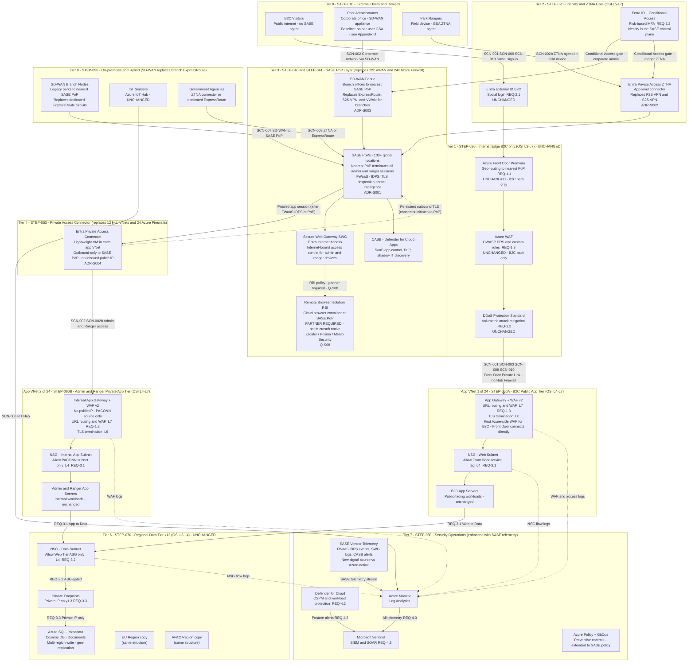
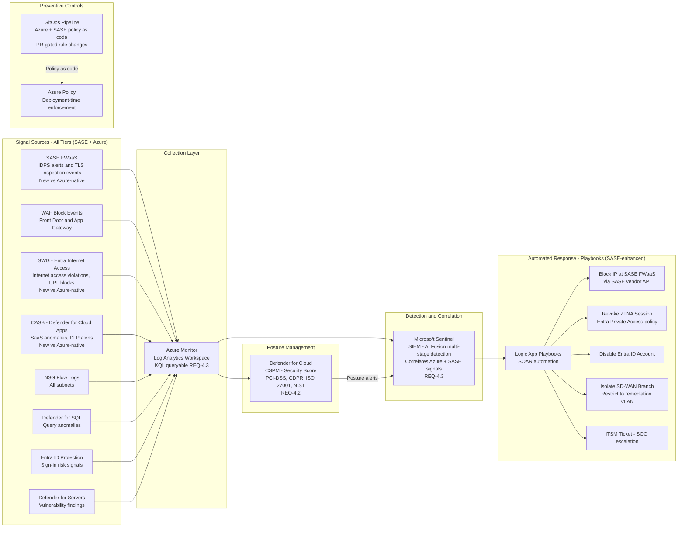

# GlobalParks - Cloud Network Security and Management
### SASE Architecture Design - Companion to DESIGN.md

| | |
|---|---|
| **Audience** | Security Architects, Network Team |
| **Cloud scope** | Microsoft Azure - SASE / SSE overlay |
| **Operations model** | Central Cloud SRE team + SASE vendor operations |
| **Status** | v1.7 - SASE iteration |
| **Last updated** | 2026-03-27 |
| **Companion document** | [DESIGN.md](DESIGN.md) - Azure-native Hub-and-Spoke reference architecture |

---

## How to use this document

This document is a **companion to `DESIGN.md`**. It re-architects the same GlobalParks platform using **SASE (Secure Access Service Edge)** principles. Every section follows the same structure as `DESIGN.md` and includes a **comparison table** showing what changes, what stays the same, and the reasoning behind each difference.

Where content is identical to the Azure-native design, this document states so explicitly and focuses on the delta. Where the SASE approach introduces a fundamentally different component or topology, full detail is provided.

**Reading path:** Sections **1–2**, **8–10**, and the **stub sections 3–7** give the short story. **Appendices C–H** hold glossary, persona detail, security architecture tables, STEP walkthrough, SCN traces, and full traceability/cost material. Each appendix links back to its main section.

> **Interactive companion** - Open **[sase-networking-flowchart.html](sase-networking-flowchart.html)** alongside this document. It contains the SASE-specific architecture diagram with full filtering by Tier, Scenario, Step, Requirement, and OSI Layer, plus SASE-specific walkthrough scenarios for the Admin (SD-WAN) and Ranger (ZTNA) paths.

---

## Table of Contents

1. [Executive Summary](#1-executive-summary)
   - 1.1 [Glossary and Acronyms](#11-glossary-and-acronyms)
2. [Platform Context and Constraints](#2-platform-context-and-constraints)
3. [User Personas](#3-user-personas) — [detail → Appendix D](#appendix-d---user-personas-full-detail)
4. [Security Architecture Overview](#4-security-architecture-overview) — [detail → Appendix E](#appendix-e---security-architecture-overview-full-detail)
5. [Architecture Walkthrough](#5-architecture-walkthrough) — [detail → Appendix F](#appendix-f---architecture-walkthrough-step-detail)
6. [Scenario Traces](#6-scenario-traces) — [detail → Appendix G](#appendix-g---scenario-traces-full-detail)
7. [Requirements Traceability Matrix](#7-requirements-traceability-matrix) — [detail → Appendix H](#appendix-h---requirements-traceability-full-detail)
8. [Architectural Decisions](#8-architectural-decisions)
9. [Open Questions](#9-open-questions)
10. [Revision History](#10-revision-history)
- [Appendix A - Architecture Diagram (Mermaid Source)](#appendix-a---architecture-diagram-mermaid-source)
- [Appendix B - STEP-080 Security Operations Detail Diagram](#appendix-b---step-080-security-operations-detail-diagram)
- [Appendix C - Glossary (SASE extensions)](#appendix-c---glossary-and-acronyms-sase-extensions)
- [Appendix D - User Personas (full detail)](#appendix-d---user-personas-full-detail)
- [Appendix E - Security Architecture (full detail)](#appendix-e---security-architecture-overview-full-detail)
- [Appendix F - Architecture Walkthrough / STEP detail](#appendix-f---architecture-walkthrough-step-detail)
- [Appendix G - Scenario Traces (full detail)](#appendix-g---scenario-traces-full-detail)
- [Appendix H - Requirements Traceability (full detail)](#appendix-h---requirements-traceability-full-detail)

---

## 1. Executive Summary

> **Interactive Architecture Visualization**
> As you read through this document, keep the SASE live diagram open alongside it.
> Each `STEP-###`, `SCN-###`, and `REQ-#.#` reference maps directly to a highlighted node in the diagram.
>
> **[Open sase-networking-flowchart.html →](sase-networking-flowchart.html)**
>
> Use the **Tier**, **Step**, **Scenario**, **Requirement**, and **OSI Layer** filter tabs, or step through the **Walkthrough** mode for the Admin SD-WAN and Ranger ZTNA paths.

---

GlobalParks is the same globally distributed platform for millions of park visitors, rangers, and administrators described in `DESIGN.md`. The business requirements, personas, compliance obligations, and data residency constraints are identical. What changes is **where and how security is enforced**.

In the Azure-native design, security inspection is **inside Azure**: 12 Hub VNets each hosting 2 Azure Firewall Premium instances (24 total), with traffic forced through them via Virtual WAN Routing Intent. In the SASE architecture, security inspection moves **outside Azure to the network edge**: a global network of SASE Points of Presence (PoPs) apply FWaaS, IDPS, TLS inspection, SWG, and CASB before traffic ever enters an Azure VNet. Azure's role becomes a clean backend, not a security enforcement hub.

The three foundational principles remain unchanged - **Zero Trust**, **defence in depth**, and **central governance with regional workload isolation** - but the implementation of each shifts from Azure-native constructs to SASE cloud-delivered services.

**The single most impactful change:** VPN Gateway (P2S and S2S) and Azure Virtual WAN are eliminated from the privileged connectivity path. Park Rangers connect via a **ZTNA agent** (Entra Private Access). Corporate administrators connect via **SD-WAN** to the nearest SASE PoP. Before traffic reaches any Azure VNet, both paths are inspected at the PoP by **FWaaS** (IDPS, TLS inspection, threat intelligence), **SWG** (Entra Internet Access for URL and web policy), **CASB** (Defender for Cloud Apps for SaaS visibility, session policy, and SaaS-side DLP signals), and, where required, **RBI** (Remote Browser Isolation via a **partner** such as Zscaler, Prisma, or Menlo, because Microsoft SSE has no native RBI). The 12 Hub VNets and 24 Azure Firewall instances are eliminated.

**Design trade-off (administrators and ZTNA):** The baseline architecture assumes administrators on the **corporate LAN** reach the SASE fabric through a **site-based SD-WAN** path, **without** requiring a **per-user GSA / ZTNA client** on every admin laptop. Private access to GlobalParks apps still flows **through the SASE PoP** and **Private Access Connector** with Entra ID and Conditional Access; the difference from rangers is **how the workstation attaches** (trusted branch edge vs user agent). That simplifies rollout and avoids a second client stack on standard corporate desktops. It **does not** claim that **insider threat**, **lateral movement on the LAN**, or **compromised corp PCs** are impossible. For stronger **defense in depth** and **app-level parity** with rangers, see [Administrators, ZTNA, and defense in depth](#administrators-ztna-and-defense-in-depth-design-trade-off) in **[Appendix D](#appendix-d---user-personas-full-detail)** (summary in [Section 3](#3-user-personas)) and [Q-S09](#9-open-questions).

**What does not change:** B2C public visitor traffic continues to use Azure Front Door Premium as the internet edge - Front Door is itself a SASE-class edge service and is not replaced. The data tier (Private Endpoints, Azure SQL, Cosmos DB) is unchanged. Microsoft Sentinel, Defender for Cloud, and Azure Policy remain the security operations and governance layer, enriched with additional SASE vendor telemetry.

### Executive Summary - Key Differences at a Glance

| Aspect | Azure-native (DESIGN.md) | SASE (this document) | Reasoning |
|---|---|---|---|
| **Security perimeter for admin/ranger** | Azure Hub VNets + 24x Azure Firewall Premium | SASE PoPs - FWaaS in cloud | Inspection moves to the edge; Azure becomes a clean backend |
| **Admin connectivity** | ExpressRoute (primary) + S2S VPN → VWAN → Hub Firewall | SD-WAN → nearest SASE PoP → FWaaS → Private Access Connector | No dedicated circuit needed; any broadband underlay works |
| **Ranger connectivity** | P2S VPN client → VWAN → Hub Firewall | ZTNA agent (Entra Private Access) → nearest SASE PoP | App-level access replaces network tunnel; per-app policy |
| **Admin ZTNA client (GSA)** | N/A (ExpressRoute / VPN path) | **Baseline:** optional - SD-WAN site path without per-user GSA; **Hardening:** GSA on admins for same app-level segmentation as rangers ([Appendix D](#appendix-d---user-personas-full-detail)) | Connectivity story vs least-privilege on the endpoint |
| **B2C connectivity** | Front Door → Hub Firewall (public IP) → App Gateway | Front Door → App Gateway directly (Private Link) | B2C path unchanged in principle; Hub Firewall hop eliminated |
| **Hub VNets** | 12 (one per region) | 0 - eliminated | SASE PoP + Private Access Connector replaces Hub VNet function |
| **Firewall instances in Azure** | 24 Azure Firewall Premium | 0 in Azure - FWaaS at SASE PoP | Firewall is cloud-delivered, not VNet-deployed |
| **Azure Virtual WAN** | 12 separate instances (Option B, ADR-004) | Eliminated - SASE PoP fabric replaces it | SASE vendor's global PoP network is the WAN fabric |
| **VPN Gateways** | 12x S2S + 12x P2S via VWAN | Eliminated - replaced by SD-WAN and ZTNA | Connectivity method changes fundamentally |
| **Policy management** | Azure Firewall Manager + GitOps | SASE vendor policy console + Azure Policy + GitOps | Security policy split across SASE platform and Azure |
| **CASB (SaaS governance)** | Partial (FQDN allow lists, Sentinel alerts) | **Defender for Cloud Apps** at SASE edge - shadow IT, SaaS session policy, DLP on SaaS | **Enhanced** - explicit CASB vs firewall-only SaaS hints in Azure-native |
| **B2C IDPS coverage** | Hub Firewall IDPS on B2C path | Front Door WAF + App Gateway WAF v2 only - no IDPS | Accepted trade-off; documented in ADR-S004 |
| **SASE vendor dependency** | None - 100% Azure-native | SASE vendor (Microsoft SSE or Zscaler/Prisma) | New operational dependency; vendor selection matters |
| **Compliance (GDPR)** | Data stays in Azure regions always | SASE PoP traffic transit requires data residency scrutiny | PoP routing must be constrained to compliant regions |
| **Cost model** | Azure Firewall Premium per-instance + VWAN | SASE per-user licensing + reduced Azure costs | Different cost structure - evaluate at scale |
| **Remote Browser Isolation (RBI)** | Not present | RBI at SASE PoP - **partner required** (Zscaler, Prisma, Menlo) | Microsoft SSE has no native RBI; gap for PCI-DSS-scoped admin/ranger browser sessions |

---

### 1.1 Glossary and Acronyms

This document extends the Glossary in `DESIGN.md` Section 1.1. **SASE-specific terms and acronyms** (SSE, ZTNA, FWaaS, GSA vs Entra Private Access, RBI, and so on) are in **[Appendix C - Glossary and Acronyms (SASE extensions)](#appendix-c---glossary-and-acronyms-sase-extensions)**.

---

## 2. Platform Context and Constraints

The platform context is largely unchanged. GlobalParks is a hybrid architecture from day one, with the same 12-region footprint, same compliance obligations, same on-premises integration requirements, and same Central SRE team.

The key contextual shift is that SASE **redistributes responsibility**: the Central SRE team no longer manages 24 Azure Firewall instances and 12 VWAN hubs. Instead, they co-manage Azure Policy and GitOps (unchanged) alongside the SASE vendor's policy console (new). This changes the operational model and requires new skill sets around SASE platforms.

### Platform Context - Differences from Azure-native

| Constraint | Azure-native (DESIGN.md) | SASE (this document) | Reasoning |
|---|---|---|---|
| **Topology** | Hub-and-Spoke VNet - 12 Hub VNets + 24 Spoke VNets | 24 App VNets only - no Hub VNets | Hub function (routing + inspection) moves to SASE PoP |
| **Firewall** | 2x Azure Firewall Premium per region - 24 total | 0 in Azure; FWaaS at SASE PoPs | Inspection at SASE edge, not in VNet |
| **Hub VNets** | 12 total | 0 - eliminated | SASE connector in app VNet replaces Hub VNet |
| **Spoke VNets** | 24 total - 2 per region | 24 total - 2 per region (B2C + Admin/Ranger) | Spoke count unchanged; they become direct app VNets |
| **VWAN instances** | 12 separate (Option B, ADR-004) | 0 - eliminated | SASE PoP fabric replaces VWAN routing |
| **VPN Gateways** | 12x S2S + 12x P2S | 0 - eliminated | SD-WAN and ZTNA replace both |
| **ExpressRoute** | Required for admin connectivity (4-8 wk lead time) | Optional - only for government agency integration | SD-WAN removes the need for dedicated circuits for branches |
| **SASE vendor** | Not applicable | Required - Microsoft SSE or third-party (ADR-S001) | New operational and commercial dependency |
| **GDPR data residency** | Azure regions enforced by design | SASE PoP routing must be constrained to compliant regions | PoP selection must not route EU traffic through non-EU nodes |
| **RTO / RPO** | RTO 5 min, RPO 15 min | Same targets - SASE PoP HA + connector HA must be designed | SASE vendor SLA and connector redundancy must meet RTO |
| **On-premises systems** | Legacy via ExpressRoute; IoT via IoT Hub; Gov via ExpressRoute | Legacy via SD-WAN; IoT via IoT Hub (unchanged); Gov via ZTNA or ExpressRoute | SD-WAN replaces dedicated ExpressRoute circuits for legacy branches |
| **Operational model** | Azure-only; SRE owns Firewall Manager + GitOps | Azure + SASE vendor; SRE co-manages SASE console + GitOps | New platform to operate; vendor's SRE support is co-responsibility |

---

## 3. User Personas

Personas and compliance context match `DESIGN.md`; **connectivity and access granularity** change for administrators and rangers. **Full narrative:** ZTNA vs VPN, administrator **SD-WAN vs GSA** trade-off, and Conditional Access nuance are in **[Appendix D - User Personas (full detail)](#appendix-d---user-personas-full-detail)**.

| Persona | Identity (unchanged) | Azure-native connectivity | SASE connectivity | Key difference |
|---|---|---|---|---|
| **B2C Visitor** | Entra External ID - social login | Front Door → Hub Firewall → B2C Spoke | Front Door → App Gateway directly | Hub Firewall hop removed from B2C path |
| **Park Administrator** | Entra ID + Conditional Access + MFA | Corporate LAN → ExpressRoute → VWAN → Hub Firewall → Spoke | Corporate LAN → SD-WAN → SASE PoP → FWaaS → Private Access Connector → Spoke | No dedicated circuit; **baseline** no GSA on device—optional hardening in Appendix D |
| **Park Ranger** | Entra ID + Conditional Access + MFA + risk-based | Field device → P2S VPN client → VWAN → Hub Firewall → Spoke | Field device → GSA ZTNA agent → SASE PoP → FWaaS → Private Access Connector → Spoke | App-level access replaces network tunnel; per-app policy at PoP |

---

## 4. Security Architecture Overview

Tiers **T3** and **T4** change fundamentally (SASE PoP + Private Access Connector replace VWAN, VPN gateways, and hub firewalls). B2C tiers **T1** and data tier **T6** stay aligned with `DESIGN.md`. **Tier-by-tier comparison, OSI mapping, and detection/prevention tables** are in **[Appendix E - Security Architecture Overview (full detail)](#appendix-e---security-architecture-overview-full-detail)**.

---

## 5. Architecture Walkthrough

Same **STEP-###** sequence as `DESIGN.md` Section 5. **Full step narratives, comparison tables, and SCN cross-links** are in **[Appendix F - Architecture Walkthrough (STEP detail)](#appendix-f---architecture-walkthrough-step-detail)**.

| Step | Title | Detail |
|---|---|---|
| STEP-010 | Users and Personas | [Appendix F →](#step-010---users-and-personas) |
| STEP-020 | Identity and Access | [Appendix F →](#step-020---identity-and-access) |
| STEP-040 | Connectivity - Administrators (SD-WAN → SASE PoP) | [Appendix F →](#step-040---connectivity---park-administrators-sd-wan-to-sase-pop) |
| STEP-041 | Connectivity - Rangers (ZTNA) | [Appendix F →](#step-041---connectivity---park-rangers-ztna-via-entra-private-access) |
| STEP-030 | Internet Edge and Global Routing | [Appendix F →](#step-030---internet-edge-and-global-routing) |
| STEP-050 | SASE PoP and Private Access Connector | [Appendix F →](#step-050---sase-pop-and-private-access-connector-replaces-hub-vnet) |
| STEP-060A | B2C App VNet - Public Web Tier | [Appendix F →](#step-060a---b2c-app-vnet---public-web-tier) |
| STEP-060B | Admin/Ranger App VNet - Internal App Tier | [Appendix F →](#step-060b---adminranger-app-vnet---internal-app-tier) |
| STEP-070 | Regional Data Tier | [Appendix F →](#step-070---regional-data-tier) |
| STEP-080 | Security Operations and Governance | [Appendix F →](#step-080---security-operations-and-governance) |
| STEP-090 | On-premises and Hybrid Systems | [Appendix F →](#step-090---on-premises-and-hybrid-systems) |

---

## 6. Scenario Traces

**Full step-by-step traces** (with “Back to STEP” links) are in **[Appendix G - Scenario Traces (full detail)](#appendix-g---scenario-traces-full-detail)**.

| Scenario | Summary | Detail |
|---|---|---|
| SCN-001 | Public visitor - B2C path without Hub Firewall | [Appendix G →](#scn-001---public-visitor-accesses-the-globalparks-platform) |
| SCN-002 | Administrator via SD-WAN and SASE | [Appendix G →](#scn-002---park-administrator-accesses-via-sd-wan-and-sase) |
| SCN-002b | Ranger via ZTNA | [Appendix G →](#scn-002b---park-ranger-accesses-via-ztna) |
| SCN-003 | DDoS and SQLi on public endpoints | [Appendix G →](#scn-003---attacker-attempts-ddos-and-sqli-against-public-endpoints) |
| SCN-004 | Cross-region admin traffic via SASE fabric | [Appendix G →](#scn-004---cross-region-traffic) |
| SCN-005 | SOC multi-stage attack with SASE telemetry | [Appendix G →](#scn-005---soc-investigates-a-multi-stage-attack) |
| SCN-006 | IoT telemetry (unchanged) | [Appendix G →](#scn-006---iot-sensor-sends-telemetry-to-azure-iot-hub) |
| SCN-007 | Legacy sync via SD-WAN | [Appendix G →](#scn-007---legacy-park-system-syncs-to-azure-sql) |
| SCN-008 | Government agency access | [Appendix G →](#scn-008---government-agency-accesses-park-data) |
| SCN-009 | Sydney visitor / Great Barrier Reef | [Appendix G →](#scn-009---sydney-visitor-books-a-campsite-at-great-barrier-reef-gold-coast-australia) |
| SCN-010 | Sydney visitor / Yosemite | [Appendix G →](#scn-010---sydney-visitor-books-a-campsite-at-yosemite-national-park-california-usa) |

---

## 7. Requirements Traceability Matrix

[Back to Section 5](#5-architecture-walkthrough)

**Full matrices** (legend, central governance, TCO checklist, illustrative cost comparison, single-vendor summary, and row-level traceability) are in **[Appendix H - Requirements Traceability (full detail)](#appendix-h---requirements-traceability-full-detail)**.

### Legend (summary)

| Symbol | Meaning |
|---|---|
| ✅ **Native** | Microsoft products in M365 E3/E5 or Azure—no extra SASE vendor |
| ⚠️ **Partial** | Microsoft covers the capability with documented limits |
| ❌ **Gap** | Needs third-party SASE/FWaaS, SD-WAN partner, or hybrid Azure component |

### Coverage at a glance (stub)

| Area | Microsoft SSE / Azure (summary) | Typical gap or partner |
|---|---|---|
| B2C edge (REQ-1.x) | Front Door, WAF, DDoS—**unchanged** | — |
| Identity / ZTNA (REQ-2.x) | Entra ID, CA, Entra Private Access—**enhanced** for app scope | — |
| Ranger internet / SWG | Entra Internet Access | ⚠️ L7 HTTP/S only; no PoP IDPS—FWaaS partner or hybrid |
| CASB / SaaS | Defender for Cloud Apps | ⚠️ Non-Microsoft SaaS depth vs specialist CASB |
| Privileged IDPS (REQ-4.1 admin/ranger) | Not in Microsoft SSE alone | ❌ Zscaler / Prisma / Cloudflare FWaaS or hybrid Azure Firewall |
| B2C IDPS (REQ-4.1) | WAF only on B2C path | ❌ Accepted trade-off (ADR-S004); hybrid Firewall if required |
| Branch WAN (REQ-4.1) | No native SD-WAN | ❌ Validated SD-WAN partner |
| Segmentation / data (REQ-3.x) | NSG, ASG, Private Endpoints | — **unchanged** |
| Posture / SIEM (REQ-4.2, 4.3) | Defender for Cloud, Sentinel | ⚠️ SASE telemetry via connector (native for Microsoft SSE) |
| DLP (REQ-DLP) | Purview + CASB + SWG | ⚠️ Non-Microsoft SaaS at scale |
| RBI (REQ-RBI) | Not native in Microsoft SSE | ❌ Partner RBI (Q-S08) |

---

## 8. Architectural Decisions

---

### ADR-S001 - SASE Vendor Selection: Microsoft SSE vs Third-Party

**Status:** Microsoft SSE (Entra Internet Access + Entra Private Access + Defender for Cloud Apps) preferred for initial deployment. Third-party evaluation triggered if conditions below are met.

**Microsoft SSE rationale:**
- Native Entra ID integration - Conditional Access policies evaluated inline with ZTNA session establishment
- Single agent (Global Secure Access) for both private access (ZTNA) and internet access (SWG)
- Defender for Cloud Apps (CASB) already in Microsoft E5 licensing - no additional vendor
- Sentinel native connector - no API integration required for telemetry ingestion
- SD-WAN: Microsoft does not have a native SD-WAN product; requires a partner (Barracuda SecureEdge, VMware SD-WAN, Cisco Meraki) with Microsoft-validated SASE integration

**Third-party SASE evaluation triggers:**
- Requirement for a single-vendor SD-WAN + SSE platform (Zscaler, Palo Alto Prisma Access, Cloudflare One)
- FIPS 140-2 certified FWaaS is required by a compliance framework
- PoP count or geographic coverage of Microsoft SSE is insufficient for specific regional latency requirements
- Advanced UEBA or DLP capabilities beyond Microsoft's current SSE feature set are required

| Factor | Microsoft SSE | Zscaler (ZIA + ZPA) | Palo Alto Prisma Access |
|---|---|---|---|
| Entra ID integration | Native | API-based | API-based |
| SD-WAN | Partner-required | Native (ZDX) | Native (Prisma SD-WAN) |
| PoP count | 100+ (Global Secure Access network) | 150+ | 100+ |
| Sentinel integration | Native connector | Syslog/API | API |
| Licensing model | Per user, included in E5/F5 (SSE) | Per user, additional cost | Per user, additional cost |
| Single-vendor | No (SD-WAN partner needed) | Yes | Yes |

---

### ADR-S002 - Entra Private Access (ZTNA) over VPN Gateway for Rangers

**Status:** Accepted

**Decision:** Replace P2S VPN Gateway with Entra Private Access (ZTNA) for ranger field access.

**Rationale:**
- ZTNA provides per-application access scope - a ranger can only reach explicitly published apps, not any VNet resource. P2S VPN gives a ranger a routed IP in the VNet, relying entirely on Firewall rules to restrict lateral movement.
- ZTNA session is established after Conditional Access evaluation - if risk score is High, the session is denied before any network connection is made. P2S VPN blocks happen at the Firewall after the tunnel is established.
- No VPN Gateway infrastructure to manage, patch, or scale. SASE PoP availability is the vendor's SLA.
- GSA agent replaces the Azure VPN client - single client for both private access and internet access.

**Trade-offs:**
- ZTNA requires the GSA agent to be installed and maintained on all ranger devices (Intune-managed - achievable).
- SASE vendor PoP availability becomes a dependency for ranger connectivity (SLA must be evaluated against RTO requirement).
- Offline-first scenarios (rangers in areas with no internet at all) require a fallback - this is unchanged from P2S VPN, which also requires internet connectivity.

**Corporate administrators (baseline):** This ADR does **not** require GSA on every admin PC. Admins reach the same PoP and **Private Access Connector** path via **SD-WAN** (ADR-S003). The **endpoint** trade-off—whether to add **GSA** on admins for app-level parity and insider-threat reduction—is documented in [Appendix D](#administrators-ztna-and-defense-in-depth-design-trade-off) and **Q-S09**.

---

### ADR-S003 - SD-WAN over ExpressRoute for Branch Office Connectivity

**Status:** Accepted

**Decision:** Replace dedicated ExpressRoute circuits for legacy park and corporate branch offices with SD-WAN connected to SASE PoPs.

**Rationale:**
- ExpressRoute requires 4-8 week provider lead time and a contractual commitment per-circuit. SD-WAN can be deployed over existing internet connections within days.
- SD-WAN provides automatic failover across multiple underlinks (broadband + 4G + MPLS). ExpressRoute requires redundant circuits and BGP failover configuration for the same resilience.
- SD-WAN eliminates the VWAN dependency - branch traffic goes to the nearest SASE PoP rather than to an Azure-specific endpoint.

**Retained for:** Government agencies with existing ExpressRoute contracts or regulatory requirements that prohibit SD-WAN-over-internet for sensitive data.

---

### ADR-S004 - Hub VNet Elimination and B2C IDPS Trade-off

**Status:** Accepted - trade-off documented

**Decision:** Eliminate 12 Hub VNets and 24 Azure Firewall Premium instances. For admin/ranger traffic, FWaaS at the SASE PoP provides equivalent IDPS and TLS inspection. For B2C traffic, Front Door WAF (Layer 7) and App Gateway WAF v2 provide two WAF layers but no IDPS (signature-based stateful inspection).

**The trade-off:** In the Azure-native design, B2C traffic passed through Azure Firewall Premium IDPS after Front Door. This provided signature-based threat detection (2,500+ signatures) on the B2C path in addition to WAF. In the SASE design, this layer is absent from the B2C path because:
- B2C traffic enters via Front Door Private Link directly to App Gateway - no Hub Firewall is in the path.
- SASE FWaaS at PoPs is in the admin/ranger path, not the B2C path (SASE is identity-centric and B2C visitors do not have SASE agents).

**Why this trade-off is accepted:**
- B2C traffic is HTTP/HTTPS-only. The attack surface is L7 web application attacks (SQL injection, XSS, OWASP Top 10) - which WAF covers comprehensively.
- Non-HTTP protocols (where IDPS adds the most value vs. WAF) are not present on the B2C path.
- Front Door WAF (global, DRS ruleset) + App Gateway WAF v2 (application-specific rules) provide two independent inspection layers.
- Sentinel correlation and Defender for Cloud Apps provide compensating detective controls.

**Mitigation if IDPS is required on B2C path:** A single lightweight Azure Firewall Standard (not Premium) instance per region could be added in front of the App Gateway as an IDPS proxy - this would be a hybrid approach, not pure SASE. Documented as a future option.

---

### ADR-S005 - GDPR Data Residency and SASE PoP Routing

**Status:** Open - requires vendor confirmation

**Issue:** GDPR requires that EU visitor data (PII, reservation data) does not transit non-EU infrastructure. In the Azure-native design, all EU traffic stays within EU Azure regions by design. In the SASE design, EU admin and ranger sessions transit SASE PoPs - the SASE vendor must be configured to restrict EU user sessions to EU PoPs only.

**Required action before SASE production deployment in EU regions:**
- Confirm SASE vendor's EU-only routing configuration capability (geo-fenced PoP selection)
- Review SASE vendor's data processing agreements for GDPR compliance
- Validate that SASE vendor's EU PoPs are covered by adequate data residency certifications
- Document EU-specific SASE routing policy in the network design

---

## 9. Open Questions

| ID | Question | Why it matters | Owner | Status |
|---|---|---|---|---|
| Q-S01 | Which SD-WAN partner for Microsoft SSE integration? | Microsoft SSE requires an SD-WAN partner; vendor affects PoP integration, routing policy, and SLA | Network team / Procurement | **Open** |
| Q-S02 | GDPR compliance for SASE PoP routing (EU users) | EU admin/ranger sessions must not transit non-EU PoPs | Legal / Network team | **Open - ADR-S005** |
| Q-S03 | SASE PoP latency SLA vs ExpressRoute - latency-sensitive workloads? | Some admin workloads may require sub-10ms latency (e.g. real-time telemetry dashboards) | Architecture / Network team | **Open** |
| Q-S04 | SASE per-user licensing cost vs. Azure Firewall Premium + VWAN cost at GlobalParks scale? | Cost model changes from instance-based to per-user; total cost depends on user count and tier | Finance / SRE | **Open** |
| Q-S05 | Government agency integration - ZTNA connector or retain ExpressRoute? | Agency operational constraints may not allow GSA agent installation in their network | Network team / Agency IT | **Open** |
| Q-S06 | Private Access Connector redundancy - how many connectors per App VNet for RTO? | PACONN is in the critical path for admin/ranger access; single connector = single point of failure | SRE | **Open** |
| Q-S07 | SASE PoP telemetry ingestion format for Sentinel - native connector or Syslog? | Affects telemetry latency, fidelity, and Sentinel cost | SRE / SOC | **Open - depends on ADR-S001 vendor selection** |
| Q-S08 | Is Remote Browser Isolation (RBI) required for ranger and admin endpoints by PCI-DSS scope or accepted as a risk gap? | Rangers and admins access external portals while holding active ZTNA sessions to payment-adjacent systems. A browser-borne compromise on such a device is a higher-risk event. PCI-DSS DSS v4.0 Req 5 (malware protection) and Req 6 (secure systems) may require RBI for in-scope endpoints. Microsoft SSE has no native RBI - a third-party vendor is required. If not mandated, Microsoft Edge for Business session controls + Defender for Endpoint are the fallback compensating controls. | Security Architect / Compliance | **Open** |
| Q-S09 | Should GlobalParks require **GSA / Entra Private Access on corporate administrator devices** (not only SD-WAN site path) for defense in depth? | Baseline design uses **SD-WAN to PoP** without mandatory **per-user GSA** on admin laptops. Threats from **inside the corporate network** and **lateral movement** argue for **optional or mandatory GSA** on privileged admins, **micro-segmentation**, or **PAW**—see [Appendix D](#appendix-d---user-personas-full-detail). Decision affects client rollout, helpdesk, and blast-radius story. | Security Architect / IAM | **Open** |

---

## 10. Revision History

| Version | Date | Summary of changes |
|---|---|---|
| 1.0 | 2026-03-21 | Initial SASE design document - complete SASE rearchitecture of DESIGN.md; all sections with comparison tables; ADR-S001 through ADR-S005; SCN-001 through SCN-010 updated for SASE; sase-networking-flowchart.html interactive companion created |
| 1.1 | 2026-03-21 | Added Remote Browser Isolation (RBI) - Glossary, Exec Summary table, STEP-041, Section 4.3, Section 7 traceability matrix and single-vendor summary, Open Question Q-S08; sase-networking-flowchart.html updated with RBI node and filter data |
| 1.2 | 2026-03-27 | Removed em dash punctuation across SASE doc; Exec Summary CASB row; Glossary Entra Private Access vs GSA; Section 7 central governance + TCO checklist; connector/PoP arrow semantics aligned with HTML diagram; cross-reference from DESIGN.md |
| 1.3 | 2026-03-27 | Section 1 "single most impactful change" paragraph: CASB, SWG, RBI at PoP; Section 7 illustrative annual cost stab; sase-networking-flowchart Inspect tiers / zoom (later removed in v1.4) |
| 1.4 | 2026-03-27 | Removed zoom and Inspect tiers from sase-networking-flowchart.html (filtering and walkthrough unchanged) |
| 1.5 | 2026-03-27 | Documented **administrator vs ZTNA (GSA)** design trade-off: Executive Summary, new Section 3 subsection, Conditional Access nuance, Exec table row, Tier 2 / OSI L5 / Section 4.3 clarifications; Open Question **Q-S09**; diagram labels in Appendix A and sase-networking-flowchart.html |
| 1.6 | 2026-03-27 | Section 7 cost material: **one-time vs recurring vs operational** framing; **Approaches A/B/C** with explicit trade-offs; separate illustrative tables; **when each approach tends to win** on TCO; removed implied single “winner” on annual totals |
| 1.7 | 2026-03-27 | **Reader fatigue reduction:** Sections **1.1**, **3–7** are stubs in the main body; full content moved to **Appendices C–H** with back-links. Section **7** retains a **coverage-at-a-glance** summary table. **Appendix A** intro references STEP detail in Appendix F. |

---

## Appendix A - Architecture Diagram (Mermaid Source)

The Mermaid source below generates the SASE eight-tier architecture diagram. Each tier corresponds to a `STEP-###` in [Section 5](#5-architecture-walkthrough).

### How to view or export this diagram

| Method | How |
|---|---|
| **GitHub (online)** | GitHub renders Mermaid natively - diagram displays automatically |
| **Interactive browser** | Open [`sase-networking-flowchart.html`](sase-networking-flowchart.html) - full filtering and SASE-specific walkthroughs |
| **Mermaid Live Editor** | Copy the code block and paste at [mermaid.live](https://mermaid.live) |

---

---

## Appendix B - STEP-080 Security Operations Detail Diagram

The diagram below shows the full signal-to-response flow for the SASE Security Operations tier. The key addition versus `DESIGN.md` Appendix B is the **SASE Vendor Telemetry** input.

## Appendix C - Glossary and Acronyms (SASE extensions)

← [Back to Section 1.1](#11-glossary-and-acronyms)

### Glossary and Acronyms (full table)

This section extends the Glossary in `DESIGN.md` Section 1.1. All original terms (ADR, ASG, B2C, IDPS, etc.) remain valid. The following terms are specific to the SASE architecture.

| Acronym / Term | Full name | Brief description |
|---|---|---|
| **SASE** | Secure Access Service Edge | Gartner-coined architecture combining SD-WAN (network) and SSE (security) into a unified cloud-delivered service. Security is delivered from the edge, not from data centre appliances. |
| **SSE** | Security Service Edge | The security half of SASE: SWG + CASB + ZTNA. Microsoft's SSE offering comprises Entra Internet Access, Entra Private Access, and Defender for Cloud Apps. |
| **ZTNA** | Zero Trust Network Access | An alternative to VPN that provides per-application access rather than network-level access. Users connect to a SASE PoP; the PoP proxies access to specific apps. The user never gets a routed IP into the network. |
| **SWG** | Secure Web Gateway | A cloud-delivered proxy for internet-bound traffic. Enforces acceptable-use policy, TLS inspection, URL filtering, and malware scanning for admin and ranger devices. Microsoft product: Entra Internet Access. |
| **FWaaS** | Firewall as a Service | A cloud-delivered firewall running at SASE PoPs, providing IDPS, TLS inspection, threat intelligence IP/domain blocking, and application-layer policy - the cloud equivalent of Azure Firewall Premium. |
| **CASB** | Cloud Access Security Broker | A security policy enforcement point between users and SaaS applications. Provides visibility into shadow IT, DLP, session controls, and access governance. Microsoft product: Defender for Cloud Apps. |
| **SD-WAN** | Software-Defined Wide Area Network | Software-defined overlay network that uses any underlay (MPLS, broadband, 4G/5G) to connect branch offices to the nearest SASE PoP. Replaces dedicated MPLS or ExpressRoute circuits for branch connectivity. |
| **SASE PoP** | SASE Point of Presence | A globally distributed edge node operated by the SASE vendor. Terminates user connections (ZTNA, SD-WAN), applies FWaaS and SWG inspection, and proxies traffic to the target application. Microsoft Global Secure Access, Zscaler, and Palo Alto Prisma Access all operate global PoP networks (100+ locations). |
| **Private Access Connector** | Entra Private Access Connector | A lightweight VM or container deployed inside an Azure VNet (or on-premises). It maintains a persistent outbound connection to the SASE PoP, allowing the PoP to proxy authenticated, inspected user sessions to private apps - without any inbound public IP or firewall rule on the VNet. |
| **Entra Private Access (service)** | Microsoft Entra Private Access | The **cloud service** (control plane + PoP integration) that defines ZTNA app segments, policies, and connector registration. Not installed on the device; it is what the GSA agent and connectors talk to. |
| **GSA** | Global Secure Access | The **client software** on Windows or macOS that implements Microsoft's SSE on the endpoint. It is the user-facing agent that tunnels private app traffic to Entra Private Access (ZTNA) and internet traffic to Entra Internet Access (SWG). **GSA is not the same as Entra Private Access:** Entra Private Access is the service; GSA is one way users consume it (see row above). |
| **Microsoft SSE** | Microsoft Security Service Edge | Microsoft's current SSE product: Entra Internet Access (SWG) + Entra Private Access (ZTNA) + Defender for Cloud Apps (CASB). The SD-WAN element is provided through Microsoft's network partner ecosystem. |
| **Private Link Origin** | Azure Front Door Private Link Origin | A Front Door Premium feature allowing the origin backend (e.g. App Gateway) to have a private IP with no public-facing endpoint. Front Door connects to the App Gateway via Private Link, removing the need for a public IP on the App Gateway. |
| **DLP** | Data Loss Prevention | Controls that detect and block sensitive data (PII, financial data, credentials) from leaving an authorised perimeter. Available in CASB and SWG platforms. |
| **UEBA** | User and Entity Behaviour Analytics | Machine-learning-driven detection of anomalous user behaviour compared to a historical baseline. Available in Microsoft Sentinel and some SASE vendors. |
| **RBI** | Remote Browser Isolation | A SASE security capability that executes web browsing inside a cloud-hosted browser container at the SASE PoP. Only a pixel-stream (or DOM-reconstructed rendering) is sent to the user's device - the actual web content never reaches the endpoint. Prevents browser-borne malware, zero-day exploits, and credential phishing at the point of rendering. **Microsoft SSE does not include native RBI today** - a third-party vendor (Zscaler Cloud Browser Isolation, Palo Alto Prisma Browser Isolation, Menlo Security) is required if RBI is mandated. |

---

## Appendix D - User Personas (full detail)

← [Back to Section 3](#3-user-personas)

The three personas remain identical in terms of identity, trust level, and compliance requirements. What changes is the **connectivity mechanism** for administrators and rangers, and the **access granularity** ZTNA provides compared to VPN.

| Persona | Identity (unchanged) | Azure-native connectivity | SASE connectivity | Key difference |
|---|---|---|---|---|
| **B2C Visitor** | Entra External ID - social login | Front Door → Hub Firewall → B2C Spoke | Front Door → App Gateway directly | Hub Firewall hop removed from B2C path |
| **Park Administrator** | Entra ID + Conditional Access + MFA | Corporate LAN → ExpressRoute → VWAN → Hub Firewall → Spoke | Corporate LAN → SD-WAN → SASE PoP → FWaaS → Private Access Connector → Spoke | No dedicated circuit; SASE PoP is the chokepoint; **baseline** no GSA on device—optional hardening below |
| **Park Ranger** | Entra ID + Conditional Access + MFA + risk-based | Field device → P2S VPN client → VWAN → Hub Firewall → Spoke | Field device → GSA ZTNA agent → SASE PoP → FWaaS → Private Access Connector → Spoke | App-level access replaces network tunnel; per-app policy enforced at PoP |

### ZTNA vs VPN - What changes for Rangers

The shift from P2S VPN to ZTNA is the most operationally significant persona change. The table below captures the practical differences:

| Factor | P2S VPN (Azure-native) | ZTNA - Entra Private Access (SASE) | Why it matters |
|---|---|---|---|
| **Access scope** | Network-level - ranger gets a routed IP into the VNet | App-level - ranger reaches only explicitly permitted apps | ZTNA enforces least-privilege at the access layer, not just at the Firewall |
| **Client software** | Azure VPN client with P2S profile | Global Secure Access (GSA) agent | Single agent replaces both VPN and SWG clients |
| **Authentication** | Entra ID credentials + device certificate | Entra ID credentials + device compliance (Conditional Access) | Same identity plane; ZTNA integrates tighter with CA signals |
| **Session establishment** | Tunnel to VPN Gateway (full network route) | TLS session to nearest SASE PoP (proxy, not tunnel) | No network route established; blast radius of credential compromise reduced |
| **Lateral movement risk** | Ranger VPN session can reach any VNet resource permitted by Firewall rules | Ranger can only reach explicitly published apps | Lateral movement is architecturally impossible beyond published app boundaries |
| **Internet traffic** | Separate from VPN (split tunnel or force-tunnel) | Routed through SWG at SASE PoP (Entra Internet Access) | Unified internet + private access through single agent and policy |
| **Offline resilience** | VPN re-establishes automatically | ZTNA agent re-connects to nearest PoP automatically | Both are resilient; ZTNA PoP availability replaces VPN Gateway availability |

### Administrators, ZTNA, and defense in depth (design trade-off)

ZTNA (Entra Private Access via **GSA** on the device) enforces **application-level** reachability: the user does not receive a full routed corporate path into Azure; only **published applications** are proxied through the PoP. **Park Rangers** use that model in the baseline design because they lack a **fixed SD-WAN-attached site** and would otherwise depend on **P2S VPN** with broader network semantics.

**Park Administrators** in the baseline design are modeled on **corporate offices** with an **SD-WAN appliance** that steers traffic to the **nearest SASE PoP**. After PoP inspection (**FWaaS**, **SWG**, **CASB** as applicable), traffic to GlobalParks private apps still uses the **Private Access Connector** and **published app** definitions—the **connector** is the VNet-side enforcement anchor for both personas. The **trade-off** is on the **endpoint**:

- **Baseline (as drawn):** No **GSA** requirement on every admin PC. Trust is layered as **Entra ID + Conditional Access + SD-WAN site path + PoP controls + connector + NSG/ASG** inside Azure. Corporate **LAN** exposure (lateral movement, compromised workstations, flat networks) is **not** reduced to the same degree as on a ranger laptop that only has **ZTNA-published** paths from the device.
- **Stronger alignment with Zero Trust:** Deploy **GSA / Entra Private Access on administrator devices** (especially **privileged** roles, **remote** admins without SD-WAN, or **high-value** app tiers) so **both** personas get **explicit per-app sessions** from the workstation. Alternatively or additionally: **micro-segmentation** on the corporate LAN, **Privileged Access Workstations (PAW)**, **JIT/JEA**, and **strict** CA policies for admin sign-in.

This document **does not** mandate one choice for all enterprises; it documents the **baseline diagram** and the **security rationale** for tightening. See [Q-S09](#9-open-questions).

### Conditional Access - unchanged

Conditional Access policies for administrators and rangers remain **aligned** with those in `DESIGN.md` Section 3. The SASE identity plane is Entra ID—SASE is identity-centric. For **rangers**, a **GSA-mediated ZTNA session** is gated by Conditional Access before the PoP grants access to private apps. For **administrators on the baseline SD-WAN path**, the user still signs in under the same CA policies; traffic from the **SD-WAN-attached site** is forwarded through the PoP to **published applications** via the connector without requiring a **GSA client** on the device unless the organization adopts the **optional hardening** above. Risk-based policy (High risk = hard block; Medium risk = step-up MFA) applies identically at identity evaluation time.

---

## Appendix E - Security Architecture Overview (full detail)

← [Back to Section 4](#4-security-architecture-overview)

### 4.1 N-Tier Architecture Diagram

The SASE architecture retains eight tiers but the **content and components of Tier 3 and Tier 4 change fundamentally**. Tiers 0, 1, 2, 5A, 5B, 6, 7, and 8 evolve (some components removed, some added) while preserving the same security intent.

**Interactive visualization** - View [`sase-networking-flowchart.html`](sase-networking-flowchart.html) in any browser. Filter by Tier, Scenario, Requirement, Step, or OSI Layer. Use the Walkthrough tab for the Admin SD-WAN path and Ranger ZTNA path step-by-step traces.

**Diagram source and rendering** - The complete Mermaid source is in [Appendix A](#appendix-a---architecture-diagram-mermaid-source).

#### Tier-by-tier comparison

| Tier | Step | Azure-native | SASE | Change summary |
|---|---|---|---|---|
| **T0** | STEP-010 | B2C (internet), Admin (corporate LAN), Ranger (field, VPN client) | B2C (internet), Admin (corporate LAN + SD-WAN), Ranger (field, ZTNA agent) | Device-side client changes for Admin and Ranger |
| **T1** | STEP-030 | Azure Front Door + WAF + DDoS (B2C only) | Azure Front Door + WAF + DDoS (B2C only) - **unchanged** | B2C edge is unchanged; SASE does not apply to anonymous internet traffic |
| **T2** | STEP-020 | Entra External ID (B2C), Entra ID + CA (Admin/Ranger) | Same + **Entra Private Access (ZTNA)** as app-access gate | Connector + published apps for **both** personas; **GSA on device** baseline for rangers, **optional** for admins ([Appendix D](#appendix-d---user-personas-full-detail)) |
| **T3** | STEP-040/041 | 12x VWAN, 12x VPN Gateway S2S, 12x VPN Gateway P2S, ExpressRoute circuits | **SASE PoPs** (global, 100+ locations), SD-WAN fabric, SWG, CASB | Entire private connectivity layer replaced by SASE cloud fabric |
| **T4** | STEP-050 | 12 Hub VNets, 24x Azure Firewall Premium, UDRs, Routing Intent | **Private Access Connector** (lightweight VM per app VNet) | Hub VNets and Azure Firewalls eliminated; connector is the VNet-side anchor |
| **T5A** | STEP-060A | App Gateway WAF v2 (B2C Spoke) - behind Hub Firewall | App Gateway WAF v2 (B2C App VNet) - **Front Door connects directly** | NSG allows Front Door service tag instead of Hub Firewall IP |
| **T5B** | STEP-060B | Internal App Gateway WAF v2 - behind Hub Firewall | Internal App Gateway WAF v2 - **behind Private Access Connector** | Traffic arrives from PACONN subnet instead of Hub Firewall |
| **T6** | STEP-070 | Private Endpoints, SQL, Cosmos DB, NSG, Private DNS - 12 regions | **Identical - unchanged** | Data tier is independent of connectivity and inspection topology |
| **T7** | STEP-080 | Sentinel, Defender for Cloud, Azure Monitor, Azure Policy | Same + **SASE vendor telemetry** (FWaaS, SWG, CASB logs) as new signal source | SASE adds a new telemetry plane; Sentinel ingests it |
| **T8** | STEP-090 | ExpressRoute for legacy branches, IoT Hub, gov via ExpressRoute | **SD-WAN** for legacy branches, IoT Hub unchanged, gov via ZTNA or ExpressRoute | Legacy branch circuits replaced by SD-WAN; IoT unchanged |

---

### 4.2 OSI Layer Control Mapping

The OSI mapping is largely preserved. The key shift is **who enforces each layer control** - in some cases the enforcement point moves from an Azure VNet resource to a SASE PoP cloud resource.

| OSI Layer | Azure-native control | SASE control | Change |
|---|---|---|---|
| **L7 - Application** | WAF (Front Door + App Gateway), Azure Firewall IDPS, Sentinel | WAF (Front Door + App Gateway), **FWaaS IDPS at SASE PoP**, Sentinel + SASE vendor logs | IDPS moves from Azure Firewall to SASE FWaaS for admin/ranger path |
| **L6 - Presentation** | TLS termination at Hub Firewall (IDPS inspection), App Gateway | TLS termination at **SASE PoP** (admin/ranger), App Gateway (B2C) | SASE PoP performs TLS inspection before traffic enters Azure |
| **L5 - Session** | Entra ID + Conditional Access, VPN session (IKEv2) | Entra ID + Conditional Access, **ZTNA proxy session to published apps** (TLS proxy, no IKE) for traffic through the PoP; **rangers:** user agent (GSA) establishes client ZTNA session; **admins (baseline):** SD-WAN site path to PoP without mandatory GSA—optional GSA for same session model ([Appendix D](#appendix-d---user-personas-full-detail)) | VPN session replaced for privileged paths; identity plane identical; admin endpoint model is a **documented trade-off** |
| **L4 - Transport** | NSG, Azure Firewall network rules, App Gateway | NSG, **SASE PoP port/protocol policy**, App Gateway | Azure Firewall L4 rules replaced by SASE PoP policy |
| **L3 - Network** | VWAN routing, UDRs, DDoS, Private Endpoints, Azure Firewall threat intelligence | **SASE PoP routing** (IP threat intelligence), DDoS (B2C unchanged), Private Endpoints | VWAN + UDR routing replaced by SASE PoP routing fabric |
| **L2 - Data Link** | ExpressRoute dedicated VLANs, Azure VNet abstraction | **SD-WAN underlay** (any broadband/MPLS), Azure VNet abstraction | L2 underlay changes from dedicated circuit to SD-WAN overlay |
| **L1 - Physical** | Azure datacentre physical security, ExpressRoute dedicated fibre | Azure datacentre physical security (unchanged), **SD-WAN on shared underlay** | Physical isolation reduced - SD-WAN uses shared internet underlay for branch |

---

### 4.3 Security Detection and Prevention by Tier

The SASE architecture adds a new telemetry source (SASE vendor logs) to the detection layer. For the Security Operations signal-to-response flow diagram, see [Appendix B](#appendix-b---step-080-security-operations-detail-diagram).

| Tier | Step | Service | Detection | Prevention | vs. Azure-native |
|---|---|---|---|---|---|
| T0 - External Users | STEP-010 | Entra ID Protection | Risky sign-in events, leaked credentials | - | **Unchanged** |
| T2 - Identity + ZTNA | STEP-020 | Entra Conditional Access | Risk signal aggregation | Hard block (High), step-up MFA (Medium), device compliance gate | **Unchanged** |
| T2 - Identity + ZTNA | STEP-020 | Entra Private Access (ZTNA) + connector | Access to unpublished apps blocked by default at connector/PoP | Only **published** GlobalParks apps are reachable through the PoP path; **rangers** use GSA for client-side ZTNA session; **admins (baseline)** rely on SD-WAN to PoP without mandatory GSA—see [Appendix D](#appendix-d---user-personas-full-detail) for optional GSA / LAN controls | **New** - replaces VPN route table; admin **client** ZTNA is optional |
| T3 - SASE PoP | STEP-040/041 | FWaaS at SASE PoP | IDPS alerts, threat intelligence events, TLS inspection hits | Inline IDPS block, malicious IP/domain block, TLS re-encrypt | **New** - replaces Azure Firewall Premium |
| T3 - SASE PoP | STEP-040/041 | SWG (Entra Internet Access) | Malicious URL access, policy violations, shadow IT | Block non-permitted internet destinations for admin/ranger | **New** - replaces Azure Firewall internet rules |
| T3 - SASE PoP | STEP-040/041 | CASB (Defender for Cloud Apps) | Shadow IT, SaaS policy violation, unusual data export | Block unauthorised SaaS apps, enforce session controls | **New** - replaces partial coverage from Sentinel alerts |
| T3 - SASE PoP | STEP-041 | **RBI - Remote Browser Isolation** (partner: Zscaler / Prisma / Menlo) | Browser-borne malware execution, drive-by downloads, phishing page rendering | External web content rendered in cloud container - device never executes web code | **New - partner required; ❌ not native in Microsoft SSE** |
| T1 - Internet Edge | STEP-030 | Azure Front Door + WAF | L7 attack pattern logging | OWASP/DRS blocking, geo-blocking, bot protection | **Unchanged** |
| T1 - Internet Edge | STEP-030 | Azure DDoS Protection Standard | Volumetric attack telemetry | Adaptive scrubbing at Azure edge | **Unchanged** |
| T4 - Private Access Connector | STEP-050 | Entra Private Access Connector | Connector health - disconnection events logged | Outbound-only - no inbound public IP; unauthenticated access impossible | **Replaces** Azure Firewall + Hub VNet |
| T5A - B2C App VNet | STEP-060A | App Gateway WAF v2 | OWASP detection, custom rule alerts | WAF blocking tuned to B2C API surface | **Unchanged** - now more critical (no Hub Firewall above it) |
| T5A - B2C App VNet | STEP-060A | NSG (web subnet) | Flow log anomalies | Allow Front Door service tag only (was Hub Firewall IP) | **NSG source changed** |
| T5B - Admin/Ranger App VNet | STEP-060B | Internal App Gateway WAF v2 | Management API attack detection | WAF blocking for admin/ranger API endpoints | **Unchanged** - now receives traffic from PACONN |
| T5B - Admin/Ranger App VNet | STEP-060B | NSG (app subnet) | Flow log anomalies | Allow PACONN subnet only (was Hub Firewall IP) | **NSG source changed** |
| T6 - Data Tier | STEP-070 | NSG + ASG | Unauthorised subnet access | Allow only asg-b2c-web and asg-admin-app | **Unchanged** |
| T6 - Data Tier | STEP-070 | Defender for SQL | Query anomalies, injection attempts | Alert to Sentinel; Playbook can quarantine | **Unchanged** |
| T6 - Data Tier | STEP-070 | Private Endpoints | - | No public endpoint - private IP only | **Unchanged** |
| T7 - Security Operations | STEP-080 | SASE Vendor Telemetry | FWaaS IDPS events, SWG violation logs, CASB alerts | - (detection only; response via Sentinel Playbooks) | **New signal source** - streams to Azure Monitor |
| T7 - Security Operations | STEP-080 | Microsoft Sentinel | AI Fusion detection, cross-tier correlation including SASE events | SOAR Playbooks: IP block at SASE PoP, account disable, isolation | **Enhanced** - now ingests SASE telemetry |
| T7 - Security Operations | STEP-080 | Defender for Cloud | CSPM posture drift, compliance dashboards | Policy blocks non-compliant deployments | **Unchanged** |
| T7 - Security Operations | STEP-080 | Azure Policy + GitOps | Policy violation detection | Preventive enforcement + SASE policy-as-code | **Extended** - SASE policy added to GitOps scope |
| T8 - On-premises | STEP-090 | SD-WAN branch nodes | Branch connectivity health, path analytics | SD-WAN policy restricts which SASE apps branches can reach | **New** - replaces ExpressRoute monitoring |
| T8 - On-premises | STEP-090 | Azure Arc | Hybrid posture, Defender for Servers | Policy extended to on-premises servers | **Unchanged** |
| T8 - On-premises | STEP-090 | Azure IoT Hub | Device identity anomalies | X.509 cert device auth; per-device policy | **Unchanged** |

---

## Appendix F - Architecture Walkthrough (STEP detail)

← [Back to Section 5](#5-architecture-walkthrough)

This section follows the same step order as `DESIGN.md` Section 5. Each step includes a comparison table at the end showing the delta from the Azure-native design. Click any `SCN-###` in a step table to jump to the full scenario write-up in [Appendix G](#appendix-g---scenario-traces-full-detail).

---

### STEP-010 - Users and Personas

The three personas are unchanged. The architectural branching point is the same: B2C visitor, park administrator, and park ranger take completely separate identity and connectivity paths.

**What changes at STEP-010:** The device-side software changes for administrators and rangers. The Azure VPN client is replaced by the **Global Secure Access (GSA) agent**, which simultaneously handles ZTNA (private app access) and SWG (internet access) through a single client. Administrators in a corporate office with SD-WAN appliances may not need the GSA agent on individual devices - the SD-WAN appliance routes office traffic to the SASE PoP transparently.

| | Detail |
|---|---|
| **Scenarios** | [SCN-001](#scn-001---public-visitor-accesses-the-globalparks-platform), [SCN-002](#scn-002---park-administrator-accesses-via-sd-wan-and-sase), [SCN-002b](#scn-002b---park-ranger-accesses-via-ztna) |
| **PRD requirements** | REQ-2.1, REQ-2.2 |
| **SASE components** | Global Secure Access (GSA) agent on ranger devices; SD-WAN appliance at admin offices |
| **vs. Azure-native** | Azure VPN client replaced by GSA agent; no P2S VPN profile to distribute |

---

### STEP-020 - Identity and Access

Identity is **the control plane of SASE**. Entra ID Conditional Access is even more central in a SASE architecture than in the Azure-native design because ZTNA access decisions are gated entirely on identity and device compliance signals - there is no network-level fallback.

All Conditional Access policies from `DESIGN.md` Section 3 apply without modification:
- Administrators: device compliance, MFA, Named Location (corporate IP), 8-hour session
- Rangers: device compliance, MFA, risk-based policy (High = hard block, Medium = step-up MFA), 4-hour session

**What is new in SASE:** **Entra Private Access (ZTNA)** is added as the app-level access enforcement mechanism. It integrates with Conditional Access as a resource in the policy - a Conditional Access policy can require that a ZTNA session is established from a compliant device before any private app is published to the user. ZTNA is not a replacement for Conditional Access; it is enforced by Conditional Access.

The risk-based Conditional Access policy described in `DESIGN.md` Section 5 (STEP-020) is unchanged. The only difference is that instead of triggering a P2S VPN block at the Hub Firewall, a High-risk event now blocks the ZTNA session at the SASE PoP - before any Private Access Connector is contacted.

| | Detail |
|---|---|
| **Scenarios** | [SCN-001](#scn-001---public-visitor-accesses-the-globalparks-platform), [SCN-002](#scn-002---park-administrator-accesses-via-sd-wan-and-sase) |
| **SASE components** | Entra Private Access (ZTNA gate), Entra Internet Access (SWG), Entra ID + Conditional Access |
| **vs. Azure-native** | Entra Private Access replaces VPN Gateway as the app-access gate; identity plane is otherwise identical |

---

### STEP-040 - Connectivity - Park Administrators (SD-WAN to SASE PoP)

Park administrators connect from corporate offices. In the Azure-native design, this requires a dedicated ExpressRoute circuit (4-8 week lead time) and Azure Virtual WAN. In the SASE design, the corporate office has an **SD-WAN appliance** that connects over any broadband or MPLS underlay to the nearest **SASE PoP**.

**SD-WAN operation:** The SD-WAN appliance continuously monitors path quality across available underlinks (corporate broadband, MPLS, 4G backup). It steers GlobalParks management traffic to the best-performing path dynamically. At the SASE PoP, the corporate office traffic is terminated, inspected by **FWaaS** (IDPS, TLS inspection, threat intelligence), and then proxied through the nearest **Private Access Connector** to the internal App Gateway in the Admin/Ranger Spoke VNet.

**Why SD-WAN over ExpressRoute for branches:**

| Factor | ExpressRoute (Azure-native) | SD-WAN to SASE PoP | Reasoning |
|---|---|---|---|
| Provisioning time | 4-8 weeks with provider | Hours - SD-WAN on existing internet | Eliminates the critical-path dependency at launch |
| Underlay | Dedicated private fibre circuit | Any broadband, MPLS, or 4G | More flexible; branches without fibre connectivity can still connect |
| Bandwidth guarantee | Yes - contractual SLA | Quality of underlying ISP; SD-WAN selects best path | ExpressRoute provides stronger bandwidth SLA |
| Latency | Predictable, low | Variable - depends on internet path to nearest PoP | ExpressRoute has an edge on latency for high-sensitivity workloads |
| Cost | High - circuit fee + VWAN gateway + provider | Lower - SD-WAN licensing + existing internet | Significant cost saving at scale |
| Security | Private circuit - never on public internet | TLS-encrypted tunnel over internet - inspected at PoP | Both secure; ExpressRoute has no internet exposure |
| Resilience | Active-Active with redundant ER circuits | SD-WAN automatic failover across underlinks | Both resilient by design |
| Scalability | Fixed circuit capacity | Elastic - aggregate multiple broadband links | SD-WAN scales more flexibly |

**Trade-off accepted (ADR-S003):** SD-WAN provides adequate security and sufficient performance for GlobalParks management traffic. The specific park management workloads (configuration updates, reporting, booking management) are not ultra-low-latency sensitive. If sub-10ms latency is required for specific workloads, a private underlay can be added to the SD-WAN fabric without changing the architecture.

| | Detail |
|---|---|
| **Scenarios** | [SCN-002](#scn-002---park-administrator-accesses-via-sd-wan-and-sase) |
| **SASE components** | SD-WAN appliance at corporate office, SASE PoP (FWaaS), Private Access Connector in Azure VNet |
| **vs. Azure-native** | ExpressRoute + VWAN + Hub Firewall replaced by SD-WAN + SASE PoP + Private Access Connector |

---

### STEP-041 - Connectivity - Park Rangers (ZTNA via Entra Private Access)

Park rangers connect from field locations via the **Global Secure Access (GSA) agent** installed on their Intune-managed field devices. The agent establishes a TLS session to the nearest SASE PoP (not a routed VPN tunnel). The PoP evaluates the Conditional Access policy in real time: device compliance, sign-in risk score, MFA completion. If all conditions pass, the SASE PoP proxies the ranger's HTTP/S requests through the **Private Access Connector** to the specific published apps in the Admin/Ranger Spoke VNet.

**Critically, the ranger never receives a network route into the VNet.** The GSA agent does not install a network-layer tunnel. The ranger can only reach the specific apps that have been published in Entra Private Access. An attacker who compromises a ranger credential cannot use it to reach Hub management interfaces, the B2C spoke, or any resource not explicitly published - because no network path exists from the ranger's device to those resources.

**ZTNA vs P2S VPN - the security advantage:**

In the P2S VPN model (Azure-native), a ranger's VPN session gives the device a private IP in the VNet. Even with Firewall rules restricting destination, lateral movement risk exists if the Firewall policy has any overly permissive rule or if a second vulnerability is chained. ZTNA eliminates the network route entirely - there is no network to move laterally within from the ranger's perspective.

**Remote Browser Isolation (RBI) - partner capability for rangers:** When a ranger opens an external website (public-facing content) through the SWG at the SASE PoP, RBI can be triggered by policy to execute that page inside a cloud browser container rather than on the ranger's device. Only a rendered pixel stream is delivered to the ranger's device - malware, drive-by download scripts, and phishing kits cannot reach the endpoint.

This is particularly valuable for GlobalParks rangers because:
- Rangers access external vendor portals, government agency sites, and park supplier systems from Intune-managed field devices that are also connected to internal park management apps via ZTNA.
- A browser-borne compromise on a ranger device that has an active ZTNA session is a higher-risk event than on an isolated workstation.
- PCI-DSS scope may require that any device with access to payment-system applications also has malware protection on its browsing activity - RBI is the strongest available control.

**Microsoft SSE gap:** Entra Internet Access (SWG) does not include native RBI today. RBI requires a third-party vendor (Zscaler Cloud Browser Isolation, Palo Alto Prisma Browser Isolation, Menlo Security) integrated with the SASE PoP, or Microsoft Edge for Business session controls as a partial compensating control. This is captured in [Appendix H](#appendix-h---requirements-traceability-full-detail) (summary in [Section 7](#7-requirements-traceability-matrix)) and [Q-S08](#9-open-questions).

| | Detail |
|---|---|
| **Scenarios** | [SCN-002b](#scn-002b---park-ranger-accesses-via-ztna) |
| **SASE components** | GSA agent on ranger device, SASE PoP (FWaaS + ZTNA policy), Entra Private Access Connector, **RBI at SASE PoP (partner - if required)** |
| **vs. Azure-native** | P2S VPN client + VWAN + Hub Firewall replaced by GSA agent + SASE PoP + Private Access Connector |

---

### STEP-030 - Internet Edge and Global Routing

**B2C visitor path - unchanged.** Azure Front Door Premium, Azure WAF (OWASP DRS + custom rules), and Azure DDoS Protection Standard operate identically to the Azure-native design. B2C visitors are anonymous internet users - SASE does not apply to them, as SASE is identity-centric and B2C visitors are not corporate identities with SASE agents.

**One architectural change for B2C:** In the Azure-native design, Front Door routes to the Hub Firewall's public IP, which then forwards to the App Gateway. In the SASE design, Front Door connects directly to the App Gateway using **Azure Private Link Origin** (a Front Door Premium feature). The App Gateway no longer needs a public IP. This is arguably more secure than the original (the App Gateway's public-IP exposure is eliminated), though it also removes the IDPS layer that the Hub Firewall provided on the B2C path. This trade-off is documented in [ADR-S004](#adr-s004---hub-vnet-elimination-and-b2c-idps-trade-off).

**Admin and Ranger internet traffic (new in SASE):** When administrators and rangers browse the internet from their corporate/field devices, that traffic is now routed through the **SWG (Secure Web Gateway)** at the SASE PoP via the GSA agent. This provides URL filtering, TLS inspection, malware scanning, and acceptable-use policy enforcement - controls that in the Azure-native design required Azure Firewall FQDN rules or an explicit internet breakout configuration.

| | Detail |
|---|---|
| **Scenarios** | [SCN-001](#scn-001---public-visitor-accesses-the-globalparks-platform), [SCN-003](#scn-003---attacker-attempts-ddos-and-sqli-against-public-endpoints) |
| **SASE components** | Azure Front Door Premium + WAF + DDoS (B2C, unchanged); SWG at SASE PoP (admin/ranger internet traffic) |
| **vs. Azure-native** | Front Door → App Gateway direct (Private Link Origin) instead of Front Door → Hub Firewall → App Gateway |

---

### STEP-050 - SASE PoP and Private Access Connector (replaces Hub VNet)

This step represents the most fundamental change in the SASE architecture. In the Azure-native design, STEP-050 describes 12 Hub VNets each hosting 2 Azure Firewall Premium instances - the mandatory choke point for all traffic. In the SASE design, this choke point moves outside Azure.

**SASE PoP as the convergence point:** All admin and ranger sessions converge at the nearest SASE PoP. FWaaS at the PoP applies:
- **IDPS** - Same signature-based threat detection as Azure Firewall Premium IDPS, run at the SASE vendor's cloud edge
- **TLS Inspection** - Decrypt, inspect, re-encrypt HTTPS sessions before they reach Azure
- **Threat Intelligence** - Block known-malicious IPs, domains, and C2 infrastructure
- **App-level access policy** - Only published Entra Private Access apps are reachable; all other destinations denied by default

**Private Access Connector:** A lightweight VM or container is deployed in each App VNet (Admin/Ranger Spoke). It maintains a persistent outbound HTTPS connection to the SASE PoP - no inbound ports, no public IP, no firewall rules needed. When an authenticated, inspected ranger session arrives at the SASE PoP, the PoP proxies the request through the connector to the Internal App Gateway inside the VNet.

**How to read PoP / connector arrows in the flowchart:** The connector **initiates** outbound TLS to the PoP (dashed line **from connector toward PoP** in `sase-networking-flowchart.html` and Appendix A). **Proxied application traffic** for an allowed session travels **from PoP to connector** (solid line), then connector to Internal App Gateway. That is not contradictory: the tunnel is opened from inside Azure outward; app requests are then delivered over that channel from the PoP. The B2C path does not use the connector; the visitor browser reaches Front Door over the public internet (arrows follow visitor sign-in then edge tiers only).

**What is lost compared to Hub Firewall:**
- The Hub Firewall was simultaneously the Tier 4 enforcement point for admin/ranger traffic AND the public IP entry for B2C. In SASE, B2C no longer goes through any Azure-side firewall at the VNet layer (only Front Door WAF + App Gateway WAF). IDPS on the B2C path is sacrificed. This is the principal security trade-off (see ADR-S004).

| | Detail |
|---|---|
| **Scenarios** | [SCN-002](#scn-002---park-administrator-accesses-via-sd-wan-and-sase), [SCN-002b](#scn-002b---park-ranger-accesses-via-ztna) |
| **SASE components** | SASE PoP (FWaaS, IDPS, TLS inspection, threat intelligence), Entra Private Access Connector (per App VNet) |
| **vs. Azure-native** | 12 Hub VNets + 24 Azure Firewall Premium + VWAN Routing Intent → 0 Hub VNets + 0 Azure Firewalls in Azure + SASE PoP |

---

### STEP-060A - B2C App VNet - Public Web Tier

The B2C App VNet (formerly B2C Public Spoke VNet) is largely unchanged in its internal structure. The App Gateway WAF v2 still provides L7 load balancing, TLS termination, and a second OWASP inspection layer. NSGs enforce that only App Gateway source IPs can reach B2C app servers.

**What changes:** The source of traffic entering the App Gateway changes. In the Azure-native design, the App Gateway received traffic from the Hub Firewall's private IP. In SASE, the App Gateway receives traffic directly from Front Door via Azure Private Link (no Hub Firewall intermediary). The NSG on the web subnet is updated to allow the **Azure Front Door service tag** instead of the Hub Firewall's private IP range.

**Heightened importance of App Gateway WAF v2:** With no Hub Firewall above the App Gateway on the B2C path, the App Gateway WAF v2 becomes the only Azure-side L7 inspection layer for B2C traffic (Front Door WAF is the first layer). This means WAF policy tuning and rule coverage become more critical than in the Azure-native design.

| | Detail |
|---|---|
| **Scenarios** | [SCN-001](#scn-001---public-visitor-accesses-the-globalparks-platform) |
| **SASE components** | Azure Front Door Private Link Origin (connects directly to App Gateway) |
| **vs. Azure-native** | NSG source: Hub Firewall IP → Front Door service tag; App Gateway WAF v2 is now first (not second) Azure-side WAF |

---

### STEP-060B - Admin/Ranger App VNet - Internal App Tier

The Internal App Gateway with WAF v2 remains unchanged in function. The difference is the source of inbound traffic. In the Azure-native design, the Hub Firewall forwarded to the Internal App Gateway. In SASE, the **Private Access Connector** (PACONN) is the source - SASE PoP proxies sessions through the connector to the Internal App Gateway.

The NSG on the Internal App Gateway subnet is updated to allow the PACONN subnet as the source (instead of the Hub Firewall private IP). The NSG on the app server subnet continues to allow only the Internal App Gateway source IP. The App servers are tagged with ASG `asg-admin-app` for data tier NSG gating - unchanged.

The security rationale for the Internal App Gateway (WAF v2 catching application-layer attacks from compromised but authenticated admin devices) remains fully valid in the SASE design. SASE FWaaS at the PoP provides the IDPS layer; the Internal App Gateway WAF provides the application-specific HTTP-layer inspection layer. Two independent inspection layers are preserved on the admin/ranger path.

| | Detail |
|---|---|
| **Scenarios** | [SCN-002](#scn-002---park-administrator-accesses-via-sd-wan-and-sase), [SCN-002b](#scn-002b---park-ranger-accesses-via-ztna) |
| **SASE components** | Private Access Connector (source of inbound to Internal App Gateway) |
| **vs. Azure-native** | NSG source: Hub Firewall IP → Private Access Connector subnet |

---

### STEP-070 - Regional Data Tier

**Unchanged.** The Data Tier is fully independent of the connectivity and inspection topology changes. Private Endpoints, Azure SQL, Cosmos DB, NSGs gated to ASGs, and the centralised DNS model are identical to `DESIGN.md` STEP-070. Cosmos DB multi-region write, Azure SQL Active Geo-Replication, RTO 5 min / RPO 15 min targets - all unchanged.

The SASE connectivity change does not affect how app servers (in T5A or T5B) reach the data tier. App servers have private IP routes to Private Endpoints within the same or peered VNet. This is an intra-VNet path - SASE PoPs are not in this path.

| | Detail |
|---|---|
| **vs. Azure-native** | **Identical** - no changes |

---

### STEP-080 - Security Operations and Governance

The SecOps architecture is enhanced rather than replaced. All components from `DESIGN.md` STEP-080 remain: Azure Monitor, Defender for Cloud, Microsoft Sentinel, Azure Policy, GitOps. The key additions are:

**SASE vendor telemetry as a new signal source:** The SASE platform streams FWaaS IDPS events, SWG violation logs, and CASB alerts to a SIEM connector (native Microsoft Sentinel connector for Microsoft SSE; API-based for third-party SASE vendors). These events join the existing Azure Monitor workspace as an additional telemetry source. Sentinel can now correlate:
- A SASE PoP IDPS alert (threat signature matched on admin session) with
- An Entra ID high-risk sign-in event, followed by
- An anomalous bulk query detected by Defender for SQL - across all from the same user identity

This cross-tier, cross-platform correlation was not possible in the Azure-native design where SASE signals did not exist.

**SASE policy as code (GitOps extension):** The GitOps pipeline extends to include SASE policy-as-code. SASE vendor platforms expose API-driven policy management. FWaaS rule changes (IDPS policies, URL categories, app access policies) are managed through the same PR-review workflow as Azure Firewall Policy changes, using the vendor's Terraform provider or API.

**Logic App Playbooks - new SASE response actions:** In addition to the existing playbook actions (block IP at Azure Firewall, disable Entra ID account, isolate VM subnet), new playbooks are added:
- Block a source IP at the SASE PoP (via SASE vendor API)
- Revoke a ranger's ZTNA session (via Entra Private Access app access policy)
- Quarantine a compromised SD-WAN branch (restrict branch to SASE remediation VLAN)

| | Detail |
|---|---|
| **vs. Azure-native** | + SASE vendor telemetry as new Sentinel signal source; + SASE policy in GitOps scope; + SASE-specific Playbook response actions |

---

### STEP-090 - On-premises and Hybrid Systems

**IoT sensors and Azure Arc - unchanged.** IoT Hub, Azure Stream Analytics, Cosmos DB ingestion, and Azure Arc on-premises governance are identical to `DESIGN.md` STEP-090.

**Legacy park systems (changed):** In the Azure-native design, legacy park system offices connected via dedicated ExpressRoute circuits. In SASE, these offices use **SD-WAN branch nodes** that connect to the nearest SASE PoP. The same FWaaS inspection applies. Azure Data Factory pipelines run identically - only the underlay connectivity method changes.

**Government agency integration (choice):** Government agencies can connect either:
- Via **ZTNA Connector** (Entra Private Access) - the agency installs a lightweight connector in their network; GlobalParks publishes specific read-only API apps to the agency identity. This provides the tightest scope control.
- Via **dedicated ExpressRoute** - retaining the original approach for agencies that cannot install software or have strict connectivity requirements (recommended for regulatory agencies with existing connectivity contracts).

| | Detail |
|---|---|
| **vs. Azure-native** | Legacy branches: ExpressRoute → SD-WAN; IoT unchanged; Gov: choice of ZTNA connector or retain ExpressRoute |

---

## Appendix G - Scenario Traces (full detail)

← [Back to Section 6](#6-scenario-traces)

---

### SCN-001 - Public Visitor Accesses the GlobalParks Platform

Path is **identical to `DESIGN.md` SCN-001** with one difference: the Hub Firewall hop is removed.

1. **STEP-010** - Identified as B2C persona.
2. **STEP-020** - Google login via Entra External ID. Token issued.
3. **STEP-030** - HTTPS request hits nearest Front Door PoP. WAF inspects. DDoS protection active. Front Door routes to App Gateway via **Private Link Origin** (no Hub Firewall).
4. **STEP-060A** - App Gateway WAF v2 inspects (OWASP DRS + custom rules). Load-balances to B2C app server.
5. **STEP-070** - Reservation written to Cosmos DB via Private Endpoint.
6. **STEP-080** - WAF, App Gateway, and NSG flow logs stream to Sentinel.

**Difference from Azure-native:** Step 4 in `DESIGN.md` (Hub Firewall IDPS and TLS inspection) is absent. Front Door WAF and App Gateway WAF v2 are the two inspection layers.

**Requirements exercised:** REQ-1.1, REQ-1.2, REQ-1.3, REQ-2.1, REQ-3.1, REQ-3.2, REQ-3.3, REQ-4.3

[Back to STEP-030](#step-030---internet-edge-and-global-routing) | [Back to STEP-060A](#step-060a---b2c-app-vnet--public-web-tier)

---

### SCN-002 - Park Administrator Accesses via SD-WAN and SASE

An administrator at corporate HQ needs to update park capacity limits. The corporate office has an SD-WAN appliance.

1. **STEP-010** - Identified as privileged admin persona.
2. **STEP-020** - Signs in via Entra ID. Conditional Access evaluates: device is Intune-compliant, sign-in risk is low, location matches corporate IP, MFA completed. **Baseline:** The admin laptop does **not** run the GSA ZTNA client; identity and policy are satisfied before traffic is forwarded from the corporate site. Published-app access to GlobalParks is still brokered through the **SASE PoP** and **Private Access Connector** (not a generic corporate network route into the VNet). **Trade-off:** Optional GSA on admins for the same endpoint model as rangers—see [Appendix D](#administrators-ztna-and-defense-in-depth-design-trade-off) and **Q-S09**.
3. **STEP-040** - Admin's HTTP/S traffic is routed by the SD-WAN appliance to the nearest SASE PoP over the best available underlink (broadband or MPLS).
4. **STEP-050** - FWaaS at the SASE PoP decrypts and re-inspects the TLS session. IDPS runs against the payload. Threat intelligence checks the source IP. Session passes. SASE PoP proxies the request through the Private Access Connector in the Admin/Ranger App VNet.
5. **STEP-060B** - Internal App Gateway (WAF v2) receives the request from the PACONN subnet. Second WAF inspection catches any HTTP-layer attack payload. URL routing directs to the admin API backend pool. NSG permits PACONN source only.
6. **STEP-070** - Configuration update written to Azure SQL via Private Endpoint.
7. **STEP-080** - SASE PoP FWaaS events stream to Sentinel. Admin session logged in Azure Monitor.

**Key difference:** No ExpressRoute circuit, no VWAN hub, no Hub Firewall. SASE PoP performs the inspection role of the Hub Firewall.

**Design trade-off:** This scenario uses **SD-WAN site ingress** without mandatory **per-user GSA**. It does not assert that **insider** or **LAN lateral-movement** risk is as low as the **ranger + GSA** path; optional hardening is documented in [Appendix D](#administrators-ztna-and-defense-in-depth-design-trade-off).

**Requirements exercised:** REQ-1.3, REQ-2.2, REQ-3.1, REQ-3.2, REQ-3.3, REQ-4.3

[Back to STEP-040](#step-040---connectivity---park-administrators-sd-wan-to-sase-pop) | [Back to STEP-050](#step-050---sase-pop-and-private-access-connector-replaces-hub-vnet)

---

### SCN-002b - Park Ranger Accesses via ZTNA

A ranger at a remote visitor centre marks a trail as closed.

1. **STEP-010** - Identified as privileged ranger persona. GSA agent active on field device.
2. **STEP-020** - Entra ID sign-in. Conditional Access: device Intune-enrolled, sign-in risk low (standard MFA sufficient). ZTNA session established - only Admin/Ranger app published apps are reachable.
3. **STEP-041** - GSA agent routes the request to the nearest SASE PoP (TLS tunnel, not IPSec VPN).
4. **STEP-050** - FWaaS at SASE PoP: TLS decryption, IDPS inspection, threat intelligence check. Ranger session is clean. ZTNA policy confirms the ranger is authorised for the trail management app. Request proxied through Private Access Connector.
5. **STEP-060B** - Internal App Gateway WAF v2 inspects the trail-update HTTP request. URL routing directs to the ranger API backend pool. NSG permits PACONN source only.
6. **STEP-070** - Trail status update written to Azure SQL via Private Endpoint.
7. **STEP-080** - SASE ZTNA session and FWaaS events logged. Sentinel correlates with Entra ID sign-in telemetry.

**Key difference:** No VPN tunnel, no VPN gateway, no VWAN. The ranger's device has no network route into the VNet - only the specific trail management app is reachable via ZTNA proxy.

**Requirements exercised:** REQ-2.2, REQ-3.1, REQ-3.2, REQ-3.3, REQ-4.3

[Back to STEP-041](#step-041---connectivity---park-rangers-ztna-via-entra-private-access) | [Back to STEP-050](#step-050---sase-pop-and-private-access-connector-replaces-hub-vnet)

---

### SCN-003 - Attacker Attempts DDoS and SQLi Against Public Endpoints

Path **identical to `DESIGN.md` SCN-003** - B2C path is unchanged.

1. **STEP-030** - Volumetric flood absorbed by Front Door PoP. DDoS Protection Standard activates. WAF detects SQLi and blocks at the Front Door PoP.
2. **STEP-080** - WAF block events stream to Sentinel. Playbook adds attacker IP to WAF block list.

[Back to STEP-030](#step-030---internet-edge-and-global-routing)

---

### SCN-004 - Cross-Region Traffic (Admin from Americas to Europe Spoke)

In the Azure-native design, cross-region admin traffic traversed the Hub Firewall (Americas) then the VWAN inter-hub path to the Europe Hub Firewall. In SASE, cross-region is handled by the SASE PoP network.

1. **STEP-050** - Admin session arrives at the Americas SASE PoP. If the target private app is in the Europe VNet, the SASE PoP fabric routes the session to the Europe SASE PoP (SASE vendors maintain low-latency inter-PoP networks). The Europe SASE PoP proxies through the Europe Private Access Connector.
2. **STEP-080** - Cross-region SASE session visible in vendor telemetry and Sentinel.

**Key difference:** No explicit site-to-site VWAN connection is needed between regions. The SASE PoP network handles inter-region routing automatically - this resolves the complexity of ADR-004 (12 separate VWANs needing explicit S2S connections per region pair).

**Requirements exercised:** REQ-4.3

---

### SCN-005 - SOC Investigates a Multi-Stage Attack

1. **STEP-080** - Sentinel AI Fusion correlates: an Entra ID anomalous sign-in (from a new country), a SASE PoP FWaaS IDPS alert (payload matched ransomware C2 signature on the same user session), and an unusual bulk query to Azure SQL from Defender for SQL - all within 10 minutes. The SASE telemetry source is the new signal that closes the correlation gap. Playbooks: disable Entra ID account, revoke ZTNA session at SASE PoP, block source IP at SASE FWaaS, create ITSM ticket.

**vs. Azure-native:** In the Azure-native design, the IDPS alert would have come from Azure Firewall logs. In SASE, it comes from SASE PoP FWaaS telemetry. The Sentinel correlation logic is the same; the signal source changes.

[Back to STEP-080](#step-080---security-operations-and-governance)

---

### SCN-006 - IoT Sensor Sends Telemetry to Azure IoT Hub

**Unchanged from `DESIGN.md` SCN-006.** IoT Hub, Stream Analytics, Cosmos DB ingestion are unaffected by the SASE topology change.

---

### SCN-007 - Legacy Park System Syncs to Azure SQL (via SD-WAN)

1. **STEP-090** - SD-WAN branch node at the legacy park office routes Data Factory pipeline traffic to the nearest SASE PoP. FWaaS inspects the session. Private Access Connector proxies to the data tier.
2. **STEP-070** - Transformed records land in Azure SQL via Private Endpoint.
3. **STEP-080** - Data Factory run logs in Azure Monitor; SASE PoP session logs in Sentinel.

**vs. Azure-native:** ExpressRoute circuit to VWAN → SD-WAN branch node to SASE PoP. Functionally equivalent; provisioning is faster and more flexible.

---

### SCN-008 - Government Agency Accesses Park Data

1. **STEP-090** - Agency connects via ZTNA connector deployed in their network. Entra ID B2B identity for the agency service account. Conditional Access policy enforces MFA and compliance.
2. **STEP-050** - SASE PoP: FWaaS inspection + ZTNA policy restricts access to the read-only API app only. Private Access Connector proxies to Internal App Gateway.
3. **STEP-060B** - Internal App Gateway WAF v2 inspects. URL routing: read-only API backend pool only.
4. **STEP-070** - Read-only query to Azure SQL via Private Endpoint.
5. **STEP-080** - Agency session logged in Sentinel.

**vs. Azure-native:** ExpressRoute peering into VWAN → ZTNA connector in agency network → SASE PoP. ZTNA connector is more agile and does not require dedicated circuits.

---

### SCN-009 - Sydney Visitor Books a Campsite at Great Barrier Reef

**Identical to `DESIGN.md` SCN-009** with Hub Firewall hop removed. Full path:

Visitor → Entra External ID → Front Door Sydney PoP (WAF + DDoS) → **App Gateway WAF v2 directly** (Private Link) → Cosmos DB (Australia East, Private Endpoint). Sub-100ms. Transaction in Australia East.

[Back to STEP-030](#step-030---internet-edge-and-global-routing) | [Back to STEP-070](#step-070---regional-data-tier)

---

### SCN-010 - Sydney Visitor Books a Campsite at Yosemite National Park

**Identical to `DESIGN.md` SCN-010** with Hub Firewall hop removed. Cosmos DB multi-region write mechanism unchanged. Sydney visitor still served from Australia East App Gateway; Yosemite rangers see the booking after Cosmos DB replication.

[Back to STEP-030](#step-030---internet-edge-and-global-routing) | [Back to STEP-070](#step-070---regional-data-tier)

---

## Appendix H - Requirements Traceability (full detail)

← [Back to Section 7](#7-requirements-traceability-matrix)

[Back to Section 5](#5-architecture-walkthrough)

### Legend

| Symbol | Meaning |
|---|---|
| ✅ **Native** | Delivered by Microsoft products included in M365 E3/E5 or Azure - no additional SASE vendor needed |
| ⚠️ **Partial** | Microsoft provides capability but with limitations noted - acceptable for many workloads, evaluated per risk appetite |
| ❌ **Gap** | Microsoft SSE does not cover this natively - a third-party SASE partner (Zscaler, Palo Alto Prisma, Cloudflare) or a hybrid Azure component is required |

---

### Central governance (Azure-native vs SASE)

| Area | Azure-native (`DESIGN.md`) | SASE (this document) | Cost and operating impact |
|---|---|---|---|
| **Network security policy** | Azure Firewall Manager + Firewall Policy (JSON/GitOps), VWAN Routing Intent, NSG/ASG definitions in repo | **Split:** SASE vendor console or API/Terraform for FWaaS, SWG, ZTNA app segments **plus** Azure Policy + GitOps for VNet, Private Link, and landing zone | SASE adds a **second policy plane** (vendor) with its own change windows, RBAC, and training; can reduce Azure Firewall/VWAN **Azure meter** spend but adds **per-user or platform** SSE fees |
| **Identity governance** | Entra ID, Conditional Access, PIM, lifecycle in Entra admin center | **Same Entra plane** for admins/rangers; ZTNA app publishing adds app-owner workflow in Entra Private Access | Mostly **unchanged** licensing model if staying on Microsoft SSE; effort shifts to **app segment** design |
| **Posture and compliance** | Defender for Cloud, Azure Policy initiatives, compliance dashboards | **Same** in Azure; SASE telemetry also subject to retention and DPA in Sentinel | Possible **incremental** Log Analytics ingestion cost for SASE logs; **GDPR/PoP** legal review (ADR-S005) |
| **Operational ownership** | Central SRE owns hubs, firewalls, VWAN; network team owns ExpressRoute | Central SRE **co-manages** with SASE vendor NOC; SD-WAN partner for underlay | **FTE** mix changes: fewer Azure Firewall experts needed, more **SSE/SD-WAN** vendor management and integration engineers |

Governance is still **central** (one GlobalParks policy intent), but **enforcement is distributed** across Azure Resource Manager and the SASE control plane. That split is the main driver for **duplicate tooling, double runbooks, and coordination cost** in TCO models.

---

### Cost and TCO modeling (inputs for trade-off conversations)

Use this checklist when comparing Azure-native vs SASE **capital and operating** cost and **implementation time**. The document does not fix dollar amounts; fill cells with quotes from Finance and vendors.

| Category | What to quantify | Typical inputs |
|---|---|---|
| **Azure meters** | Firewall Premium SKUs, VWAN, VPN Gateway, ExpressRoute ports, data processing, Private Link | Azure Pricing Calculator + actual commitment discounts |
| **SSE / SASE licensing** | Per-user (admin + ranger), Entra Suite vs E5, third-party FWaaS if not Microsoft-only | Microsoft EA / partner quote; Zscaler/Prisma if applicable |
| **SD-WAN** | Appliance or virtual CPE, orchestrator, circuits (vs retained ExpressRoute) | SD-WAN partner BOM |
| **Partner add-ons** | RBI, non-Microsoft CASB depth, dedicated support tiers | Vendor quotes |
| **Implementation (one-time)** | Hub buildout vs SASE rollout + connector per VNet; firewall rule migration; pilot | Project plan with person-weeks by role (network, identity, SecOps) |
| **Run state (recurring)** | Patch and upgrade cycles (24 firewalls vs PoP SLA), on-call, ticket volume, training | SRE and NOC time studies |
| **Risk / compliance** | GDPR PoP routing, PCI scope changes, insurance or audit findings | Legal and QSA input |

Roll these into a **3-5 year TCO (total cost of ownership)** view: **Year 1** (implementation-heavy) vs **steady state** (licensing + operations). Tie governance rows above to **who bills** (cloud center of excellence vs security vs network).

---

### Illustrative cost comparison (Azure-native vs SASE) — planning bands only

**Not a quote.** Order-of-magnitude **USD** for **internal trade-off conversations** only. Replace every band with **EA (Enterprise Agreement)**, **SD-WAN** partner, and Microsoft field pricing.

**Shared assumptions** (aligned to this document): **12 Azure regions**, **24× Azure Firewall Premium** and **12× VWAN** in the Azure-native reference; **~2,500** combined **admin + ranger** users in scope for **SSE (Security Service Edge)**-class services; **12** corporate/legacy branch sites needing **WAN (wide area network)** attachment; **ExpressRoute** modeled as **4** active circuits on Azure-native admin paths vs **internet underlay** + **SD-WAN** on the SASE path; **RBI (remote browser isolation)** on **~500** high-risk users **if** mandated.

#### Cost types (read tables with these lenses)

| Cost type | What it usually includes | How to use it |
|---|---|---|
| **One-time** | Design, build, migration, cutover, testing, training spike, capital equipment if purchased (e.g. some **CPE (customer premises equipment)**) | **Cash out** in **Year 1**; optionally **amortise** over 3–5 years for **TCO** comparison—not the same as “annual run rate.” |
| **Recurring** | Azure meters, **SaaS (software as a service)** / **SSE** licenses, **SD-WAN** subscriptions, partner **FWaaS (Firewall-as-a-Service)** / **RBI**, **Log Analytics** ingestion | **Steady-state** **OpEx (operating expenditure)**; compare **after** pilots are stable. |
| **Operational (people and process)** | **SRE (site reliability engineering)**, **NOC (network operations center)**, vendor **TAM (technical account manager)** hours, **dual runbooks** (Azure + SASE console), audit and **DPA (data processing agreement)** effort | Often **larger than license deltas**; **Azure-native** leans on **firewall + VWAN (virtual wide area network)** depth; **SASE** leans on **co-management** with **PoP (point of presence)** vendor and **SD-WAN** partner. Rarely zero-sum. |

No single row answers “which is cheaper”; **recurring Azure meters** can fall on **SASE** while **per-user SSE** and **partners** rise, and **Year 1** can invert **steady state**.

#### Three approaches and their trade-offs

Use these as **scenarios** when building a **3–5 year** model—not as mutually exclusive forever states.

| Approach | Description | Where spend concentrates | Typical trade-offs |
|---|---|---|---|
| **A — Azure-native (hub inspection)** | **ExpressRoute**, **VWAN**, **Azure Firewall Premium** in every hub; **P2S (point-to-site) VPN** / **S2S (site-to-site) VPN** for branches and rangers as in `DESIGN.md` | **High** recurring **Azure network meters** (firewall instances, gateways, circuits); **lower** incremental **Microsoft SSE** if privileged users do not use **GSA (Global Secure Access)** for the same paths | **Pros:** **IDPS (intrusion detection and prevention system)** and **L3–L7** in Azure under your **RBAC (role-based access control)**; predictable for teams already strong on **Azure Firewall Manager**. **Cons:** **CapEx/OpEx** for **ER** lead time and **24** firewall footprints; scale is **per region/instance**, not **per user**. |
| **B — Microsoft-led SASE (this document’s baseline)** | **SD-WAN** to **SASE PoP**, **Microsoft SSE** (**Entra Private Access**, **Entra Internet Access**, **Defender for Cloud Apps**), **Private Access Connector**, optional **RBI** / third-party **FWaaS** to close **PoP IDPS** gaps | **Lower** **Azure Firewall + VWAN** meter (often **$0** in pure form); **higher** **SSE** licensing (unless already **E5**); **new** **SD-WAN**, optional **RBI** / partner **FWaaS** | **Pros:** Shifts from **dedicated circuits** and **hub** appliances toward **per-user** and **PoP** **SLA (service level objective)**; faster branch onboarding over **internet underlay**. **Cons:** **Second policy plane**; **partner** stack; **Microsoft SSE** alone does not replace full **PoP IDPS** without partner or hybrid (see **Approach C**). |
| **C — Hybrid mitigations** | Keep **reduced** **Azure Firewall** footprint (e.g. selective regions or **B2C (business-to-consumer)** **IDPS** only) **or** third-party **FWaaS** while rolling **SSE** for **ZTNA (zero trust network access)** / **SWG (secure web gateway)** | **Split** between Azure meters and **SSE + partners**; often **highest** tool count **unless** staged | **Pros:** Closes **REQ-4.1** gaps (e.g. **B2C IDPS**, **PoP IDPS**) without all-or-nothing rip-and-replace. **Cons:** **Duplicate** cost and **operational** tax until consolidation; needs explicit **exit** plan. |

**When Approach A tends to look stronger on TCO (illustrative, not a rule):** Very large **inspected throughput** where **per-GB** or **per-user** **SSE** would scale badly; **existing** **ER** commits and **discounted** **Azure** consumption; **small** privileged user count vs **many** regional hubs already sunk; team **run cost** already absorbed for **Firewall** operations.

**When Approach B tends to look stronger on TCO (illustrative):** **Many** branches avoiding **new ER**; **per-user** licensing **already** covered by **M365 E5** (**$0 incremental** for **SSE** class); desire to **reduce** **24× firewall** **Opex**; acceptable **partner** **SD-WAN** economics vs **dedicated** circuits.

**When Approach C tends to win politically or risk-wise:** **PCI-DSS (Payment Card Industry Data Security Standard)** or **ISO 27001** requires **IDPS** where **Microsoft SSE** alone is **SWG-class**; **B2C** path still needs **hub-style** **IDPS**; **migration** **dual-run** **Year 1** **spike** before **steady state** drops.

#### Illustrative recurring bands (steady state, USD/year)

These rows are **recurring OpEx** only (rough **annual** bands). They **do not** include **one-time** implementation or **FTE**.

| Cost bucket | Approach A — Azure-native | Approach B — SASE (this doc) | Cost type | Notes |
|---|---|---|---|---|
| **Azure Firewall Premium** (24 hubs) | ~$300k - $550k / yr | ~$0 *(pure baseline)* | Recurring | ~$1.0k - $1.9k / month / firewall × 24, varies by region and usage |
| **VWAN + VPN Gateway** (12 hubs) | ~$120k - $280k / yr | ~$0 | Recurring | Scale units, gateways, data processing |
| **ExpressRoute** (4 circuits, blended) | ~$200k - $480k / yr | ~$40k - $120k / yr | Recurring | SASE path: fewer dedicated circuits; may retain **ER** for gov/agency |
| **Azure landing zone** (monitoring, Policy, shared) | ~$80k - $150k / yr | ~$90k - $170k / yr | Recurring | **Log Analytics** may rise with **SASE** telemetry volume |
| **Microsoft SSE** (~2.5k users) | ~$0 - $60k / yr *(if already E5)* | ~$150k - $400k / yr | Recurring | If **not** **E5**, use **~$6 - $14 / user / month** band (illustrative) for **SSE**-class SKUs |
| **SD-WAN** (12 sites) | ~$0 | ~$35k - $110k / yr | Recurring | **~$250 - $750 / site / month** CPE + orchestration (illustrative) |
| **Third-party FWaaS / IDPS** | ~$0 | ~$0 - $200k / yr | Recurring | **Approach B** gap-fill; **Approach C** may also use |
| **RBI partner** (500 users) | ~$0 | ~$25k - $90k / yr | Recurring | **~$4 - $15 / user / month** (illustrative) |

#### Illustrative one-time bands (implementation / migration, USD, not annualised)

| Cost bucket | Approach A — Azure-native | Approach B — SASE | Cost type | Notes |
|---|---|---|---|---|
| **Programme delivery** (network, identity, **SecOps**) | ~$400k - $900k | ~$350k - $800k | One-time | **Firewall/VWAN/ER** commissioning vs **connectors**, **SD-WAN**, **policy** migration; **dual-run** adds **both** sides |
| **Hybrid (Approach C) overlay** | *(add)* ~$150k - $400k incremental | *(add)* ~$100k - $350k incremental | One-time | **Phased** coexistence, extra testing, **rollback** rehearsal |

Treat **one-time** as **Year 1 cash** (or amortise over the **TCO** window your **Finance** standard uses).

#### How to read “totals” without fooling yourself

**Summing the recurring table** for **Approach A** yields a **wide** band roughly **~$700k - $1.5M+ / yr** under the assumptions above; **Approach B** often lands roughly **~$350k - $900k / yr** **before** **third-party FWaaS** and **before** treating **SSE** as **incremental**.

**Critical adjustments:**

1. **If privileged users are already on M365 E5**, set **Microsoft SSE** incremental to **~$0** in **Approach B**; recurring **SASE** side is then **dominated** by **SD-WAN**, optional **RBI**, optional partner **FWaaS**, and **smaller** **ER**—while **Approach A** still pays **full** **Firewall + VWAN + ER** unless retired. **Net:** **B** can move from “lower recurring” to “**similar or higher**” if **E5** was already paid and **A**’s **Azure** stack is **heavily committed/discounted**.

2. **Add operational (FTE) cost** explicitly: **Approach A** needs deep **Azure Firewall** / **VWAN** skills; **Approach B** needs **SSE** + **SD-WAN** + **PoP** **co-management**. **Rule of thumb:** if **FTE** is **under-modeled**, the “cheaper” architecture **flips** after go-live.

3. **Year 1** often **favors neither** purely—**dual-run**, **pilots**, and **parallel** **ER** + **SD-WAN** **inflate** cash before **steady state**.

**Bottom line for economics:** **Neither** architecture is universally cheaper. **Approach B** typically **trades** **Azure network meters** for **per-user SSE** (unless **E5** absorbs it) **plus** **SD-WAN** and **optional** partners. **Approach A** optimizes when **hub-scale inspection** and **existing ER** economics dominate. **Approach C** buys **compliance** and **gradual** migration at **higher** **near-term** **TCO** complexity. Model **recurring**, **one-time**, and **operational** **separately** for **Finance** sign-off.

---

### Single-vendor (Microsoft-only) summary

| Verdict | Explanation |
|---|---|
| **Pro - Identity and access control** | Microsoft's identity plane (Entra ID, Conditional Access, Entra ID Protection, Entra Private Access ZTNA) is best-in-class and natively integrated. No vendor can match the depth of Conditional Access + Entra ID Protection signal correlation. |
| **Pro - Posture and compliance** | Defender for Cloud (CSPM), Sentinel (SIEM/SOAR), and Azure Policy are fully native. Compliance dashboards for PCI-DSS, GDPR, ISO 27001, NIST are built in. |
| **Pro - DLP** | Microsoft Purview DLP with Sensitivity Labels provides unified policy across endpoint, SaaS, web, and email - a significant advantage over point-solution DLP. |
| **Pro - Cost** | Entra Private Access and Entra Internet Access are included in M365 E5 or available as Entra Suite add-on—**reducing incremental SSE licensing** versus a third-party SASE stack. **Total TCO** still depends on **SD-WAN**, **ExpressRoute** retention, **Azure meters** retired or kept (hybrid), and **FTE**; see **Illustrative cost comparison** in [Appendix H](#appendix-h---requirements-traceability-full-detail). |
| **Con - No native FWaaS / IDPS at PoP** | Entra Internet Access is a SWG (L7 HTTP/HTTPS only). It does not provide IDPS, L3/L4 network firewall rules, or non-HTTP protocol inspection at the PoP. Azure Firewall Premium IDPS is not available in cloud-delivered form outside Azure VNets. |
| **Con - No native SD-WAN** | Microsoft has no SD-WAN product. Branch-to-SASE-PoP connectivity requires a validated partner (Barracuda SecureEdge, VMware SD-WAN, Cisco Meraki). This introduces a second vendor regardless. |
| **Con - SWG breadth** | Entra Internet Access is improving rapidly but currently lacks some advanced SWG features available in mature platforms (Zscaler ZIA, Netskope) - e.g. cloud sandbox detonation, full DNS security, advanced SSL inspection features. |
| **Con - CASB non-Microsoft SaaS depth** | Defender for Cloud Apps covers 750+ SaaS apps but has shallower session controls for non-Microsoft apps compared to specialist CASB vendors (Netskope, Zscaler CASB). |
| **Con - No native RBI** | Microsoft SSE (Entra Internet Access) has no Remote Browser Isolation capability. RBI prevents browser-borne malware from reaching endpoints during external web browsing - relevant for rangers and admins accessing external portals while also connected to ZTNA-published internal apps. A third-party partner (Zscaler Cloud Browser Isolation, Menlo Security, Palo Alto Prisma Browser Isolation) is required if RBI is needed for PCI-DSS scope compliance. Microsoft Edge for Business session controls (redirect to browser, read-only mode) are the closest native partial control. |
| **Bottom line** | Microsoft SSE is the right choice if identity, posture, DLP, and ZTNA are the primary priorities and the IDPS gap on the admin/ranger path is accepted or mitigated. A third-party SASE vendor is required if network-layer FWaaS with IDPS at the PoP is mandatory - which it is for GlobalParks PCI-DSS and ISO 27001 scope (privileged access to payment data systems). RBI is an additional partner capability that may be required depending on PCI-DSS scope assessment (Q-S08). |

---

### Full traceability matrix

| Req ID | Requirement | Azure-native service | SASE service - Microsoft native | Microsoft SSE coverage | SASE partner needed if gap | Change vs. Azure-native |
|---|---|---|---|---|---|---|
| REQ-1.1 | Route traffic to nearest region by geography | Azure Front Door Premium | Azure Front Door Premium | ✅ **Native** | None | **Unchanged** |
| REQ-1.2 | Automatically absorb DDoS attacks | Azure DDoS Protection Standard + Front Door PoP | Azure DDoS Protection Standard + Front Door PoP | ✅ **Native** | None | **Unchanged** |
| REQ-1.3 | Inspect HTTP/HTTPS for OWASP Top 10 at edge | Azure WAF (Front Door) + App Gateway WAF v2 x2 | Azure WAF (Front Door) + App Gateway WAF v2 x2 | ✅ **Native** | None | **Unchanged** - 3 WAF points preserved |
| REQ-2.1 | Scalable B2C identity with social login | Entra External ID | Entra External ID | ✅ **Native** | None | **Unchanged** |
| REQ-2.2 | Zero Trust for admins and rangers - MFA or block on risk | Entra Conditional Access + Entra ID Protection | Entra Conditional Access + Entra ID Protection + **Entra Private Access (ZTNA)** | ✅ **Native** | None | **Enhanced** - ZTNA adds per-app access scope |
| REQ-2.2 | Ranger internet access control (SWG) | Azure Firewall FQDN/URL rules | **Entra Internet Access (SWG)** - URL filtering, TLS inspection, Microsoft TI | ⚠️ **Partial** - L7 HTTP/HTTPS only; no IDPS; no L3/L4 firewall | Zscaler ZIA / Prisma Access for full FWaaS | **Changed** - Azure Firewall internet rules → SWG |
| REQ-2.2 | SaaS app control and DLP for admins and rangers | Partial - Azure Firewall FQDN rules only | **Defender for Cloud Apps (CASB)** - SaaS control, DLP, shadow IT | ✅ **Native** - strong for Microsoft SaaS; ⚠️ shallower for non-Microsoft SaaS | Netskope / Zscaler CASB for deeper non-Microsoft SaaS coverage | **Enhanced** |
| REQ-4.1 (admin/ranger path) | All privileged traffic through central inspection with IDPS | Azure Firewall Premium IDPS (24 instances) - full IDPS, TLS inspection, L3/L4 rules | **Entra Internet Access** provides SWG-class TLS inspection only - **no IDPS engine, no L3/L4 at PoP** | ❌ **Gap** - IDPS not available in Microsoft SSE | **Zscaler ZIA, Palo Alto Prisma Access, or Cloudflare Gateway** for FWaaS with IDPS; or retain 1x Azure Firewall per region as hybrid mitigant (ADR-S004) | **Enforcement point changes - gap introduced if Microsoft SSE only** |
| REQ-4.1 (B2C path) | B2C traffic inspected by IDPS at Azure layer | Azure Firewall Premium IDPS (Hub Firewall public IP) | Front Door WAF + App Gateway WAF v2 - no IDPS on B2C path in any SASE design | ❌ **Gap** - IDPS on B2C path absent in SASE regardless of vendor (B2C has no SASE agent) | No SASE vendor covers anonymous B2C IDPS - only hybrid mitigation (Azure Firewall) can restore it | **Trade-off accepted** - documented in ADR-S004 |
| REQ-4.1 (branch/SD-WAN) | Branch office connectivity to Azure | Azure ExpressRoute + VWAN | SD-WAN to SASE PoP | ❌ **Gap** - Microsoft has no native SD-WAN | **Barracuda SecureEdge, VMware SD-WAN, Cisco Meraki** (Microsoft-validated SASE SD-WAN partners) | **Changed** - ExpressRoute → SD-WAN via partner |
| REQ-3.1 | Web tier separated from data tier at subnet level | VNet subnetting + NSG | VNet subnetting + NSG | ✅ **Native** | None | **Unchanged** - NSG source IP updated |
| REQ-3.2 | Data tier only accepts traffic from app tier | NSG - asg-b2c-web and asg-admin-app | NSG - asg-b2c-web and asg-admin-app | ✅ **Native** | None | **Unchanged** |
| REQ-3.3 | Databases must have no public IPs | Azure Private Endpoints | Azure Private Endpoints | ✅ **Native** | None | **Unchanged** |
| REQ-4.2 | Continuous posture scanning against compliance standards | Defender for Cloud (CSPM) | Defender for Cloud (CSPM) | ✅ **Native** | None | **Unchanged** |
| REQ-4.3 | All telemetry into central AI-driven SIEM/SOAR | Sentinel + Log Analytics + Logic App Playbooks | Sentinel + Log Analytics + SASE vendor telemetry + Logic App Playbooks | ✅ **Native** for Sentinel + Azure signals; ⚠️ **Partial** - SASE telemetry requires vendor connector (native for Microsoft SSE; API-based for third-party) | Third-party SASE vendor API connector if not Microsoft SSE | **Enhanced** - SASE telemetry adds new signal source |
| REQ-DLP | Prevent sensitive data exfiltration (PCI-DSS, GDPR) | Not explicitly in DESIGN.md - partial via Firewall FQDN rules | **Microsoft Purview DLP** - unified label-based policy across endpoint (Defender), SaaS (CASB), web (SWG), email (Exchange) | ✅ **Native** - strongest in class for Microsoft 365-centric environments; ⚠️ shallower for non-Microsoft SaaS at scale | Netskope for deeper non-Microsoft SaaS DLP | **New capability introduced by SASE** |
| REQ-RBI | Remote Browser Isolation - prevent browser-borne malware and phishing on ranger/admin endpoints | Not present | RBI at SASE PoP - cloud browser container; pixel-stream only to device | ❌ **Gap** - Microsoft SSE (Entra Internet Access) has no native RBI; Microsoft Edge for Business session controls are a partial compensating control only | **Zscaler Cloud Browser Isolation, Palo Alto Prisma Browser Isolation, Menlo Security** - all integrate with SASE PoP SWG layer | **New requirement - partner required if mandated by PCI-DSS scope assessment (Q-S08)** |

---

